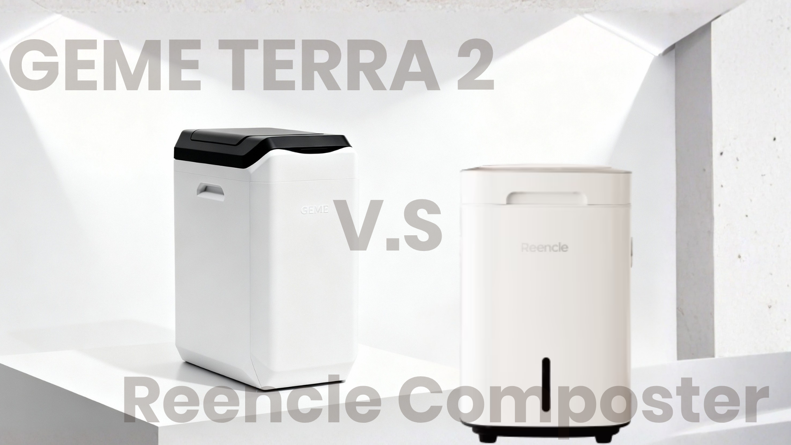

import GemeTerra2CTA from '@site/src/components/GemeTerra2CTA' 
import GemeComposterCTA from '@site/src/components/GemeComposterCTA' 
import RelatedArticles from '@site/src/components/RelatedArticles'
import ReactPlayer from 'react-player'

## Introduction

Are There Any Odor-Free Composting Options Suitable for Apartments? 

Yes, absolutely. 

You can compost in an apartment without your kitchen smelling like a landfill. The key is choosing a system that manages decomposition biologically and aerobically (or via sealed fermentation). **Modern microbial electric composters like the GEME Terra II, Bokashi fermentation, and well-maintained worm bins all allow genuinely odor-free indoor composting**. This guide covers only real composting or pre-composting methods, not dehydrators that simply dry and grind food waste. Here's how to find your perfect composter for apartment living.

<!-- truncate -->

## Table Of Content

1. [**Why Your Compost Smells?**](#1-why-your-compost-smells-and-how-to-stop-it)

2. [**Odor-Free Apartment Composting Methods: At-a-Glance**](#2-odor-free-apartment-composting-methods-at-a-glance)

3. [**Electric Composters: Microbial-Powered, Truly Odor-Free**](#3-electric-composters-microbial-powered-truly-odor-free)

4. [**Bokashi Composting: The Fermentation Method**](#4-bokashi-composting-the-fermentation-method)

5. [**Worm Composting (Vermicomposting): The Silent Workers**](#5-worm-composting-vermicomposting-the-silent-workers)

6. [**The Freezer Method: $0, Zero Effort**](#6-the-freezer-method-0-zero-effort)

7. [**How to Choose the Right System for Your Apartment**](#7-how-to-choose-the-right-system-for-your-apartment)

8. [**The Bottom Line**](#8-the-bottom-line)

9. [**Frequently Asked Questions (Answered)**](#9-frequently-asked-questions-answered)

## 1. Why Your Compost Smells (And How to Stop It)

Bad smells in composting come almost exclusively from anaerobic decomposition, organic matter rotting without oxygen. This produces the sulfur compounds and ammonia responsible for that sour, rotten-egg stench. When food scraps are trapped in a plastic trash bag headed for the landfill, they undergo this exact process, releasing methane, a greenhouse gas roughly 25 times more potent than CO₂.

The fix is simple: give your food waste access to oxygen (**aerobic decomposition**) or seal it in an environment where beneficial microbes do the work without putrefaction. Every method discussed below solves the odor problem at its source, not by masking it, but by preventing anaerobic conditions from forming in the first place.

## 2. Odor-Free Apartment Composting Methods: At-a-Glance

| **Method**                                | **How It Controls Odor**                     | **End Product**                                      | **Best For**                          | **Approx. Cost**              |
|-------------------------------------------|----------------------------------------------|------------------------------------------------------|---------------------------------------|-------------------------------|
| **Electric Microbial Composter (GEME Terra 2)**| Aerobic microbes + permanent catalyst        | Real compost                                         | Hands-off, immediate use              | \$599 (GEME Terra II)         |
| **Bokashi Fermentation**                      | Airtight seal + fermentation microbes        | Fermented pre-compost (needs soil finishing)          | Meat, dairy, tiny spaces              | ~\$65 + \$15/yr bran          |
| **Worm Composting (Vermicomposting)**         | Balanced greens/browns + worm activity       | Premium worm castings                                | Gardeners wanting high-quality output | ~\$40–\$120 + worms           |
| **Freezer Method**                            | Sub-zero halts all decomposition             | Frozen scraps for drop-off                            | Zero-cost, zero-effort                | \$0                            |

:::note
⚠️ A critical note on dehydrator-style machines: Appliances like Lomi, Vitamix FoodCycler, and Vego use heat and grinding to dry food scraps into a powder. They are not composters. **They do not produce compost; they produce dehydrated, largely sterile waste that must still break down further in soil**. If added directly, it can even cause nitrogen drawdown and acidity issues. If your goal is real composting, skip the dehydrators. This article focuses exclusively on systems that involve biological breakdown.
:::

<GemeTerra2CTA 
 imgSrc="/img/geme-terra-2-composter.jpg"
 productTitle="GEME Terra II: Best Kitchen Composter"
 features={[
    "✅ Real Composter With No Hidden Costs",
    "✅ Biologically Active Composting System",
    "✅ Quiet, Odour-Free, Real Compost",
    "✅ Zero Filter Costs, No Refills",
    "✅ Reduces Composting Time to Days"
 ]}
buttonText="Get Your GEME Terra II"
  href="https://www.geme.bio/product/terra2?utm_medium=blog&utm_source=geme_website&utm_campaign=general_seo_content&utm_content=odor-free-composting-options-for-apartments-2026"
/>

## 3. Electric Composters: Microbial-Powered, Truly Odor-Free

For apartment dwellers who want the most foolproof, low-effort path to odor-free composting, microbial electric composters are the gold standard. These countertop appliances use living microorganisms to digest food waste, without dehydrating or grinding to fake "compost." They automate aeration, temperature, and moisture so you don't have to balance greens and browns or worry about smells.

### GEME Terra II: Real Compost, Zero Filters

The GEME Terra II uses a proprietary blend of thermophilic Kobold microbes (a consortium of 46 heat-tolerant Bacillus species) that actively digest organic matter at an optimal temperature of 45–55°C in a controlled aerobic environment. Odor is neutralized at the source by a permanent metal-ion oxidation catalyst, with no carbon filters to replace, ever. The output is genuine, biologically active compost ready to use immediately on houseplants or balcony gardens. Noise levels sit at around 35–40 dB, and ongoing costs are \$0.

### Reencle Prime & Gravity: Continuous Microbial Processing

Reencle uses a similar continuous microbial process with its own Bacillus-based culture. The Reencle Prime suits 1–2-person households; the Reencle Gravity handles 3–5+ people. Odor is managed through a multi-layer activated carbon filter system that runs continuously; these filters do require periodic replacement (adds recurring costs). Output is microbially active compost, though some users prefer to let it cure briefly before use.

Both the **GEME Terra II** and **Reencle** represent genuine composting, biological decomposition that builds humus and returns nutrients safely to plants. 

[**Compare Reencle with GEME Terra II** -->](https://www.geme.bio/compare/geme-vs-reencle)

### Reencle V.S GEME Terra II: Comparison Table

| **Feature**                | **Reencle Prime**                                              | **GEME Terra II**                                              |
|----------------------------|---------------------------------------------------------------|----------------------------------------------------------------|
| **Composting Technology**  | Continuous Bacillus microbial digestion                        | Continuous thermophilic Kobold-Bacillus AI-managed digestion   |
| **Real Compost Output**    | ⚠️ Partial, needs further decomposition                        | ✅ Yes, real, ready-to-use compost                             |
| **Household Size**         | 1–2 people (Prime); larger option (Gravity)                   | 1–3 people (14L chamber)                                      |
| **Odor Control**           | Multi-layer activated carbon filter (requires replacement)     | Permanent metal-ion oxidation catalyst (never replaced)        |
| **Ongoing Filter Cost**    | \$15–\$30 per replacement (every 3–4 months)                  | \$0; no filters ever                                           |
| **Upfront Price**          | \$500–\$550 (Prime)                                           | \$599                                                          |
| **Noise Level**            | 35–40 dB                                                      | 35–40 dB                                                       |
| **Meat & Dairy**           | Best in small amounts; fatty meats may slow process           | Yes, handles meat, dairy, and small bones                      |
| **Cleaning**               | Removable bucket; filter housing needs periodic attention      | Fixed chamber with non-stick surface; scoop & wipe             |
| **Best For**               | Compact kitchen space, 1–2 person households                  | Zero maintenance costs, compact kitchen space, true “Add & Forget” operation |

## 4. Bokashi Composting: The Fermentation Method

Bokashi is a Japanese fermentation technique that "pickles" your food waste rather than composting it in the traditional sense, but it's a legitimate pre-composting biological process. You layer food scraps in a specially designed airtight bucket, sprinkling each layer with Bokashi bran inoculated with Lactobacillus bacteria. Because the bucket is completely sealed, there is genuinely no smell during fermentation.

Startup costs are low: a Bokashi kit around \$65, plus roughly \$15/year for bran. Bokashi accepts meat, fish, and dairy without issue, a huge plus for many kitchens. After about two weeks, you get a nutrient-rich liquid ("Bokashi tea") that makes excellent houseplant fertilizer, plus fermented pre-compost that must be buried in a soil factory or outdoor bed to finish decomposing. The output is acidic (pH 3–4) and not yet plant-ready; it requires a secondary soil-finishing step. Still, it's a compact, odor-free, and highly effective way to handle all kitchen waste in an apartment.

[**Compare Bokashi with GEME Terra II** -->](https://www.geme.bio/blog/geme-composter-vs-diy-bokashi-composting)

<GemeTerra2CTA 
 imgSrc="/img/geme-terra-2-composter.jpg"
 productTitle="GEME Terra II: Best Kitchen Composter"
 features={[
    "✅ Real Composter With No Hidden Costs",
    "✅ Biologically Active Composting System",
    "✅ Quiet, Odour-Free, Real Compost",
    "✅ Zero Filter Costs, No Refills",
    "✅ Reduces Composting Time to Days"
 ]}
buttonText="Get Your GEME Terra II"
  href="https://www.geme.bio/product/terra2?utm_medium=blog&utm_source=geme_website&utm_campaign=general_seo_content&utm_content=odor-free-composting-options-for-apartments-2026"
/>

## 5. Worm Composting (Vermicomposting): The Silent Workers

Worm composting uses red wiggler worms (Eisenia fetida) to consume food scraps and produce nutrient-dense castings, which many gardeners call "black gold." A properly managed worm bin smells like a fresh forest after rain. Odor control comes from the "Brown to Green" ratio: always cover your "Greens" (food scraps) with a thick layer of "Browns" (shredded cardboard or newspaper), which traps any potential smells instantly. Keep bedding as damp as a wrung-out sponge, and never overfeed; excess scraps rot before worms can process them.

Worm bins fit under sinks or in closets, require no turning (the worms do the work), and produce the highest-quality potting material for houseplants. Startup costs range from \$40 for worms plus a DIY bin to around \$120 for a purpose-built system like the Worm Factory 360. Avoid meat, dairy, and citrus in worm bins to keep the system odor-free and your worms happy.

## 6. The Freezer Method: $0, Zero Effort

For the truly commitment-averse, the freezer method is brilliantly simple: keep an airtight silicone bag or repurposed container in your freezer, toss scraps in as you cook, and the sub-zero temperature halts all decomposition and all odor instantly. Once full, drop the frozen scraps at a local farmers' market compost station, community garden, or use the ShareWaste app to find a neighbor who composts. This isn't composting at home, but it's an odor-free way to divert waste from landfills until you're ready to use a real composting system. Total cost: \$0.

## 7. How to Choose the Right System for Your Apartment

1. **For the best overall solution**: **GEME Terra II is the clear winner for most apartment households**. It checks every box that matters: genuine, biologically active compost ready to use immediately; zero ongoing costs thanks to its permanent metal-ion catalyst; a spacious 14L chamber that handles 1-3 people; and truly hands-off operation. At \$599, it costs more upfront than a Bokashi bucket or worm bin, but when you factor in the zero filter replacements, zero subscription fees, and no secondary processing step, it delivers the best long-term value of any indoor composting system. Compost quality is uncompromised, this is real, humus-rich material your houseplants will thrive on. **For anyone who wants real composting without the hassle, the GEME Terra II is the optimal choice**.

2. **For the budget-conscious foodie who cooks with meat and dairy**: If the GEME Terra II's upfront price stretches your budget, Bokashi is your next best bet. It handles meat, fish, and dairy effortlessly, costs around $65 to start, and takes up almost no space. The trade-off is the two-step process: after fermentation, the acidic pre-compost must be buried in a soil factory or outdoor bed to finish breaking down. **It works, but it’s not the one-step, ready-to-use experience the GEME Terra II delivers**.

3. **For the plant parent who wants premium fertilizer**: Worm composting produces exceptional castings, arguably the finest output for houseplants. But **it requires consistent attention: maintaining moisture levels, managing the brown-to-green ratio, and avoiding overfeeding**. If you enjoy tending a living system, it’s deeply rewarding. If you’d rather have similarly rich, plant-ready compost without the weekly maintenance, the **GEME Terra II produces real compost on autopilot, and accepts meat and dairy, which worm bins cannot**.

4. **For the "I don't want to think about it at all" person**: The freezer method costs nothing and prevents all odor. But it’s not composting, it’s waste storage until you drop it off elsewhere. It’s a fine stopgap. If you're ready for a real solution that closes the loop right in your kitchen, the GEME Terra II transforms that frozen-scrap routine into a single appliance that makes compost while you go about your day.

👉 [Learn More About GEME Terra II](https://www.geme.bio/product/terra2?utm_medium=blog&utm_source=geme_website&utm_campaign=general_seo_content&utm_content=odor-free-composting-options-for-apartments-2026)

👉 [Explore GEME Pro for Big Households/Plant Shops/Restaurants](https://www.geme.bio/product/geme?utm_medium=blog&utm_source=geme_website&utm_campaign=general_seo_content&utm_content=?utm_medium=blog&utm_source=geme_website&utm_campaign=general_seo_content&utm_content=odor-free-composting-options-for-apartments-2026)

<GemeTerra2CTA 
 imgSrc="/img/geme-terra-2-composter.jpg"
 productTitle="GEME Terra II: Best Kitchen Composter"
 features={[
    "✅ Real Composter With No Hidden Costs",
    "✅ Biologically Active Composting System",
    "✅ Quiet, Odour-Free, Real Compost",
    "✅ Zero Filter Costs, No Refills",
    "✅ Reduces Composting Time to Days"
 ]}
buttonText="Get Your GEME Terra II"
  href="https://www.geme.bio/product/terra2?utm_medium=blog&utm_source=geme_website&utm_campaign=general_seo_content&utm_content=odor-free-composting-options-for-apartments-2026"
/>

## 8. The Bottom Line

Odor-free apartment composting is not only possible, but it's easier than ever in 2026. Whether you choose a high-tech microbial electric composter like the GEME Terra II with its permanent catalyst and zero-filter odor control, a simple Bokashi bucket that pickles your scraps into plant food, or a humble worm bin that turns waste into gardening gold, there's a genuinely smell-free option that fits your space, budget, and lifestyle. Just remember: **dehydration is not composting**. Stick with biology, and your apartment will stay fresh while your food waste builds soil, not stink.

## 9. Frequently Asked Questions (Answered)

### Q: Can I really compost meat and dairy indoors without smells?

> A: Yes, with the right system. Bokashi fermentation handles meat, fish, and dairy effortlessly thanks to its airtight, anaerobic fermentation. The GEME Terra II's thermophilic microbes also break down meat and small bones completely without odor. Traditional worm bins should avoid these items.

### Q: Which electric composter has the lowest ongoing costs?

> A: The GEME Terra II uses a permanent metal-ion oxidation catalyst that never needs replacement, resulting in \$0 ongoing consumable costs. Reencle and other filter-based microbial composters require periodic filter changes.

### Q: What do I do with the compost if I don't have a garden?

> A: Use it on houseplants, donate it to a community garden, share it with a plant-loving neighbor, or drop it at a farmers' market compost station. 

### Q: Can I use GEME Terra II compost directly on my plants?

> A: Yes. The GEME Terra II produces mature, biologically active compost that can be applied to garden beds, potted plants, or lawns right away. Just remember the 1:8 ratio rules (1 part of compost and 8 part of soil) when applying directly to plants.

### Q: Is the freezer method really "composting"?

> A: No, it's a waste diversion method. It doesn't create compost in your home, but by freezing scraps and dropping them off at a composting site, you successfully eliminate landfill methane, and the nutrients eventually become compost elsewhere.

### Q: Does the GEME Terra 2 smell? What about fruit flies?

> A: The GEME Terra 2 is sealed and uses a permanent metal‑ion filter that destroys odors at the molecular level. There’s no lingering smell when the lid is closed, and when you open it to add scraps, you might notice a mild earthy scent, nothing like rotting garbage. Because the system is sealed and continuously aerated, fruit flies cannot get in or breed inside.

### Q: Does the GEME Terra II have filters to replace?

> A: No. It uses a permanent metal-ion oxidation catalyst that never needs replacement. There are zero ongoing costs for consumables.

### Q: Which is the best kitchen composter for a small apartment?

> A: For apartments with no outdoor space, a real electric composter like the GEME Terra II is ideal because it produces finished compost you can use on indoor plants immediately, with no extra subscriptions or outdoor piles required. Check this post: [**The Best Composter For Small Kitchen**](https://www.geme.bio/blog/the-best-composter-for-kitchen)

### Q: Why aren't dehydrator machines like Lomi considered composters?

> A: Because they don't biologically decompose food waste. They heat and grind scraps into a dry powder that is sterile, not compost. It still needs to break down in soil and can harm plants if used directly. Real composting always involves microbial digestion.

> **Check the following posts**: 

> 1. [**Does the Lomi Composter Really Compost? Lomi vs GEME Terra 2**](https://www.geme.bio/blog/does-lomi-composter-really-compost)
> 2. [**Does Mill Composter Produce Real Compost?**](https://www.geme.bio/blog/does-mill-composter-pruduce-compost)

<GemeTerra2CTA 
 imgSrc="/img/geme-terra-2-composter.jpg"
 productTitle="GEME Terra II: Best Kitchen Composter"
 features={[
    "✅ Real Composter With No Hidden Costs",
    "✅ Biologically Active Composting System",
    "✅ Quiet, Odour-Free, Real Compost",
    "✅ Zero Filter Costs, No Refills",
    "✅ Reduces Composting Time to Days"
 ]}
buttonText="Get Your GEME Terra II"
  href="https://www.geme.bio/product/terra2?utm_medium=blog&utm_source=geme_website&utm_campaign=general_seo_content&utm_content=odor-free-composting-options-for-apartments-2026"
/>

<GemeComposterCTA 
 imgSrc="/img/geme-bio-composter.jpg"
 productTitle="GEME Pro Composter"
 features={[
    "✅ Real Composter With No Hidden Costs",
    "✅ Produce Soil-Ready Compost For Plant Growth",
    "✅ Quiet, Odor-Free, Quick(6-8 hours)",
    "✅ Large Capacity (19 L) For Daily Waste"
  ]}
buttonText="Get Your GEME Pro"
  href="https://www.geme.bio/product/geme?utm_medium=blog&utm_source=geme_website&utm_campaign=general_seo_content&utm_content=?utm_medium=blog&utm_source=geme_website&utm_campaign=general_seo_content&utm_content=odor-free-composting-options-for-apartments-2026"
/>

## Cited Sources

1. GEME, "[How to Reduce Odor: Practical Tips for Indoor Composting That Actually Work](https://www.geme.bio/blog/how-to-reduce-odor-indoor-composting-tips)," geme.bio, Feb. 2026. 

2. GEME, "[The Best Electric Kitchen Composter of 2026](https://www.geme.bio/blog/best-kitchen-composter-2026)," geme.bio, Jan. 2026. 

3. GEME, "[What is the difference between GEME Terra 2 and GEME Pro?](https://www.geme.bio)" geme.bio. 

4. Reencle, "[Best Electric Composter for Apartments (2026 Guide)](https://reencle.co/blogs/news/best-electric-composter-apartments)," reencle.co, Apr. 2026. 

5. Reencle, "[Best Electric Composter for a Family of 4 or More (2026)](https://reencle.co/blogs/news/best-electric-composter-family)," reencle.co, Apr. 2026. 

6. Kitchen Compost Bins, "[BeyondGREEN All-Electric Kitchen Composter: Pros, Cons & Verdict](https://kitchencompostbins.com/beyondgreen-all-electric-kitchen-composter-pros-cons-verdict-2/)," kitchencompostbins.com, Dec. 2025. 

7. GreenSmith Nepal, "[Stop Throwing Away 'Trash Taxes': The 3-Step No-Stink Apartment Composting Guide](https://www.greensmithnepal.com.np/2026/02/stop-throwing-away-trash-taxes-3-step.html)," greensmithnepal.com.np, Feb. 2026. 

8. EarthFriendlyBlog, "[Indoor Composting Without the Smell: Best Methods for Small Spaces](https://earthfriendlyblog.com/indoor-composting-without-the-smell-best-methods-for-small-spaces/)," earthfriendlyblog.com, Apr. 2026. 

9. Indoor Garden Space, "[Bokashi Soil Factory Composting for Apartments: Tips and Tricks](https://indoorgardenspace.com/bokashi-soil-factory/)," indoorgardenspace.com, Feb. 2026. 

10. Bob Vila, "[The Best Electric Composters for Recycling Food Waste, Tested](https://www.bobvila.com/reviews/best-electric-composters-2025/)," bobvila.com, Dec. 2025. 

11. Planters Realm, "[5 Best Composting Bins for Small Spaces in 2026](https://plantersrealm.com/products/tools-reviews/best-composting-bins-small-spaces-2026/)," plantersrealm.com, Apr. 2026. 

12. SEVENSEAS Media, "[Home Electric Composters Explained and Our Recommendations](https://sevenseasmedia.org/home-electric-composters-explained-and-our-recommendations/)," sevenseasmedia.org, Jan. 2026. 

13. BillionHands, "[GEME Pro: Info, Rankings & Votes](https://billionhands.com)," billionhands.com. 

<RelatedArticles
  slugs={[
  "does-mill-composter-pruduce-compost",
  "the-best-electric-kitchen-composter-mill-composter-vs-geme-terra-2",
  "geme-composter-mothers-day-discount",
  "mothers-day-geme-composter-discount-code",
  "best-home-composter-for-apartment-geme-vs-lomi",
  "the-best-kitchen-composter-for-zero-waste-lifestyle",
  "geme-terra-2-the-silent-gearbox",
  "geme-composter-amazon-discount-earth-day-2026",
  "how-to-avoid-leftover-food-poisoning-fried-rice-syndrome",
  "geme-composter-vs-diy-bokashi-composting",
  "permanent-odor-control-catalyst-path-vs-disposable-carbon",
  "why-the-geme-chassis-is-intentionally-heavier-than-a-typical-countertop-appliance",
  "geme-composter-review-2026-geme-pro",
  "how-to-fertilize-your-plants-in-spring",
  "how-to-plant-tulip-bulbs-in-spring-guide",
  "what-can-you-put-in-electric-composter-meat-dairy-bones",
  "electric-composter-salt-oil-boundaries",
  "advanced-geme-compost-application-guide",
  "countertop-composter-misnomer-floor-standing-electric-composter",
  "top-5-electric-composters-on-amazon-2026",
  "geme-terra-2-pros-and-cons",
  "top-5-kitchen-composters-pros-and-cons",
  "geme-composter-review-2026",
  "best-kitchen-composter-verdict-2026",
  "best-composter-avoid-recurring-fees-geme-terra-2",
  "how-to-compost-cut-flowers-guide",
  "how-long-does-bokashi-take-to-compost",
  "how-to-care-for-hydrangeas-and-change-colors",
  "best-composter-daily-operation-comparison-lomi-mill-reencle-geme",
  "how-long-does-pizza-last-in-fridge-guide",
  "how-to-compost-eggshells-guide-geme",
  "how-to-compost-coffee-grounds-guide",
  "never-buy-carbon-filter-for-your-composter",
  "best-composter-fastest-real-compost-geme-terra-2",
  "how-to-compost-at-home-beginners-guide",
  "how-long-can-chicken-stay-in-the-fridge",
  "how-to-reduce-odor-indoor-composting-tips",
  "how-long-can-ground-beef-stay-in-the-fridge",
  "nyc-composting-fines-2026-geme-terra-2-best-electric-compost",
  "best-indoor-composter-for-apartment-geme-vs-lomi",
  "the-best-composter-for-kitchen",
  "how-to-reduce-food-waste-during-spring-festival",
  "does-reencle-composter-produce-real-compost",
  "does-mill-composter-really-compost",
  "how-to-reduce-food-waste-at-home-2026",
  "free-mcnugget-caviar-raises-food-waste-concerns",
  "composting-in-winter",
  "how-to-compost-at-home",
  "zero-waste-home-kitchen-composter",
  "does-lomi-composter-really-compost",
  "5-best-kitchen-composters-in-2026",
  "best-kitchen-composter-in-2026-geme-terra-2",
  "geme-vs-reencle-composter-2026",
  "geme-vs-mill-composter-2026",
  "best-kitchen-composter-2026",
  "advanced-geme-compost-application-guide",
  "electric-compost-bin-filters-costs-comparison",
  "geme-vs-lomi", 
  "geme-terra-2-debuts",
  "the-best-composter-to-reduce-food-waste",
  "compost-pile-vs-electric-composter",
  "how-to-make-bananas-last-longer",
  "how-long-do-apples-last-in-the-fridge",
  "can-i-compost-moldy-grapes",
  "can-you-compost-moldy-bread",
  ]}
/>

_Ready to transform your gardening game? Subscribe to our [newsletter](http://geme.bio/signup?utm_medium=blog&utm_source=geme_website&utm_campaign=general_seo_content&utm_content=how-to-compost-at-home-beginners-guide) for expert composting tips and sustainable gardening advice._

