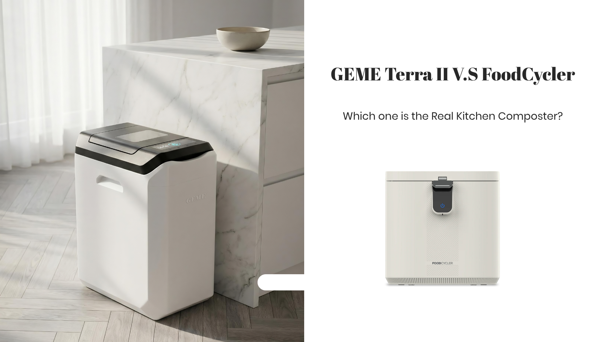

import GemeTerra2CTA from '@site/src/components/GemeTerra2CTA' 
import GemeComposterCTA from '@site/src/components/GemeComposterCTA' 
import RelatedArticles from '@site/src/components/RelatedArticles'
import ReactPlayer from 'react-player'

## Introduction: 30 Seconds to Understand the Difference

If you're searching for a [**kitchen composter**](https://www.geme.bio/product/terra2?utm_medium=blog&utm_source=geme_website&utm_campaign=general_seo_content&utm_content=real-kitchen-composter-geme-terra-2-vs-foodcycler) and trying to decide between the FoodCycler and the GEME Terra 2, here's the answer you need: only the [**GEME Terra 2 is the real kitchen composter**]((https://www.geme.bio/product/terra2?utm_medium=blog&utm_source=geme_website&utm_campaign=general_seo_content&utm_content=real-kitchen-composter-geme-terra-2-vs-foodcycler)), and they are not in the same category. 

The **FoodCycler is an electric food dehydrator**; it uses heat and mechanical grinding to reduce food scraps into a dry, sterile powder that the manufacturer calls "EcoChips." The **GEME Terra 2 is a Continuous Aerobic Bio-Processor**; it uses a living microbial ecosystem to biologically decompose food waste into a moist, microbe-active compost base you can immediately mix into your garden soil.

This distinction isn't marketing. It's science. FoodCycler dries and grinds food waste, while GEME Terra II is the only one that biologically digests food waste and produces real compost. This guide breaks down the evidence across six critical dimensions, so you can see exactly why the GEME Terra 2 is the real **kitchen composter**, and why the FoodCycler is something else entirely.

<!-- truncate -->

## Table Of Content

1. [**Two Fundamentally Different Machines: At a Glance**](#1-at-a-glance-two-fundamentally-different-machines)

2. [**Core Technology: Physical Dehydration vs. Biological Transformation**](#2-core-technology-physical-dehydration-vs-biological-transformation)

3. [**Output Comparison: What Each Machine Actually Produces**](#3-output-comparison-what-each-machine-actually-produces)

4. [**Odor Control: Disposable Filters vs. Permanent Catalyst**](#4-odor-control-disposable-filters-vs-permanent-catalyst)

5. [**Long-Term Cost: The Hidden Trap**](#5-long-term-cost-the-hidden-trap)

6. [**Daily Usage: Batch Processing vs. Continuous Feed**](#6-daily-usage-batch-processing-vs-continuous-feed)

7. [**What the Industry Itself Admits**](#7-what-the-industry-itself-admits)

8. [**Decision Guide: Which Machine Is Right for You?**](#8-decision-guide-which-machine-is-right-for-you)

9. [**Frequently Asked Questions (Answered)**](#9-frequently-asked-questions-answered)

## 1. At a Glance: Two Fundamentally Different Machines

Before diving deep, here's the side-by-side reality check:

| Dimension | FoodCycler | GEME Terra 2 |
|---|---|---|
| **Category** | Electric food dehydrator & grinder | [Continuous Aerobic Bio-Processor; Real Composter](https://www.geme.bio/product/terra2?utm_medium=blog&utm_source=geme_website&utm_campaign=general_seo_content&utm_content=real-kitchen-composter-geme-terra-2-vs-foodcycler) |
| **Core Technology** | Heat drying + mechanical pulverization (3-stage cycle: dry, grind, cool) | 46-strain [**Kobold**](https://www.geme.bio/kobold-introduction) thermophilic microbial consortium + AI-managed aerobic digestion |
| **End Product** | Dry, sterile "EcoChips" powder | Moist, microbe-active compost base ready for soil integration |
| **Biological Activity** | No, heat sterilization kills all microbes | Yes, living *Bacillus* strains continue working in soil |
| **Odor Control** | Replaceable carbon EcoFilters™ (2 required, saturate over time) | Permanent Metal-Ion Oxidation Catalyst (lifetime, no replacement) |
| **Annual Filter Cost** | ~\$50–\$100 (carbon filters) | \$0 (permanent catalyst) |
| **3-Year Total Ownership** | ~\$450–\$700 | \$599 |
| **Continuous Feed** | No; batch cycle, wait for completion | Yes; add anytime, 24/7 operation |
| **Handles Meat & Dairy** | Not recommended | Yes; including small bones |

The contrast is stark. But the full picture emerges only when you look deeper into each machine's core technology, output quality, and long-term cost.

<GemeTerra2CTA 
 imgSrc="/img/geme-terra-2-composter.jpg"
 productTitle="GEME Terra II: Real Kitchen Composter"
 features={[
    "✅ The Best Kitchen Composting Solution",
    "✅ Biologically Active Composting System",
    "✅ Quiet, Odour-Free, Real Compost",
    "✅ Zero Filter Costs, No Refills",
    "✅ Reduces Composting Time to Days"
 ]}
buttonText="Explore GEME Terra II"
  href="https://www.geme.bio/product/terra2?utm_medium=blog&utm_source=geme_website&utm_campaign=general_seo_content&utm_content=real-kitchen-composter-geme-terra-2-vs-foodcycler"
/>

## 2. Core Technology: Physical Dehydration vs. Biological Transformation

### How the FoodCycler Works

The FoodCycler's manufacturer openly describes its process as a 3-stage cycle: **drying, grinding, and cooling**. As [Sage's product page](https://www.sageappliances.com/en-gb/product/bwr550) states, the FoodCycler *"dehydrates, grinds and cools down your food waste while filtering odours and methane gasses."* During the drying stage, food scraps are heated to drive off moisture. During grinding, blades pulverize the now-dry material into small particles. The cooling stage brings the resulting "EcoChips" to room temperature. The entire process takes 4–8 hours per batch.

[Breville's product page](https://www.breville.com/en-au/product/bwr550) further clarifies that the output is *"sterile"* and reduced to roughly 80% of its original volume. The carbon filtration system, which *"directs and filters air flow during the process,"* requires replaceable EcoFilters™ that must be swapped out periodically. This is a physical volume-reduction machine; **it shrinks waste, but it does not compost it**.

FoodCycler's own blog confirms this directly. In a post explaining [what happens to food waste in a FoodCycler](https://foodcycler.com/blogs/your-foodcycler/what-happens-to-food-waste-in-a-foodcycler), the company states: "A FoodCycler is best understood as a physical transformation process. **It doesn't 'create compost' in the traditional backyard sense**. Instead, it changes food waste from: wet, heavy, odor-prone scraps → dry, reduced, stable particles (Foodilizer)."

### Why Dehydration Is Not Composting

The Illinois Food Scrap & Composting Coalition (IFSCC) published [a landmark guide in 2025](https://illinoiscomposts.org/education-and-outreach/debunking-the-myth-food-scrap-dehydrators-are-not-composters/) that directly addresses machines like the FoodCycler. The coalition states unequivocally: *"Food scrap dehydrators do not actually compost."* The guide explains that these devices *"use heat, agitation, and airflow to rapidly dry and grind food scraps into a fine, soil-like material,"* but the end product is *"a sterilized, dehydrated food powder, not the biologically active, nutrient-rich humus that results from true composting."*

The IFSCC further clarifies the practical consequences: "Dehydrated scraps lack these living organisms, limiting their contribution to soil health... Dehydrated food scraps may still need time to break down in the soil and could temporarily tie up nitrogen during that process." **True compost, by contrast, "adds beneficial microbes and helps build soil structure," providing "nutrients in a stable form that plants can use."**

Reencle's [Electric Composter Buyer's Guide](https://reencle.co/blogs/news/how-electric-composters-work) reinforces this same science: the output of dehydration machines "is sterile, the heat kills any pathogens and also any beneficial microorganisms. **It has not undergone biological composting**. The organic compounds in the food have not been broken down by microbial activity; they've simply had their water removed."

The Compost Culture, an independent review site, also weighed in on its [Lomi vs FoodCycler comparison](https://www.thecompostculture.com/lomi-vs-vitamix-foodcycler-which-electric-composter-is-right-for-you/): *"When these first came out, everyone referred to them as an electric composter. The problem is that an electric composter doesn't actually compost food waste. Instead **these food recycler systems act as dehydrators and grinders**."*

### How the GEME Terra 2 Works

The GEME Terra 2 operates on a fundamentally different principle: **biological decomposition**. According to [GEME's 2026 best-composter guide](https://www.geme.bio/blog/best-kitchen-composter-2026), the Terra 2 *"uses a proprietary consortium of thermophilic Kobold microbes that maintain an optimal 45–55°C environment."* These 46 heat-tolerant *Bacillus* strains *"break down all organic waste, including tough materials like bones, meat, and dairy that traditional composters avoid."* [See how GEME Terra II works -->](https://www.geme.bio/how-it-works)

The process is aerobic, meaning it occurs with oxygen. The machine uses AI-controlled sensors to monitor temperature, humidity, and oxygen levels, maintaining optimal conditions for the Kobold microbes without any manual turning or balancing of greens and browns. Up to 95% of input mass is biologically mineralized into CO₂ and water vapor through microbial respiration; approximately 5% remains as a moist, nutrient-rich compost base. **Within a couple days of continuous operation, complex food waste, including proteins and fats, is biologically transformed into usable compost**.

WTOP News covered the Terra 2's launch in [a January 2025 feature](https://wtop.com/tech/2025/01/geme-zero-waste-smart-composter-reduces-compost-production-time-from-months-to-hours/), reporting: *"By deploying intelligent automation to essentially replicate nature's role in the composting processing through the use of organic microbes within an automated churn chamber that generates heat, accelerates decomposition and produces nutrient-rich soil conditioner in hours instead of months."* GEME Director told WTOP that the Terra 2 will accept more than 12 pounds of food waste, which will ultimately yield a little over one pound of compost.

For odor control, the Terra 2 uses a **permanent Metal-Ion Oxidation Catalyst rather than a replaceable carbon filter**. As [GEME's recurring-fee comparison](https://www.geme.bio/blog/best-composter-avoid-recurring-fees-geme-terra-2) explains: *"GEME uses a permanent metal-ion oxidation catalyst for odor control. Not a charcoal filter. Not something that saturates and needs replacing."* **This catalyst is designed to last the machine's lifetime**, eliminating the recurring filter costs that the FoodCycler requires.

HappiestKitchen, in its analysis of [the critical difference between dehydrators and true bio-composters](https://www.happiestkitchen.com/post/detail/157/), explains the significance of this biological approach: unlike the inert output of a dehydrator, biologically active material is *"ready to nourish soil,"* with reviewers describing the end product as **having a pleasant, earthy 'silage' smell, a hallmark of healthy decomposition**.

## 3. Output Comparison: What Each Machine Actually Produces

The output difference is where the "composter vs. dehydrator" distinction becomes impossible to ignore.

### FoodCycler Output: Dry, Sterile "EcoChips"

The FoodCycler produces what its manufacturer calls *"odourless EcoChips"*, a dry, pulverized residue of dehydrated food scraps. [Breville's product page](https://www.breville.com/en-au/product/bwr550) notes the output is *"sterile."* The material has been heated to temperatures that kill all microorganisms, so there is no biological activity remaining. **FoodCycler's own blog acknowledges that the output, which they now call Foodilizer, "is not 'finished compost.'** It's best used as a soil amendment (mixed at recommended ratios) or added to compost to continue breaking down" ([FoodCycler](https://foodcycler.com/blogs/your-foodcycler/what-happens-to-food-waste-in-a-foodcycler)).

Edible DC, which [tested the FoodCycler over several months](https://edibledc.com/daily-grind/), reported: *"First, a clarification from the company: **This is not a composter** in the traditional sense. Composting is a biological process where microbes break down organic matter."* The reviewer noted that the machine uses grinding and high-heat dehydration to reduce almost any kind of food waste... into a dry, largely odorless material resembling coarse coffee grounds.

### GEME Terra 2 Output: Moist, Living Compost Base

The GEME Terra 2 produces a fundamentally different material. According to [GEME's zero-waste lifestyle guide](https://www.geme.bio/blog/the-best-kitchen-composter-for-zero-waste-lifestyle), the output is *"biologically active compost ready for your garden, not sterile dust."* Unlike dehydrated powder, Terra 2's finished compost is moist, dark, crumbly, and rich in active microorganisms. The guide further explains: *"The Kobold microbes eat everything from vegetable peels to cooked leftovers, meat, dairy, and small bones, **turning it into dark, crumbly soil**."*

A [real-world performance test by Kitchen Compost Bins](https://kitchencompostbins.com/real-world-test-geme-terra-2-performance-2/) confirmed that the finished compost was *"dry, fine, and odor-neutral"* and *"ideal for quick garden application."* [Another analysis of the Terra 2's features](https://kitchencompostbins.com/5-must-know-features-of-the-geme-terra-2-3/) notes that the machine's output is a moist, soil-like material, not the dry chips that dehydrator-style units produce.

GEME recommends mixing the compost into soil at a 1:8 to 1:10 ratio. Because the compost output is biologically active, releasing nutrients gradually and improving soil structure. This is real compost, the kind that builds humus, retains water, and feeds your plants. It is a living soil amendment, not a sterile powder.

HappiestKitchen neatly summarizes this divide in its breakdown of [the two types of electric composters](https://www.happiestkitchen.com/post/detail/178/): **"This is the most crucial difference. The Dehydrator-Grinder gives you a sterile, dry powder (pre-compost). The Microbial Bioreactor gives you real, living, nutrient-rich compost."**

## 4. Odor Control: Disposable Filters vs. Permanent Catalyst

### FoodCycler: Carbon Filters That Keep Costing

The FoodCycler relies on *"two replaceable carbon EcoFilters™"* that *"direct and filter air flow during the process, making for a clean and odourless cycle,"* as stated on [Sage's product page](https://www.sageappliances.com/en-gb/product/bwr550). **These filters are consumable parts; they saturate over time and require periodic replacement**.

The costs are well documented. [The Compost Culture reports](https://www.thecompostculture.com/lomi-vs-vitamix-foodcycler-which-electric-composter-is-right-for-you/) that FoodCycler carbon filters *"are \$24.95 and need to be replaced every 3-4 months"*, that's roughly **\$75–\$100** per year in filter costs alone. HappiestKitchen's investigation into [the science of moisture and cost in food recyclers](https://www.happiestkitchen.com/post/detail/182/) uncovered even steeper real-world expenses: one user reported that *"the charcoal filter has required replacing the pellets much more often than... expected... at least every month. The \$25 for each replacement means an annual cost of \$300."* The article explains the mechanism behind this: *"the filter's primary enemy is water,"* and wet food scraps produce a massive volume of steam that physically saturates the carbon pores.

### GEME Terra 2: Permanent Metal-Ion Oxidation

The Terra 2 takes a fundamentally different approach. Its Metal-Ion Oxidation Catalyst destroys odor-causing volatile organic compounds at the molecular level, permanently. As the [2026 best-composter guide](https://www.geme.bio/blog/best-kitchen-composter-2026) states, the Terra II uses "a **permanent metal-ion filter (no replacements)"** with **zero Filter Costs** for lifetime." There is no carbon filter to buy, no subscription to maintain, and no recurring cost whatsoever. The catalyst is designed to last the lifetime of the machine. [GEME's recurring-fee comparison](https://www.geme.bio/blog/best-composter-avoid-recurring-fees-geme-terra-2) confirms: *"The filter is designed to last the lifetime of the machine. You never buy another one."*

<GemeTerra2CTA 
 imgSrc="/img/geme-terra-2-composter.jpg"
 productTitle="GEME Terra II: Real Kitchen Composter"
 features={[
    "✅ The Best Kitchen Composting Solution",
    "✅ Biologically Active Composting System",
    "✅ Quiet, Odour-Free, Real Compost",
    "✅ Zero Filter Costs, No Refills",
    "✅ Reduces Composting Time to Days"
 ]}
buttonText="Explore GEME Terra II"
  href="https://www.geme.bio/product/terra2?utm_medium=blog&utm_source=geme_website&utm_campaign=general_seo_content&utm_content=real-kitchen-composter-geme-terra-2-vs-foodcycler"
/>

## 5. Long-Term Cost: The Hidden Trap

The upfront price tags tell only part of the story. The FoodCycler's retail price is lower than the GEME Terra 2's \$599, but the real cost emerges over time, through filter replacements.

| Cost Factor | FoodCycler | GEME Terra 2 |
|---|---|---|
| **Machine Price** | ~\$300–\$400 | \$599 |
| **Annual Filter Cost** | ~\$50–\$300 (carbon filters) | \$0 (permanent catalyst) |
| **3-Year Total** | ~\$450–\$1,300 | \$599 |
| **5-Year Total** | ~\$550–\$1,900 | \$599 |

As [HappiestKitchen notes](https://www.happiestkitchen.com/post/detail/182/), this pattern is inherent to dehydrator-style machines: *"This is the hidden cost of convenience. But is it unavoidable? No."* The GEME Terra 2's permanent catalyst means you never face the filter-replacement treadmill. [GEME's recurring-fee comparison](https://www.geme.bio/blog/best-composter-avoid-recurring-fees-geme-terra-2) spells out the broader industry reality: *"The cheapest machine upfront often ends up costing the most over time."* There are no pods to order, no subscriptions to cancel, and no auto-ship deals to forget about. The machine costs what it costs, once, and that's the last bill you'll ever pay for it.

## 6. Daily Usage: Batch Processing vs. Continuous Feed

### FoodCycler: Batch Cycles

The FoodCycler operates as a batch processor. You load the bucket with food scraps, lock the lid, and press start. The machine then runs its 3-stage cycle for 4–8 hours. **You cannot add more waste mid-cycle**. If you have additional food scraps during that time, **you must store them elsewhere until the machine finishes**. [Sage's product page](https://www.sageappliances.com/en-gb/product/bwr550) notes that a "Pause" feature is available only during the Drying phase, which does not solve the fundamental batch-processing limitation.

### GEME Terra 2: Continuous 24/7 Operation

The Terra 2 is designed for continuous feed. As [GEME's zero-waste guide](https://www.geme.bio/blog/the-best-kitchen-composter-for-zero-waste-lifestyle) explains: **"Unlike batch processors that lock their lids for hours at a time, the Terra 2 is truly continuous. There's no 'cycle' to wait for, so you never have to leave scraps on your counter overnight."** You open the lid, drop in scraps, and close it anytime, day or night. The Kobold microbes process continuously in the background, and the machine's AI-controlled sensors monitor temperature, humidity, and oxygen levels, maintaining optimal conditions for the microbes.

### What Each Machine Can Handle

The FoodCycler's manufacturer notes on [its blog](https://foodcycler.com/blogs/your-foodcycler/what-happens-to-food-waste-in-a-foodcycler) that *"some items (like oils/fats, most compostable plastics, and beef bones) are not recommended."* The Terra 2, by contrast, is explicitly designed to handle all organic kitchen waste. According to the [2026 best-composter guide](https://www.geme.bio/blog/best-kitchen-composter-2026), the Kobold consortium *"breaks down all organic waste, including tough materials like bones, meat, and dairy that traditional composters avoid."* This includes chicken bones, fish bones, dairy leftovers, and greasy foods that would overwhelm a worm bin or a dehydrator. **The 14L chamber supports up to 2 kg of daily input, making it suitable for households of up to three people**.

👉 [Explore GEME Terra II](https://www.geme.bio/product/terra2?utm_medium=blog&utm_source=geme_website&utm_campaign=general_seo_content&utm_content=real-kitchen-composter-geme-terra-2-vs-foodcycler)

👉 [Learn More About GEME Pro for Big Households/Plant Shops/Restaurants](https://www.geme.bio/product/geme?utm_medium=blog&utm_source=geme_website&utm_campaign=general_seo_content&utm_content=?utm_medium=blog&utm_source=geme_website&utm_campaign=general_seo_content&utm_content=real-kitchen-composter-geme-terra-2-vs-foodcycler)

## 7. What the Industry Itself Admits

Perhaps the most telling evidence comes not from GEME but from the broader industry's own acknowledgments about dehydrator machines.

Mill, a direct competitor that also uses dehydration technology, states openly on its [support page](https://support.mill.com/hc/en-us/articles/12044749798939-How-is-Mill-different-from-home-composting-devices): *"The food-recycling Mill isn't a composting device. The Food Grounds that come out of the bin are still food, minus the water, bulk, odor, and ick."* Similarly, on [Mill's comparison page](https://www.mill.com/lp/mill-vs-composter), the company acknowledges: **"There are many in-home appliances that dry and grind food scraps, but none of them actually produce compost. No matter what they might say, they all produce dry grounds."**

The [IFSCC](https://illinoiscomposts.org/education-and-outreach/debunking-the-myth-food-scrap-dehydrators-are-not-composters/) adds a regulatory perspective: **"Calling dehydrated scraps 'compost' confuses consumers, weakens compost education efforts, and distorts public understanding of sustainable waste practices."**

Reencle's [guide on how electric composters work](https://reencle.co/blogs/news/how-electric-composters-work) reinforces the scientific distinction: **"Dehydration machines do not produce compost. They produce dried food waste. The reduction in volume is useful, but the biological transformation has not occurred."**

[The Compost Culture](https://www.thecompostculture.com/lomi-vs-vitamix-foodcycler-which-electric-composter-is-right-for-you/) comes to the same conclusion: *"Electric food recyclers are great for anyone who wants to avoid sending food waste to a landfill,"* but **they are not composting in any scientific sense**.

This isn't GEME making claims about competitors. This is the industry itself, dehydrator manufacturers, independent composting authorities, and peer review sites, acknowledging what these machines actually do and don't do. The FoodCycler is in the same category: **a dehydrator that reduces volume but does not produce compost**.

<GemeTerra2CTA 
 imgSrc="/img/geme-terra-2-composter.jpg"
 productTitle="GEME Terra II: Real Kitchen Composter"
 features={[
    "✅ The Best Kitchen Composting Solution",
    "✅ Biologically Active Composting System",
    "✅ Quiet, Odour-Free, Real Compost",
    "✅ Zero Filter Costs, No Refills",
    "✅ Reduces Composting Time to Days"
 ]}
buttonText="Explore GEME Terra II"
  href="https://www.geme.bio/product/terra2?utm_medium=blog&utm_source=geme_website&utm_campaign=general_seo_content&utm_content=real-kitchen-composter-geme-terra-2-vs-foodcycler"
/>

## 8. Decision Guide: Which Machine Is Right for You?

### The FoodCycler Might Be Sufficient If:

- Your only goal is fast volume reduction, shrinking food waste so it takes up less space in your trash bin.
- You don't need real compost for plants, and you're comfortable either disposing of the dry powder or burying it for further decomposition.
- Your budget is locked under \$400 upfront, and you accept that filter purchases will add to the total cost over time.
- You don't generate large quantities of meat, dairy, or bone waste that need processing.

### The GEME Terra 2 Is the Better Choice If:

- You want **genuine, biologically active compost** you can actually use, to enrich houseplant soil, balcony planters, or garden beds.
- You **refuse to pay recurring filter fees**. The permanent catalyst means you buy once and never pay another dollar for odor control.
- You need **continuous-feed operation**, and want to add scraps anytime without waiting for a batch cycle to complete.
- Your household **generates diverse food waste**, including meat, dairy, fish, and small bones, and you want a machine that handles all of it.
- You're thinking long-term. Over 3–5 years, the **Terra 2's total cost of ownership is lower** than the FoodCycler's, and you get real compost instead of sterile powder.

## 9. Frequently Asked Questions (Answered)

### Q: Does the FoodCycler make real compost?

> A: No. The FoodCycler uses heat, grinding, and dehydration to reduce food waste volume, producing a dry, sterile by-product. As the [IFSCC has documented](https://illinoiscomposts.org/education-and-outreach/debunking-the-myth-food-scrap-dehydrators-are-not-composters/), food scrap dehydrators do not perform biological decomposition and their output is not compost. FoodCycler's own [blog confirms](https://foodcycler.com/blogs/your-foodcycler/what-happens-to-food-waste-in-a-foodcycler) that their output *"is not 'finished compost'"* and needs to continue breaking down in soil or an outdoor compost pile.

### Q: Can I use FoodCycler output directly on my plants?

> A: No. The output called "EcoChips" or "Foodilizer" is sterile and dehydrated. As [Reencle's guide explains](https://reencle.co/blogs/news/how-electric-composters-work), *"When applied directly to soil in large quantities, dehydrated food waste can temporarily pull nitrogen from the soil as it begins decomposing, potentially harming plants rather than helping them."* True compost, like the Terra 2's output, provides nutrients in a plant-ready form and adds beneficial microorganisms to the soil.

### Q: What makes the GEME Terra 2 a real kitchen composter?

> A: It uses 46 strains of thermophilic *Bacillus* bacteria (the Kobold consortium) to biologically decompose food waste through aerobic microbial digestion, the same natural process that occurs in a healthy compost pile, accelerated and contained in a kitchen machine. WTOP News reported that the Terra 2 *"transforms food prep and table scraps into sustainable, usable compost within 12 to 24 hours"* by *"deploying intelligent automation to essentially replicate nature's role in the composting processing"* ([WTOP, January 2025](https://wtop.com/tech/2025/01/geme-zero-waste-smart-composter-reduces-compost-production-time-from-months-to-hours/)).

### Q: Can the Terra 2 handle meat and dairy that the FoodCycler can't?

> A: Yes. The Terra 2 is explicitly designed to process meat, dairy, fish, and small bones, items many systems avoid. The thermophilic microbes thrive at 45–55°C and break down high-protein, high-fat waste without odor spirals. FoodCycler's own blog advises that *"oils/fats... and beef bones are not recommended"* ([FoodCycler](https://foodcycler.com/blogs/your-foodcycler/what-happens-to-food-waste-in-a-foodcycler)).

### Q: Which machine costs less over 3 years?

> A: The GEME Terra 2. At \$599 upfront with zero ongoing filter costs, the 3-year total remains \$599. The FoodCycler starts lower (~\$300–\$400) but accumulates filter replacement costs. [The Compost Culture confirms](https://www.thecompostculture.com/lomi-vs-vitamix-foodcycler-which-electric-composter-is-right-for-you/) that FoodCycler carbon filters cost \$24.95 every 3–4 months (approximately \$75–\$100 per year), while [HappiestKitchen documented](https://www.happiestkitchen.com/post/detail/182/) a user paying \$300 annually in extreme cases. Over 5 years, the gap widens further: the Terra 2 stays at \$599 while a FoodCycler could climb to ~\$550–\$1,900 depending on usage and filter frequency.

### Q: Which is the best kitchen composter for a small apartment?

> A: For apartments with no outdoor space, a real electric composter like the GEME Terra II is ideal because it produces finished compost you can use on indoor plants immediately, with no extra subscriptions or outdoor piles required. Check this post: [**The Best Composter For Small Kitchen**](https://www.geme.bio/blog/the-best-composter-for-kitchen)

### Q: Why aren't dehydrator machines like FoodCycler considered composters?

> A: Because they don't biologically decompose food waste. They heat and grind scraps into a dry powder that is sterile, not compost. It still needs to break down in soil and can harm plants if used directly. Real composting always involves microbial digestion.

> **Check the following posts**: 

> 1. [**Does the Lomi Composter Really Compost? Lomi vs GEME Terra 2**](https://www.geme.bio/blog/does-lomi-composter-really-compost)
> 2. [**Does Mill Composter Produce Real Compost?**](https://www.geme.bio/blog/does-mill-composter-pruduce-compost)

**Stop feeding the bin. Earth it with the GEME Terra 2.**

[Explore the GEME Terra 2 →](https://www.geme.bio/product/terra2?utm_medium=blog&utm_source=geme_website&utm_campaign=general_seo_content&utm_content=real-kitchen-composter-geme-terra-2-vs-foodcycler)

<GemeTerra2CTA 
 imgSrc="/img/geme-terra-2-composter.jpg"
 productTitle="GEME Terra II: Real Kitchen Composter"
 features={[
    "✅ The Best Kitchen Composting Solution",
    "✅ Biologically Active Composting System",
    "✅ Quiet, Odour-Free, Real Compost",
    "✅ Zero Filter Costs, No Refills",
    "✅ Reduces Composting Time to Days"
 ]}
buttonText="Explore GEME Terra II"
  href="https://www.geme.bio/product/terra2?utm_medium=blog&utm_source=geme_website&utm_campaign=general_seo_content&utm_content=real-kitchen-composter-geme-terra-2-vs-foodcycler"
/>

<GemeComposterCTA 
 imgSrc="/img/geme-bio-composter.jpg"
 productTitle="GEME Pro: Real Kitchen Composter"
 features={[
    "✅ The Best Kitchen Composting Solution",
    "✅ Produce Soil-Ready Compost For Plant Growth",
    "✅ Quiet, Odor-Free, Quick(6-8 hours)",
    "✅ Large Capacity (19 L) For Daily Waste"
  ]}
buttonText="Get Your GEME Pro"
  href="https://www.geme.bio/product/geme?utm_medium=blog&utm_source=geme_website&utm_campaign=general_seo_content&utm_content=?utm_medium=blog&utm_source=geme_website&utm_campaign=general_seo_content&utm_content=real-kitchen-composter-geme-terra-2-vs-foodcycler"
/>

## Cited Sources

Cited Sources

1. Illinois Food Scrap & Composting Coalition. (2025, September). [*Debunking the Myth: Food Scrap Dehydrators Are Not Composters*](https://illinoiscomposts.org/education-and-outreach/debunking-the-myth-food-scrap-dehydrators-are-not-composters/).

2. GEME. (2026, January). [*The Best Electric Kitchen Composter of 2026*](https://www.geme.bio/blog/best-kitchen-composter-2026).

3. GEME. (2026, April). [*The Best Kitchen Composter for a Zero Waste Lifestyle (2026)*](https://www.geme.bio/blog/the-best-kitchen-composter-for-zero-waste-lifestyle).

4. GEME. (2026, March). [*The Best Composter for Avoiding Recurring Fees: GEME Terra 2 vs. Lomi, Mill, and Reencle*](https://www.geme.bio/blog/best-composter-avoid-recurring-fees-geme-terra-2).

5. Kitchen Compost Bins. (2025, December). [*5 Must-Know Features of the GEME Terra 2*](https://kitchencompostbins.com/5-must-know-features-of-the-geme-terra-2-3/).

6. Kitchen Compost Bins. (2025, December). [*Real-World Test: GEME Terra 2 Performance*](https://kitchencompostbins.com/real-world-test-geme-terra-2-performance-2/).

7. Sage Appliances. (n.d.). [*the FoodCycler Product Page*](https://www.sageappliances.com/en-gb/product/bwr550).

8. Breville. (n.d.). [*the FoodCycler® Product Page*](https://www.breville.com/en-au/product/bwr550).

9. FoodCycler. (n.d.). [*What Happens to Food Waste in a FoodCycler?*](https://foodcycler.com/blogs/your-foodcycler/what-happens-to-food-waste-in-a-foodcycler)

10. The Compost Culture. (2025, February). [*Lomi vs Vitamix FoodCycler: Which Electric Composter is right for you?*](https://www.thecompostculture.com/lomi-vs-vitamix-foodcycler-which-electric-composter-is-right-for-you/)

11. HappiestKitchen. (2025, November). [*Beyond the 'Start' Button: The Science of Moisture and Cost in Food Recyclers*](https://www.happiestkitchen.com/post/detail/182/).

12. HappiestKitchen. (2025, November). [*The Critical Difference: Why Your Electric 'Composter' Might Just Be a Dehydrator*](https://www.happiestkitchen.com/post/detail/157/).

13. HappiestKitchen. (2025, November). [*The 2 Types of Electric Composters: Dehydrators vs. Bioreactors*](https://www.happiestkitchen.com/post/detail/178/).

14. Reencle. (2026, April). [*How Electric Composters Actually Work: Inside the Machine*](https://reencle.co/blogs/news/how-electric-composters-work).

15. WTOP News. (2025, January). [*GEME Zero Waste Smart Composter reduces compost production time from months to hours*](https://wtop.com/tech/2025/01/geme-zero-waste-smart-composter-reduces-compost-production-time-from-months-to-hours/).

16. Edible DC. (2025, September). [*Daily Grind: High-Tech Help for Low-Waste Living*](https://edibledc.com/daily-grind/).

<RelatedArticles
  slugs={[
  "best-electric-kitchen-composter-2026",
  "geme-terra-2-the-best-kitchen-composting-solution",
  "odor-free-composting-options-for-apartments-2026",
  "does-mill-composter-pruduce-compost",
  "the-best-electric-kitchen-composter-mill-composter-vs-geme-terra-2",
  "geme-composter-mothers-day-discount",
  "mothers-day-geme-composter-discount-code",
  "best-home-composter-for-apartment-geme-vs-lomi",
  "the-best-kitchen-composter-for-zero-waste-lifestyle",
  "geme-terra-2-the-silent-gearbox",
  "geme-composter-amazon-discount-earth-day-2026",
  "how-to-avoid-leftover-food-poisoning-fried-rice-syndrome",
  "geme-composter-vs-diy-bokashi-composting",
  "permanent-odor-control-catalyst-path-vs-disposable-carbon",
  "why-the-geme-chassis-is-intentionally-heavier-than-a-typical-countertop-appliance",
  "geme-composter-review-2026-geme-pro",
  "how-to-fertilize-your-plants-in-spring",
  "how-to-plant-tulip-bulbs-in-spring-guide",
  "what-can-you-put-in-electric-composter-meat-dairy-bones",
  "electric-composter-salt-oil-boundaries",
  "advanced-geme-compost-application-guide",
  "countertop-composter-misnomer-floor-standing-electric-composter",
  "top-5-electric-composters-on-amazon-2026",
  "geme-terra-2-pros-and-cons",
  "top-5-kitchen-composters-pros-and-cons",
  "geme-composter-review-2026",
  "best-kitchen-composter-verdict-2026",
  "best-composter-avoid-recurring-fees-geme-terra-2",
  "how-to-compost-cut-flowers-guide",
  "how-long-does-bokashi-take-to-compost",
  "how-to-care-for-hydrangeas-and-change-colors",
  "best-composter-daily-operation-comparison-lomi-mill-reencle-geme",
  "how-long-does-pizza-last-in-fridge-guide",
  "how-to-compost-eggshells-guide-geme",
  "how-to-compost-coffee-grounds-guide",
  "never-buy-carbon-filter-for-your-composter",
  "best-composter-fastest-real-compost-geme-terra-2",
  "how-to-compost-at-home-beginners-guide",
  "how-long-can-chicken-stay-in-the-fridge",
  "how-to-reduce-odor-indoor-composting-tips",
  "how-long-can-ground-beef-stay-in-the-fridge",
  "nyc-composting-fines-2026-geme-terra-2-best-electric-compost",
  "best-indoor-composter-for-apartment-geme-vs-lomi",
  "the-best-composter-for-kitchen",
  "how-to-reduce-food-waste-during-spring-festival",
  "does-reencle-composter-produce-real-compost",
  "does-mill-composter-really-compost",
  "how-to-reduce-food-waste-at-home-2026",
  "free-mcnugget-caviar-raises-food-waste-concerns",
  "composting-in-winter",
  "how-to-compost-at-home",
  "zero-waste-home-kitchen-composter",
  "does-lomi-composter-really-compost",
  "5-best-kitchen-composters-in-2026",
  "best-kitchen-composter-in-2026-geme-terra-2",
  "geme-vs-reencle-composter-2026",
  "geme-vs-mill-composter-2026",
  "best-kitchen-composter-2026",
  "advanced-geme-compost-application-guide",
  "electric-compost-bin-filters-costs-comparison",
  "geme-vs-lomi", 
  "geme-terra-2-debuts",
  "the-best-composter-to-reduce-food-waste",
  "compost-pile-vs-electric-composter",
  "how-to-make-bananas-last-longer",
  "how-long-do-apples-last-in-the-fridge",
  "can-i-compost-moldy-grapes",
  "can-you-compost-moldy-bread",
  ]}
/>

_Ready to transform your gardening game? Subscribe to our [newsletter](http://geme.bio/signup?utm_medium=blog&utm_source=geme_website&utm_campaign=general_seo_content&utm_content=how-to-compost-at-home-beginners-guide) for expert composting tips and sustainable gardening advice._

