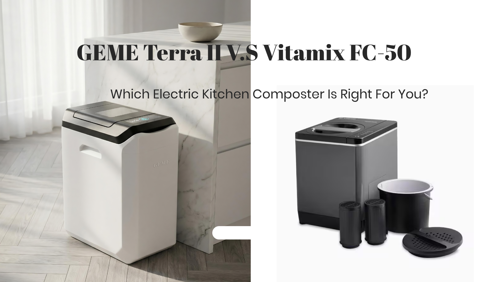
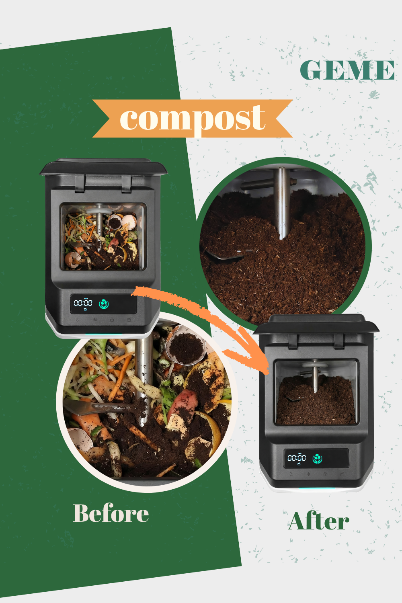

import GemeTerra2CTA from '@site/src/components/GemeTerra2CTA' 
import GemeComposterCTA from '@site/src/components/GemeComposterCTA' 
import RelatedArticles from '@site/src/components/RelatedArticles'
import ReactPlayer from 'react-player'

## Introduction: 30 Seconds to Understand the Difference

If you are searching for a **kitchen composter** and weighing up the GEME Terra 2 against the Vitamix FoodCycler FC-50, you need to know this upfront: these two machines sit in entirely different categories. **The FoodCycler is an electric food dehydrator and grinder**. [**The GEME Terra 2 is a Continuous Aerobic Bio-Processor**](https://www.geme.bio/product/terra2?utm_medium=blog&utm_source=geme_website&utm_campaign=general_seo_content&utm_content=geme-terra-2-vs-vitamix-foodcycler). One dries and grinds food waste into a sterile powder; the other biologically decomposes it into real, soil-ready compost. This distinction is not marketing fluff. It is science, confirmed by multiple independent testers and even by the dehydrator manufacturers themselves.

As the market for **electric composter** appliances has expanded rapidly over the past few years, so has the confusion around what these machines actually do. Products that share a similar sustainability pitch often use completely different technologies and produce fundamentally different outputs, as independent industry analysts have been pointing out since the first wave of these devices appeared. The purpose of this guide is to break down exactly what each machine does, what it costs over time, what kind of material it produces, and which one genuinely deserves the title of **best composter** for your home.

<!-- truncate -->

## Table Of Content

1. [**Two Fundamentally Different Machines: At a Glance**](#1-at-a-glance-two-fundamentally-different-machines)

2. [**Core Technology: Physical Dehydration vs. Biological Transformation**](#2-core-technology-physical-dehydration-vs-biological-transformation)

3. [**Output Comparison: What Each Machine Actually Produces**](#3-output-comparison-what-each-machine-actually-produces)

4. [**Odor Control: Disposable Filters vs. Permanent Catalyst**](#4-odor-control-disposable-filters-vs-permanent-catalyst)

5. [**Long-Term Cost: The Hidden Trap of Lower Upfront Prices**](#5-long-term-cost-the-hidden-trap-of-lower-upfront-prices)

6. [**Daily Usage: Batch Processing vs. Continuous Feed**](#6-daily-usage-batch-processing-vs-continuous-feed)

7. [**What the Industry Admits About Dehydrators**](#7-what-the-industry-admits-about-dehydrator-composters)

8. [**Decision Guide: Which Machine Is Right for You?**](#8-decision-guide-which-machine-is-right-for-you)

9. [**Frequently Asked Questions (Answered)**](#9-frequently-asked-questions-answered)

## 1. At a Glance: Two Fundamentally Different Machines

| Dimension | Vitamix FoodCycler FC-50 | GEME Terra 2 |
|---|---|---|
| **Category** | Electric food dehydrator and grinder | Continuous Aerobic Bio-Processor; Real Composter |
| **Core Technology** | Heat drying plus mechanical pulverization (3-stage cycle) | 46-strain [**Kobold** thermophilic microbial consortium](https://www.geme.bio/kobold-introduction) plus AI-managed aerobic digestion |
| **End Product** | Dry, sterile "EcoChips" powder | Moist, microbe-active compost base |
| **Biological Activity** | None; heat sterilization kills all microbes | High; living *Bacillus* strains continue working in soil |
| **Odor Control** | Replaceable activated carbon filters | Permanent Metal-Ion Oxidation Catalyst (lifetime, no replacement needed) |
| **Annual Filter Cost** | ~\$50–\$300 depending on usage | \$0 |
| **3-Year Total Ownership** | ~\$450–\$1,300 | ~\$599 |
| **Continuous Feed** | No; batch cycle, must wait 4–8 hours | Yes; add anytime, 24/7 operation |
| **Handles Meat and Dairy** | Not recommended for heavy use | Yes; including small bones |

The headline prices may not look dramatically different at first glance, but the total cost of ownership, the quality of what you get out of the machine, and the daily user experience are worlds apart. Here is why that gap exists and why it matters for anyone looking for a true **electric composter** for their kitchen.

<GemeTerra2CTA 
 imgSrc="/img/geme-terra-2-composter.jpg"
 productTitle="GEME Terra II: Real Kitchen Composter"
 features={[
    "✅ The Best Kitchen Composter in 2026",
    "✅ Biologically Active Composting System",
    "✅ Quiet, Odour-Free, Real Compost",
    "✅ Zero Filter Costs, No Refills",
    "✅ Reduces Composting Time to Days"
 ]}
buttonText="Explore GEME Terra II"
  href="https://www.geme.bio/product/terra2?utm_medium=blog&utm_source=geme_website&utm_campaign=general_seo_content&utm_content=geme-terra-2-vs-vitamix-foodcycler"
/>

## 2. Core Technology: Physical Dehydration vs. Biological Transformation

### How the Vitamix FoodCycler Works

The FoodCycler FC-50 operates using what the manufacturer describes as an automated three-stage cycle: drying, grinding, and cooling. According to {rel="nofollow"} <a href="https://www.breville.com/en-au/product/bwr550" rel="nofollow">Breville's official product page</a>, the machine *"dehydrates, grinds and cools down your food waste while filtering odours and methane gasses."* During the drying stage, food scraps inside the machine are heated until all moisture is driven off. Then blades pulverize the now-dry material into small particles. Finally, the cooling stage brings the resulting material down to room temperature. A full batch cycle typically takes anywhere from four to eight hours depending on what and how much you loaded in. The output is what Breville calls "EcoChips," a dry, sterile powder reduced to about 80% of its original volume. **The company itself calls the FoodCycler a food recycler and bills it as "the fast and easy alternative to composting", not as a composter**

What you need to understand is that this process is entirely physical. The FoodCycler does not break down food through microbial activity. It cooks the water out and then grinds what is left. As {rel="nofollow"} <a href="https://www.reviewed.com/cooking/content/vitamix-eco-5-foodcycler-review" rel="nofollow">Reviewed.com pointed out in their test of the Eco 5 model</a>, while many people call these gadgets kitchen composters, *"they don't actually compost your food scraps. True composting requires food and organic matter to decompose, and this process takes time."* The resulting material looks like soil because it has been ground fine, but it has not undergone any biological transformation. **It is essentially dehydrated food dust**

The technology is not new. It is a miniaturized version of industrial food dehydrators that have existed for decades. The innovation is putting it in a countertop appliance, adding a carbon filter for odor control, and marketing it as a sustainability solution. For many households, that is genuinely useful: the machine does reduce the volume of food waste going to landfill, and it does eliminate the smell of rotting scraps in the kitchen bin. **But it does not produce compost**, and understanding that distinction is essential before you decide which machine is right for you.

### How the GEME Terra 2 Works

The GEME Terra 2 operates on a fundamentally different principle: biological decomposition driven by living microorganisms. According to [GEME's official explanation of how their composters work](https://www.geme.bio/how-it-works), the machine **"replicates the conditions of a compost pile while keeping everything contained and odor-free."** Unlike dehydrators that rely on heat alone, the Terra 2 *"maintains an ideal environment for the special microbes (GEME Kobold) to break down bio-waste. This environment mimics the natural composting process but speeds it up and keeps it contained."*

At the heart of this process is the [GEME Kobold microbial consortium](https://www.geme.bio/geme-kobold), a carefully selected blend of 46 heat-tolerant aerobic *Bacillus* strains. These are not genetically engineered organisms; they are naturally occurring composting bacteria that have been selected and adapted specifically for the realities of household kitchen waste: cooked foods, oils, salts, and variable input mixes. The [Kobold introduction page](https://www.geme.bio/kobold-introduction) explains that these microbes are *"heat-tolerant aerobes"* selected to stay stable *"across the operating range GEME maintains"* and to handle *"cooked food variability, salt, oil, and mixed leftovers."*

The biological process works like this: you drop food scraps into the machine. The Kobold microbes, living in a temperature-controlled environment optimized for their activity, begin breaking down complex organic compounds immediately. Through aerobic respiration, they convert up to 95% of the input mass into carbon dioxide and water vapor. **The remaining approximately 5% becomes a moist, nutrient-rich, microbe-active compost base**. This is not a physical grinding process. It is the same biological decomposition that happens on a forest floor or in a well-managed backyard compost pile, except accelerated dramatically by the machine's precise environmental controls and contained so that no odors escape into your kitchen.

One critical design difference deserves emphasis. The Terra 2 is a floor-standing unit, designed to sit on your kitchen floor like a traditional trash bin. It is not a countertop appliance. The 14L chamber and heavy-duty 19.5 kg chassis reflect an industrial engineering philosophy: this is a machine built for continuous, daily operation in a high-load household, not an occasional-use gadget.

### The Scientific Consensus: Dehydration Is Not Composting

The [Illinois Food Scrap & Composting Coalition (IFSCC) published a landmark explainer in September 2025](https://illinoiscomposts.org/education-and-outreach/debunking-the-myth-food-scrap-dehydrators-are-not-composters/) that directly addresses machines like the FoodCycler. The IFSCC, a coalition of composting professionals and educators, states clearly: *"Food scrap dehydrators do not actually compost."* They explain that dehydrators *"use heat, agitation, and airflow to rapidly dry and grind food scraps into a fine, soil-like material,"* but what is left behind *"is typically a sterilized, dehydrated food powder, not the biologically active, nutrient-rich humus that results from true composting."*

The IFSCC goes on to detail why this matters for anyone who wants to use the output in their garden. *"Composting is a natural, biological process that involves the breakdown of organic material by microorganisms... Over time, typically months, these organisms transform food scraps, yard trimmings, and other organics into compost: a dark, crumbly substance full of beneficial microbes, nutrients, and organic matter that improves soil health."* Dehydrators take the opposite approach: *"Dehydrators, on the other hand, use heat to kill bacteria and microbes, essentially sterilizing the material. There is no decomposition or microbial activity involved, meaning the end product is not biologically alive and does not provide the same benefits to soil as finished compost does."*

This is not a minor semantic distinction. As {rel="nofollow"} <a href="https://www.reencle.com.sg/post/why-dehydrated-food-waste-isn-t-a-real-compost" rel="nofollow">Reencle Singapore explained in a 2024 deep dive</a>, dehydrated food waste *"lacks the microbial life essential for compost's benefits to soil and plants. While dehydration reduces mass and volume, it doesn't break down the organic material into the humus-like substance that defines true compost."* The key point is that dehydrated material has not undergone microbial decomposition. It may look like soil, but it does not function like soil. It does not contain the beneficial microbes that help release nutrients to plants. And as the IFSCC warns, applying it directly to garden soil *"may still need time to break down in the soil and could temporarily tie up nitrogen during that process"*, a phenomenon known as nitrogen drawdown that can actually starve plants of the nutrients they need.

The Compost Culture, a well-known independent review site that has tested both the FoodCycler and the GEME, put it succinctly in their [GEME electric kitchen composter review](https://www.thecompostculture.com/geme-electric-kitchen-composter-review/): "The FoodCycler electric composters on the market were countertop machines that dehydrate and grind up food waste. **This type of electric composter does not technically make compost as a finished product**. Instead, the food is ground up into a fine powder that makes it easy to throw in your yard or mix with soil." The reviewer confirmed that after personally using both the Lomi and the FoodCycler, the finished product was *"ground up food waste"* rather than compost. **The GEME, by contrast, "is different because it is microbe based, continuously composts, and makes compost as a finished product."**

## 3. Output Comparison: What Each Machine Actually Produces

### FoodCycler Output: Sterile EcoChips

The FoodCycler produces what Breville markets as "EcoChips," a dry, odorless, sterile powder. {rel="nofollow"} <a href="https://www.breville.com/en-au/product/bwr550" rel="nofollow">Breville's product page</a> states that the machine *"transforms your food waste into sterile and odourless EcoChips."* The company recommends mixing these EcoChips into the topsoil of indoor and outdoor plants. But the critical word in that description is "sterile." The material has been heated to temperatures that kill all microorganisms, beneficial and harmful alike. This means there is no biological activity remaining in the output. When you mix EcoChips into your garden soil, you are adding organic matter that still needs to decompose further before plants can access its nutrients.

This is not a secret. FoodCycler's parent company Food Cycle Science has acknowledged in various product descriptions that the machine produces *"a dry, sterile, and nutrient-rich soil amendment"* rather than compost. A soil amendment is a material you add to soil to improve its physical properties. Compost is a biologically active material that adds both nutrients and beneficial microorganisms. These are different things, and the distinction has real consequences for anyone who wants to use the output immediately on their plants.

### GEME Terra 2 Output: Living, Microbe-Active Compost

The GEME Terra 2 produces a fundamentally different material. [GEME's 2026 composter review](https://www.geme.bio/blog/geme-composter-review-2026-geme-pro) describes the Terra 2 as **"a genuine biological processing unit that lives in your kitchen and quietly turns your food scraps into actual, usable compost"**. The output is moist, dark, crumbly, and smells earthy, like a healthy forest floor. It contains living microorganisms from the Kobold consortium that continue working in the soil after application, gradually releasing nutrients in a form that plant roots can absorb.

[Kitchen Compost Bins' real-world test of the Terra 2](https://kitchencompostbins.com/real-world-test-geme-terra-2-performance-2/) confirmed that the finished compost was **"dry, fine, and odor-neutral"** and suitable for garden application. Notably, the moisture content was described as below 10%, which is low enough for easy handling while retaining the biological activity that distinguishes real compost from dehydrated powder. A separate [detailed review by Kitchen Compost Bins](https://kitchencompostbins.com/geme-terra-2-pros-cons-verdict-2/) noted that the Terra 2 **"converts daily kitchen scraps into nutrient-rich compost within hours"** and highlighted the machine's efficient composting cycle of under eight hours.

The most vivid real-world description comes from the [Backyard Farmer review cited in GEME's 2026 composter roundup](https://www.geme.bio/blog/geme-composter-review-2026-geme-pro). The reviewer described the output this way: **"The material was dark, crumbly, and smelled earthy. It wasn't dried, dusty, or sterile. It was real, biologically active compost ready to be mixed into my garden soil."** That is the difference in a nutshell. One machine gives you sterile, dusty powder that still needs to decompose. The other gives you real compost that is ready to feed your plants immediately.

GEME recommends mixing the finished compost into potting soil or garden beds at a ratio of roughly 1:8 or 1:10, compost to soil. The compost continues to mature in the soil, slowly releasing nutrients and improving soil structure over time. This is how real compost works. It builds humus, improves water retention, and feeds the complex web of soil life that supports healthy plant growth.

## 4. Odor Control: Disposable Filters vs. Permanent Catalyst

The difference in odor control technology between these two machines is one of the most consequential factors for long-term cost and convenience, and it directly reflects the difference between dehydrator engineering and industrial-grade biological system engineering.

### FoodCycler: Carbon Filters That Saturate and Cost Money

The FoodCycler relies on replaceable activated carbon filters to trap odors generated during the drying cycle. According to the product page, these EcoFilters are *"designed with activated carbon filtration to direct air flow and filter odours during cycling."* The filters have a finite lifespan. They saturate over time as they adsorb volatile organic compounds from the heated food waste, and **once saturated, they must be replaced**.

The real-world cost of these replacements is substantial. [An Amazon reviewer in Canada](https://arcus-www.amazon.ca/gp/customer-reviews/R26VS3DWSNA4PZ?ASIN=B08QTSPBDQ) reported in January 2024: **"These carbon filters are essential for the Vitamix Food Cycler and need to be changed every 3-4 months, which can become a bit expensive at \$30 per package. That's basically \$120/yr to operate your food cycler."** The reviewer also noted a waste concern: *"The plastic container of the carbon pellets is not recyclable so it has to go in your garbage."*

Australian consumer advocacy group {rel="nofollow"} <a href="https://www.choice.com.au/shonky-awards/hall-of-shame/shonkys-2021/breville-foodcycler/" rel="nofollow">CHOICE awarded the Breville FoodCycler a Shonky Award</a> in 2021, calculating that *"the cost of replacing the filters and other parts"* ran to **"\$223 a year."** Combined with energy costs of about \$86 a year and the initial \$499 purchase price, CHOICE estimated that over a five-year period **"the FoodCycler would set you back about \$2000."** Even Breville's own response to CHOICE, documented by {rel="nofollow"} <a href="https://www.applianceretailer.com.au/breville-responds-to-choices-shonky-award-claims/" rel="nofollow">Appliance Retailer</a>, acknowledged filter costs of around \$120 per year under typical usage, with the company noting that *"a typical household running the machine three to five times per week will likely require filter replacements every three to six months."*

The real-world variability in filter costs is even more striking. [HappiestKitchen, in a 2025 deep dive into the science of moisture and cost in food recyclers](https://www.happiestkitchen.com/post/detail/182/), documented a user reviewing a FoodCycler Eco 5 who reported that **"the charcoal filter has required replacing the pellets much more often than expected, at least every month. The \$25 for each replacement means an annual cost of \$300."** The article explains why this happens: these machines are fundamentally dehydrators. Wet food scraps produce large volumes of steam that physically saturate the carbon filter's pores, and the volatile organic compounds carried in that steam exhaust the filter's adsorption capacity far faster than many users expect. The article's analysis is worth quoting at length because it explains a cost dynamic that most buyers do not understand before purchasing: *"The filter's primary enemy is water. When you process super-wet scraps (like melon rinds, citrus, or old soup), you are maximizing the two things that destroy a carbon filter: high volume of steam that physically saturates the carbon pores, and high volume of VOCs that exhaust the filter's finite adsorption capacity."*

### GEME Terra 2: Permanent Metal-Ion Oxidation Catalyst

The Terra 2 takes a fundamentally different approach to odor control. Instead of using disposable carbon filters that trap odor molecules until they saturate, it uses a Metal-Ion Oxidation Catalyst that destroys odor-causing volatile organic compounds at the molecular level. This is the same principle used in industrial air treatment systems, miniaturized for home use.

[GEME's comparison table on their FAQ page](https://www.geme.bio/faq/geme-kobold/how-it-works) explicitly contrasts their system against dehydrators: where Lomi-style machines use *"Carbon filter, Replace every 3 months,"* the GEME uses **"Metal ion catalytic oxidation, No need to replace."** The catalyst is permanent. It does not saturate. It does not get clogged by steam. There is no filter to buy, no replacement schedule to remember, and no plastic waste stream from discarded carbon packs.

[The Compost Culture's review](https://www.thecompostculture.com/geme-electric-kitchen-composter-review/) highlighted this as a major advantage: *"The GEME doesn't use filters which is a huge benefit over the other electric composters on the market. The Lomi and the FoodCycler have filters that must be changed regularly."* And [GEME's 2026 review](https://www.geme.bio/blog/geme-composter-review-2026-geme-pro) put a number on the savings: **"Lomi owners spend an average of \$150–\$200 per year on filters. GEME costs \$0."**

Over a three- to five-year ownership period, the difference in filter costs alone can exceed the entire purchase price of the machine. This is not an incidental detail. It is a core design philosophy choice: build a machine with consumable parts that generate recurring revenue, or build a machine with permanent components that generate zero ongoing costs. The FoodCycler, like all dehydrator-style machines, follows the first model. The GEME Terra 2 follows the second.

<GemeTerra2CTA 
 imgSrc="/img/geme-terra-2-composter.jpg"
 productTitle="GEME Terra II: Real Kitchen Composter"
 features={[
    "✅ The Best Kitchen Composter in 2026",
    "✅ Biologically Active Composting System",
    "✅ Quiet, Odour-Free, Real Compost",
    "✅ Zero Filter Costs, No Refills",
    "✅ Reduces Composting Time to Days"
 ]}
buttonText="Explore GEME Terra II"
  href="https://www.geme.bio/product/terra2?utm_medium=blog&utm_source=geme_website&utm_campaign=general_seo_content&utm_content=geme-terra-2-vs-vitamix-foodcycler"
/>

## 5. Long-Term Cost: The Hidden Trap of Lower Upfront Prices

The upfront price tags tell only part of the story. The FoodCycler FC-50 typically costs less upfront than the GEME Terra 2. But the real cost of ownership emerges over time, through filter replacements that never stop.

| Cost Factor | Vitamix FoodCycler FC-50 | GEME Terra 2 |
|---|---|---|
| **Machine Price** | ~\$300–\$500 | ~\$599 |
| **Annual Filter Cost (Typical)** | ~\$50–\$120 | \$0 |
| **Annual Filter Cost (Heavy/Wet Use)** | Up to \$300 | \$0 |
| **Annual Energy Cost** | ~\$42–\$86 | ~\$55–\$75 |
| **3-Year Total (Typical)** | ~\$450–\$900 | ~\$599 |
| **5-Year Total (Typical)** | ~\$550–\$1,300 | ~\$599 |

These numbers come from the documented sources discussed above. [CHOICE's investigation](https://www.choice.com.au/shonky-awards/hall-of-shame/shonkys-2021/breville-foodcycler/) found that the FoodCycler's five-year total cost approached \$2,000 Australian dollars. [HappiestKitchen's analysis](https://www.happiestkitchen.com/post/detail/182/) documented the \$300 annual filter cost extreme. {rel="nofollow"} <a href="https://www.applianceretailer.com.au/breville-responds-to-choices-shonky-award-claims/" rel="nofollow">Breville's own response</a> acknowledged at least \$120 per year in filter costs under moderate use. The Amazon reviewer confirmed the same \$120 annual estimate from personal experience.

The GEME Terra 2 has none of these ongoing costs. The permanent metal-ion catalyst is designed to last the lifetime of the machine. The Kobold microbial culture is self-sustaining; as the [Kobold introduction page](https://www.geme.bio/kobold-introduction) explains, *"Kobold forms a self-sustaining microbial ecosystem that remains active as long as food waste is added. No routine care."* There is an optional Boost Pack for users who want to accelerate processing after their first compost harvest, but it is explicitly not required for daily operation. The machine's ongoing costs are effectively limited to electricity, which is roughly equivalent to what the FoodCycler uses.

What this means in practical terms is that within approximately two to three years of ownership, the total amount a FoodCycler owner has spent, including filter replacements, equals or exceeds what a Terra 2 owner paid upfront. And every year after that, the gap widens. The Terra 2 owner pays nothing extra. The FoodCycler owner keeps buying filters. After five years, the cost difference could be enough to buy a second Terra 2.

## 6. Daily Usage: Batch Processing vs. Continuous Feed

### FoodCycler: Batch Cycles with Locked Lid

The FoodCycler operates as a batch processor. You load the bucket, lock the lid, press start, and the machine runs its drying, grinding, and cooling cycle for anywhere from four to eight hours. During that entire time, you cannot add more food waste. If you cook a meal and generate new scraps mid-cycle, you have to store them somewhere else until the machine finishes. The 2L bucket on the FC-50 fills up quickly for a household that cooks regularly. <a href="https://www.reviewed.com/cooking/content/vitamix-eco-5-foodcycler-review" rel="nofollow">Reviewed.com noted in their test</a> that the older FC-50 model's 2.5L bucket *"fills up very quickly, especially if you're making a meal that includes a lot of vegetables,"* requiring multiple runs per week.

There are also input restrictions. FoodCycler's documentation recommends avoiding hard items like fruit pits, large bones, nuts, hard shells, gum, and candy. High concentrations of a single food type, **especially oily or wet foods, are also discouraged because they can extend cycle times, strain the filter, and produce inconsistent results**.

### GEME Terra 2: Continuous Feed, 24/7

The Terra 2 is designed for continuous feed. You do not wait for a cycle to complete. You do not press a start button. You simply kick the bottom-front panel to open the lid, drop in your food scraps, close the lid, and walk away. The Kobold microbes process continuously in the background, 24 hours a day, seven days a week.

[The Compost Culture's review](https://www.thecompostculture.com/geme-electric-kitchen-composter-review/) described this as one of the most significant practical advantages of the GEME: **"The coolest thing about the GEME composter is that you continuously add food to the compost system and empty it when it gets full (typically every 2 months for a household of 5). Once full, it is ready to use in your garden as true finished compost."** The [2026 GEME review](https://www.geme.bio/blog/geme-composter-review-2026-geme-pro) further emphasized this convenience: *"Continuous feed is a game changer. With batch machines, you have to fill the bucket and then wait hours for a cycle to finish. With GEME, you just lift the lid and toss them in. Anytime."*

The Terra 2's 14L chamber and 2 kg daily processing capacity make it suitable for households of up to five people. It **handles the full range of kitchen waste, including meat, dairy, fish, small bones, and greasy leftovers**, items that dehydrator-style machines either cannot process or process poorly. The Kobold microbes are specifically selected for their ability to break down high-protein, high-fat inputs without odor spirals, and the permanent metal-ion catalyst ensures that no smells escape regardless of what you feed the machine.

When compost is ready, typically after several weeks of continuous feeding and processing, you simply scoop it out of the fixed chamber and use it. There is no filter to replace, no subscription to renew, and no batch cycle to schedule your cooking around.amber supports up to 2 kg of daily input, making it suitable for households of up to three people**.

👉 [Learn More About GEME Terra II](https://www.geme.bio/product/terra2?utm_medium=blog&utm_source=geme_website&utm_campaign=general_seo_content&utm_content=geme-terra-2-vs-vitamix-foodcycler)

👉 [Learn More About GEME Pro for Big Households/Plant Shops/Restaurants](https://www.geme.bio/product/geme?utm_medium=blog&utm_source=geme_website&utm_campaign=general_seo_content&utm_content=?utm_medium=blog&utm_source=geme_website&utm_campaign=general_seo_content&utm_content=geme-terra-2-vs-vitamix-foodcycler)

## 7. What the Industry Admits About Dehydrator "Composters"

Perhaps the most telling evidence in this comparison comes not from GEME but from independent testers, consumer advocacy groups, and even the dehydrator manufacturers themselves.

[Reviewed.com](https://www.reviewed.com/cooking/content/vitamix-eco-5-foodcycler-review) opened their FoodCycler review with a clarification: *"While a lot of people call these gadgets 'kitchen composters,' I think it's important to note that they don't actually compost your food scraps."* They explained that true composting *"requires food and organic matter to decompose, and this process takes time, it can't be done in a few hours. Instead, the FoodCycler dries out and shreds up food waste."*

The [IFSCC's position](https://illinoiscomposts.org/education-and-outreach/debunking-the-myth-food-scrap-dehydrators-are-not-composters/) is unambiguous: dehydrators are not composters, their output is not compost, and calling it compost confuses consumers. *"Calling dehydrated scraps 'compost' confuses consumers, weakens compost education efforts, and distorts public understanding of sustainable waste practices."*

[CHOICE](https://www.choice.com.au/shonky-awards/hall-of-shame/shonkys-2021/breville-foodcycler/) gave the FoodCycler a Shonky Award specifically because the total cost of ownership was so high relative to the environmental benefit. Their home economist suggested *"a much cheaper way to break down your food waste: 'Just use a plastic container with a lid, commonly known as a compost bin.'"*

[The Compost Culture](https://www.thecompostculture.com/geme-electric-kitchen-composter-review/) confirmed from personal experience with multiple machines: *"I've personally used both brands and been happy with the results, but as previously stated, the finished product is ground up food waste that makes it easier to keep out of a landfill, the finished product is not compost."*

None of this is to say that dehydrator-style machines are useless. They serve a real purpose for households that want to reduce the volume of food waste going to landfill and eliminate kitchen odors without maintaining a traditional compost pile. They are convenient, clean, and effective at what they do. But what they do is not composting. Understanding this distinction is the single most important step in deciding which machine is right for your home.

<GemeTerra2CTA 
 imgSrc="/img/geme-terra-2-composter.jpg"
 productTitle="GEME Terra II: Real Kitchen Composter"
 features={[
    "✅ The Best Kitchen Composter in 2026",
    "✅ Biologically Active Composting System",
    "✅ Quiet, Odour-Free, Real Compost",
    "✅ Zero Filter Costs, No Refills",
    "✅ Reduces Composting Time to Days"
 ]}
buttonText="Explore GEME Terra II"
  href="https://www.geme.bio/product/terra2?utm_medium=blog&utm_source=geme_website&utm_campaign=general_seo_content&utm_content=geme-terra-2-vs-vitamix-foodcycler"
/>

## 8. Decision Guide: Which Machine Is Right for You?

### The Vitamix FoodCycler FC-50 Might Be Sufficient If:

- Your primary goal is reducing the volume of food waste that goes into your trash bin, and you are **not particularly concerned about producing real compost** for your plants.
- You **have a system for dealing with the dry output**, whether that is burying it in a garden bed for further decomposition, adding it to an outdoor compost pile, or disposing of it.
- Your upfront budget is limited, and you are willing to **accept ongoing filter replacement costs** that will accumulate over time.
- You generate relatively small amounts of food waste and **do not need continuous-feed capability**.
- You **do not regularly process large quantities of meat, dairy, greasy foods, or small bones**.

### The GEME Terra 2 Is the Better Choice If:

- **You want genuine, biologically active compost** that you can actually use to enrich the soil for your houseplants, balcony garden, or outdoor beds immediately, without a secondary decomposition step.
- **You refuse to pay recurring filter fees year after year**. The permanent metal-ion catalyst means you buy the machine once, and the odor control system works for the lifetime of the device with zero additional expense.
- **You need continuous-feed operation**. You do not want to store food scraps on your counter while waiting for a batch cycle to finish. You want to add waste anytime, day or night, exactly as you would with a normal kitchen bin.
- **Your household generates diverse food waste**, including meat scraps, dairy leftovers, fish, small bones, and oily foods, and you want a single machine that handles all of it without restrictions.
- **You are thinking long-term**. The Terra 2's total cost of ownership is lower than the FoodCycler's after roughly two to three years, and the gap continues to widen every year after that. You get real compost instead of sterile powder, and you never have to think about ordering replacement filters.

If you only need volume reduction and are comfortable with the ongoing filter expense, the FoodCycler is a capable food recycler. But if you want **a genuine kitchen composter that produces real compost, operates continuously, and never charges you another dollar after purchase, the GEME Terra 2 is the clear choice**.

## 9. Frequently Asked Questions (Answered)

### Q: Does the Vitamix FoodCycler FC-50 actually make real compost?

> A: No. The FoodCycler uses heat, grinding, and dehydration to reduce food waste volume. It produces a dry, sterile powder that the manufacturer itself calls EcoChips, not compost. As the [IFSCC has documented](https://illinoiscomposts.org/education-and-outreach/debunking-the-myth-food-scrap-dehydrators-are-not-composters/), food scrap dehydrators *"do not actually compost"* and their output *"is typically a sterilized, dehydrated food powder, not the biologically active, nutrient-rich humus that results from true composting."* [Reviewed.com](https://www.reviewed.com/cooking/content/vitamix-eco-5-foodcycler-review) reached the same conclusion in their independent testing.

### Q: What is the difference between FoodCycler EcoChips and GEME Terra 2 compost?

> A: FoodCycler EcoChips are dry, sterile, dehydrated food particles. They have no living microorganisms and may still need to decompose further in soil before plants can access their nutrients. GEME Terra 2 produces a moist, microbe-active compost base that contains living *Bacillus* bacteria. It is biologically active and can be mixed directly into potting soil or garden beds at a 1:8 or 1:10 ratio. As [The Compost Culture noted](https://www.thecompostculture.com/geme-electric-kitchen-composter-review/), the GEME output is *"true finished compost,"* not ground-up food waste.

### Q: Can the GEME Terra 2 handle meat, dairy, and bones?

> A: Yes. The [Kobold microbial consortium](https://www.geme.bio/kobold-introduction) was specifically selected to handle *"cooked food variability, salt, oil, and mixed leftovers."* The 46-strain *Bacillus* culture breaks down high-protein and high-fat inputs that dehydrators and worm bins cannot process effectively. Small bones such as chicken wing bones and fish bones are broken down during the mixing cycle. Large dense bones and hard shells like oyster or clam shells should be avoided.

### Q: How much does the FoodCycler really cost to run per year?

> A:  The answer varies with usage, but documented costs range from approximately \$120 per year under moderate use (based on <a href="https://www.applianceretailer.com.au/breville-responds-to-choices-shonky-award-claims/" rel="nofollow">Breville's own estimate</a>) to \$223 per year (based on <a href="https://www.choice.com.au/shonky-awards/hall-of-shame/shonkys-2021/breville-foodcycler/" rel="nofollow">CHOICE's independent calculation</a>) to as much as \$300 per year for households processing wet, heavy food waste loads (based on <a href="https://www.happiestkitchen.com/post/detail/182/" rel="nofollow">HappiestKitchen's documented user report</a>). These costs are exclusively for replacement carbon filters, which are consumable parts that must be replaced every few months.

### Q: Which electric kitchen composter is best for a large family?

> A: The GEME Terra 2 is better suited for larger households. Its 14L chamber and 2 kg daily processing capacity accommodate the food waste output of up to three people. The continuous-feed design means multiple family members can add scraps throughout the day without coordinating around a batch cycle. The machine runs 24/7 in the background and can handle the full range of kitchen waste a large household generates, including meat, dairy, and small bones, without odor issues or filter replacements.

### Q: Which is the best kitchen composter for a small apartment?

> A: For apartments with no outdoor space, a real electric composter like the GEME Terra II is ideal because it produces finished compost you can use on indoor plants immediately, with no extra subscriptions or outdoor piles required. Check this post: [**The Best Composter For Small Kitchen**](https://www.geme.bio/blog/the-best-composter-for-kitchen)

### Q: Why aren't dehydrator machines like FoodCycler considered composters?

> A: Because they don't biologically decompose food waste. They heat and grind scraps into a dry powder that is sterile, not compost. It still needs to break down in soil and can harm plants if used directly. Real composting always involves microbial digestion.

> **Check the following posts**: 

> 1. [**Does the Lomi Composter Really Compost? Lomi vs GEME Terra 2**](https://www.geme.bio/blog/does-lomi-composter-really-compost)
> 2. [**Does Mill Composter Produce Real Compost?**](https://www.geme.bio/blog/does-mill-composter-pruduce-compost)
> 3. [**GEME Terra 2 vs FoodCycler: Which Is The Real Kitchen Composter?**](https://www.geme.bio/blog/real-kitchen-composter-geme-terra-2-vs-foodcycler)

**Stop feeding the bin. Earth it with the GEME Terra 2.**

[Learn More About the GEME Terra 2 →](https://www.geme.bio/product/terra2?utm_medium=blog&utm_source=geme_website&utm_campaign=general_seo_content&utm_content=geme-terra-2-vs-vitamix-foodcycler)

<GemeTerra2CTA 
 imgSrc="/img/geme-terra-2-composter.jpg"
 productTitle="GEME Terra II: Real Kitchen Composter"
 features={[
    "✅ The Best Kitchen Composter in 2026",
    "✅ Biologically Active Composting System",
    "✅ Quiet, Odour-Free, Real Compost",
    "✅ Zero Filter Costs, No Refills",
    "✅ Reduces Composting Time to Days"
 ]}
buttonText="Explore GEME Terra II"
  href="https://www.geme.bio/product/terra2?utm_medium=blog&utm_source=geme_website&utm_campaign=general_seo_content&utm_content=geme-terra-2-vs-vitamix-foodcycler"
/>

<GemeComposterCTA 
 imgSrc="/img/geme-bio-composter.jpg"
 productTitle="GEME Pro: Real Kitchen Composter"
 features={[
    "✅ The Best Kitchen Composting Solution",
    "✅ Produce Soil-Ready Compost For Plant Growth",
    "✅ Quiet, Odor-Free, Quick(6-8 hours)",
    "✅ Large Capacity (19 L) For Daily Waste"
  ]}
buttonText="Get Your GEME Pro"
  href="https://www.geme.bio/product/geme?utm_medium=blog&utm_source=geme_website&utm_campaign=general_seo_content&utm_content=?utm_medium=blog&utm_source=geme_website&utm_campaign=general_seo_content&utm_content=geme-terra-2-vs-vitamix-foodcycler"
/>

## Cited Sources

Cited Sources

1. Illinois Food Scrap & Composting Coalition. (2025, September). <a href="https://illinoiscomposts.org/education-and-outreach/debunking-the-myth-food-scrap-dehydrators-are-not-composters/" rel="nofollow">*Debunking the Myth: Food Scrap Dehydrators Are Not Composters*</a>.

2. The Compost Culture. (2023, August). <a href="https://www.thecompostculture.com/geme-electric-kitchen-composter-review/" rel="nofollow">*GEME Electric Kitchen Composter Review*</a>.

3. Reviewed.com. (2023, June). <a href="https://www.reviewed.com/cooking/content/vitamix-eco-5-foodcycler-review" rel="nofollow">*This Small Appliance Turns Food Scraps Into Gardening Gold, and We Love It*</a>.

4. Breville. (n.d.). <a href="https://www.breville.com/en-au/product/bwr550" rel="nofollow">*the FoodCycler® Product Page*</a>.

5. Reencle Singapore. (2024, November). <a href="https://www.reencle.com.sg/post/why-dehydrated-food-waste-isn-t-a-real-compost" rel="nofollow">*Why Dehydrated Food Waste Isn't a Real Compost*</a>

6. HappiestKitchen. (2025, November). <a href="https://www.happiestkitchen.com/post/detail/182/" rel="nofollow">*Beyond the 'Start' Button: The Science of Moisture and Cost in Food Recyclers*</a>

7. CHOICE Australia. (2021, November). <a href="https://www.choice.com.au/shonky-awards/hall-of-shame/shonkys-2021/breville-foodcycler/" rel="nofollow">*Breville FoodCycler — Shonky Awards*</a>.

8. Appliance Retailer. (2021, November). <a href="https://www.applianceretailer.com.au/breville-responds-to-choices-shonky-award-claims/" rel="nofollow">*Breville Responds to CHOICE's Shonky Award Claims*</a>.

9. Amazon.ca Customer Review. (2024, January). <a href="https://arcus-www.amazon.ca/gp/customer-reviews/R26VS3DWSNA4PZ?ASIN=B08QTSPBDQ" rel="nofollow">*Vitamix FoodCycler Replacement 2-Pack Filter*</a>

10. GEME. (n.d.). [*How Does It Work? GEME Composter FAQ*](https://www.geme.bio/how-it-works).

11. GEME. (n.d.). [*GEME Kobold: Revolutionary Compost Starter & Food Waste Recycling Technology*](https://www.geme.bio/geme-kobold).

12. GEME. (n.d.). [*GEME Kobold: Industrial Thermophiles Trained for Your Kitchen*](https://www.geme.bio/kobold-introduction).

13. GEME. (2026, April). [*GEME Composter Review 2026: Real Compost, No Filter Costs*](https://www.geme.bio/blog/geme-composter-review-2026-geme-pro).

14. Kitchen Compost Bins. (2025, December). <a href="https://kitchencompostbins.com/real-world-test-geme-terra-2-performance-2/" rel="nofollow">*Real-World Test: GEME Terra 2 Performance*</a>.

15. Kitchen Compost Bins. (2025, December). <a href="https://kitchencompostbins.com/geme-terra-2-pros-cons-verdict-2/" rel="nofollow">*GEME Terra 2: Pros, Cons & Verdict*</a>.

<RelatedArticles
  slugs={[
  "real-kitchen-composter-geme-terra-2-vs-foodcycler",
  "best-electric-kitchen-composter-2026",
  "geme-terra-2-the-best-kitchen-composting-solution",
  "odor-free-composting-options-for-apartments-2026",
  "does-mill-composter-pruduce-compost",
  "the-best-electric-kitchen-composter-mill-composter-vs-geme-terra-2",
  "geme-composter-mothers-day-discount",
  "mothers-day-geme-composter-discount-code",
  "best-home-composter-for-apartment-geme-vs-lomi",
  "the-best-kitchen-composter-for-zero-waste-lifestyle",
  "geme-terra-2-the-silent-gearbox",
  "geme-composter-amazon-discount-earth-day-2026",
  "how-to-avoid-leftover-food-poisoning-fried-rice-syndrome",
  "geme-composter-vs-diy-bokashi-composting",
  "permanent-odor-control-catalyst-path-vs-disposable-carbon",
  "why-the-geme-chassis-is-intentionally-heavier-than-a-typical-countertop-appliance",
  "geme-composter-review-2026-geme-pro",
  "how-to-fertilize-your-plants-in-spring",
  "how-to-plant-tulip-bulbs-in-spring-guide",
  "what-can-you-put-in-electric-composter-meat-dairy-bones",
  "electric-composter-salt-oil-boundaries",
  "advanced-geme-compost-application-guide",
  "countertop-composter-misnomer-floor-standing-electric-composter",
  "top-5-electric-composters-on-amazon-2026",
  "geme-terra-2-pros-and-cons",
  "top-5-kitchen-composters-pros-and-cons",
  "geme-composter-review-2026",
  "best-kitchen-composter-verdict-2026",
  "best-composter-avoid-recurring-fees-geme-terra-2",
  "how-to-compost-cut-flowers-guide",
  "how-long-does-bokashi-take-to-compost",
  "how-to-care-for-hydrangeas-and-change-colors",
  "best-composter-daily-operation-comparison-lomi-mill-reencle-geme",
  "how-long-does-pizza-last-in-fridge-guide",
  "how-to-compost-eggshells-guide-geme",
  "how-to-compost-coffee-grounds-guide",
  "never-buy-carbon-filter-for-your-composter",
  "best-composter-fastest-real-compost-geme-terra-2",
  "how-to-compost-at-home-beginners-guide",
  "how-long-can-chicken-stay-in-the-fridge",
  "how-to-reduce-odor-indoor-composting-tips",
  "how-long-can-ground-beef-stay-in-the-fridge",
  "nyc-composting-fines-2026-geme-terra-2-best-electric-compost",
  "best-indoor-composter-for-apartment-geme-vs-lomi",
  "the-best-composter-for-kitchen",
  "how-to-reduce-food-waste-during-spring-festival",
  "does-reencle-composter-produce-real-compost",
  "does-mill-composter-really-compost",
  "how-to-reduce-food-waste-at-home-2026",
  "free-mcnugget-caviar-raises-food-waste-concerns",
  "composting-in-winter",
  "how-to-compost-at-home",
  "zero-waste-home-kitchen-composter",
  "does-lomi-composter-really-compost",
  "5-best-kitchen-composters-in-2026",
  "best-kitchen-composter-in-2026-geme-terra-2",
  "geme-vs-reencle-composter-2026",
  "geme-vs-mill-composter-2026",
  "best-kitchen-composter-2026",
  "advanced-geme-compost-application-guide",
  "electric-compost-bin-filters-costs-comparison",
  "geme-vs-lomi", 
  "geme-terra-2-debuts",
  "the-best-composter-to-reduce-food-waste",
  "compost-pile-vs-electric-composter",
  "how-to-make-bananas-last-longer",
  "how-long-do-apples-last-in-the-fridge",
  "can-i-compost-moldy-grapes",
  "can-you-compost-moldy-bread",
  ]}
/>

_Ready to transform your gardening game? Subscribe to our [newsletter](http://geme.bio/signup?utm_medium=blog&utm_source=geme_website&utm_campaign=general_seo_content&utm_content=how-to-compost-at-home-beginners-guide) for expert composting tips and sustainable gardening advice._

