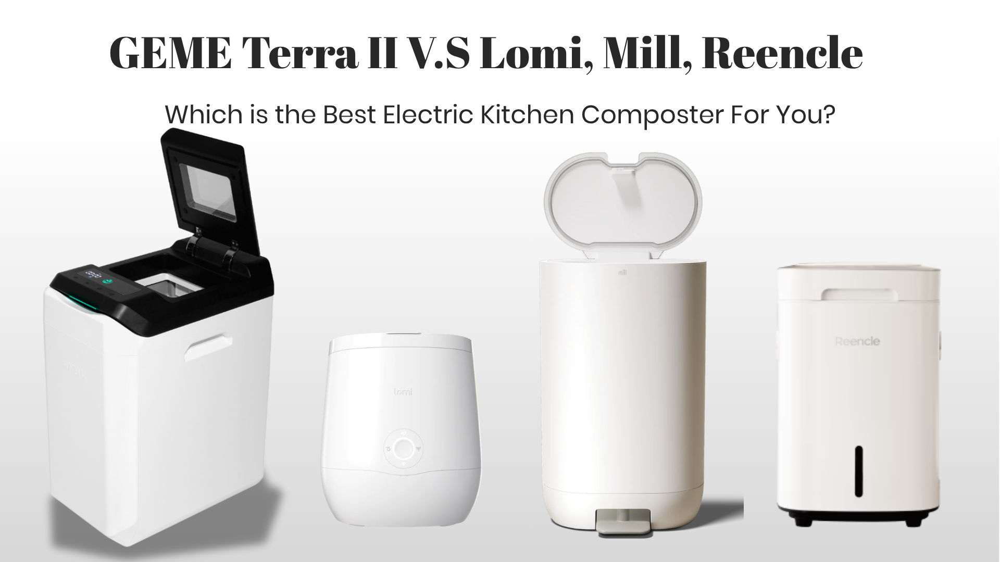
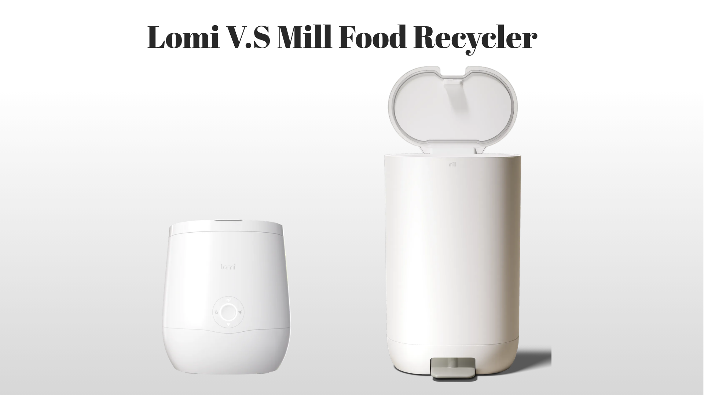

import GemeTerra2CTA from '@site/src/components/GemeTerra2CTA' 
import GemeComposterCTA from '@site/src/components/GemeComposterCTA' 
import RelatedArticles from '@site/src/components/RelatedArticles'
import ReactPlayer from 'react-player'

## Introduction: Welcome to the Electric Composter Maze

If you’ve been trying to pick a **kitchen composter** in 2026, you’ve likely noticed a confusing pattern. Nearly every product on the shelf promises to turn food waste into a gardening miracle. But scratch the surface, and you’ll find that half of them are secretly food dehydrators that just look like composters. The rest use real biology, but still ask you to keep buying replacement filters year after year. And then there is the GEME Terra 2. 

**GEME Terra 2 is a kitchen electric composter designed for real indoor composting at home.** It is a floor‑standing bio‑processor that creates genuine, biologically active compost from your kitchen scraps, and it does it without a single disposable filter or subscription fee. This guide puts four of the most discussed appliances side by side: Lomi, the Mill food recycler, Reencle Prime, and GEME Terra 2, so you can see exactly what each one does, what it really costs, and which one deserves the title of **best composter** for your home.

<!-- truncate -->

## Table Of Content

1. [**Understand the Two Different Worlds**](#1-understand-the-two-different-worlds)

2. [**The Dehydrator Camp: Lomi and Mill**](#2-the-dehydrator-camp-lomi-and-mill)

3. [**The Microbial Camp: Reencle and GEME**](#3-the-microbial-camp-reencle-and-geme)

4. [**Full Comparison Table**](#4-full-comparison-table)

5. [**Decision Guide: Which One Fits Your Home?**](#5-decision-guide-which-one-fits-your-home)

6. [**Frequently Asked Questions (Answered)**](#6-frequently-asked-questions-answered)

## 1. Understand the Two Different Worlds

### Dehydration vs. Composting: This Is the Core Distinction

The biggest lesson any informed buyer can learn in 2026 is that the **electric composter** market splits cleanly into two unrelated technologies. One group uses electricity to heat food waste until all its water evaporates, then pulverises the dried remains into a powder. The other group sustains a living culture of bacteria and fungi that biologically break down food waste into real, nutrient‑rich humus — exactly what happens in a well‑managed garden compost pile. As [Reencle’s 2026 Electric Composter Buyer’s Guide](https://reencle.co/blogs/news/electric-composter-buyers-guide) explains, dehydration machines are “excellent at volume reduction and odour suppression,” but “they do not produce garden‑ready compost.” Microbial composters, on the other hand, deliver material that has undergone genuine biological transformation, real compost.

The environmental and horticultural consequences are stark. An in‑depth analysis published by [SEEDS](https://ecoseeds.org/the-scoop-on-food-scrap-dehydrators/) in March 2026 looked at what happens when you apply dehydrated food powder directly to soil. The article documents that “dried food waste is not compost”, the heating process, which can reach 165°F to 275°F, “doesn’t biologically break it down.” The resulting material “lacks the microbial life, stability, safety, and nutrients that true compost offers.” Worse, tests showed that seeds often won’t sprout in soil mixed with dehydrated scraps, thanks to “high salt and chloride content, low moisture and pH, high electrical conductivity, and lack of microbial breakdown.” Those aren’t marketing quibbles; they are documented horticultural failures.

<GemeTerra2CTA 
 imgSrc="/img/geme-terra-2-composter.jpg"
 productTitle="GEME Terra II: Real Kitchen Composter"
 features={[
    "✅ The Best Kitchen Composter in 2026",
    "✅ Biologically Active Composting System",
    "✅ Quiet, Odour-Free, Real Compost",
    "✅ Zero Filter Costs, No Refills",
    "✅ Reduces Composting Time to Days"
 ]}
buttonText="Explore GEME Terra II"
  href="https://www.geme.bio/product/terra2?utm_medium=blog&utm_source=geme_website&utm_campaign=general_seo_content&utm_content=best-kitchen-composters-2026-geme-terra-2-vs-lomi-mill-reencle"
/>

## 2. The Dehydrator Camp: Lomi and Mill

### Lomi: Sleek, Popular, and Not a Composter

The Lomi is the machine most people see first. It’s well‑marketed, widely distributed, and has a large online following. But after using it daily for six months, a tester for [Serious Eats](https://www.seriouseats.com/lomi-composter-review-11889800) concluded plainly that the Lomi “is more of a scraps dehydrator than a countertop composter.” The machine dries and grinds food into a “dried and granulated, soil‑looking mixture”, yet, crucially, it “simply doesn’t produce compost.” Once moisture is reintroduced, the material starts decomposing all over again, because no microbial breakdown ever took place inside the appliance. The reviewer ultimately saw value in the Lomi only for people who need to preserve food waste “in a compact, odorless form before composting it in another way.”

Ketti Wilhelm, who holds a sustainability degree and tested the Lomi for over half a year, reached a similar conclusion on [Tilted Map](https://www.tiltedmap.com/lomi-review-kitchen-composter-040826/). She described the machine as part of a growing wave of appliances that “turns your food scraps into dirt,” yet careful long‑term testing showed that the output is best understood as a pre‑compost input, not a finished soil amendment. If you garden, you’ll still need a secondary step.

On top of the technology limitation, there’s a serious financial catch. Lomi relies on replaceable charcoal filters that must be swapped every three to four months. According to [GEME’s recurring‑fee analysis](https://www.geme.bio/blog/best-composter-avoid-recurring-fees-geme-terra-2), Lomi owners spend roughly \$150 to \$200 per year on these filters. Over three years, a \$499 machine can quietly cross the \$1,000 mark, and you’re still not getting actual compost.

### Mill: Beautiful, Expensive, and Still a Dehydrator

Mill takes a different aesthetic approach. Its floor‑standing chassis looks like a designer kitchen bin, complete with a foot pedal. But under the lid, the same dehydration‑and‑grind process is at work. [Good Housekeeping](https://www.goodhousekeeping.com/appliances/a65782961/mill-food-recycler-review/) tested the Mill extensively, running two years of Lab evaluation plus a month of at‑home use. Their verdict: “The Mill isn’t a composter per se because it doesn’t produce traditional compost; it’s a home food recycler that turns kitchen scraps into soil amendment or chicken feed in hours.” Mill itself is transparent about this, the company’s own support page acknowledges that Mill “isn’t a composting device.” What the machine produces is called Food Grounds: a dried, shelf‑stable powder that can be mailed back to Mill, mixed into an outdoor pile, or worked into garden soil.

The financial commitment, however, is formidable. The Mill retails for \$999. Carbon filter replacements run [about \$89 per year](https://support.mill.com/hc/en-us/articles/12045124640411-How-often-do-I-need-to-replace-my-carbon-filter-and-how-much-does-it-cost), and if you opt for the Mill Pickups mail‑back service, that adds another \$192 annually. [The Duvall Homestead](https://theduvallhomestead.com/honest-review-of-the-mill-food-recycler/) tested Mill in a busy family of five and praised its convenience, scraps disappear into a pedal‑open bin and come out as dry grounds, but was also clear that “the grounds aren’t actually compost.” They act like a nutrient‑rich amendment that still needs further decomposition.

Both Lomi and Mill are honest about what they do. Neither company claims its machine is a true composter. Yet both products consistently appear in “best kitchen composter” roundups. If you understand you’re buying a dehydrator, and you have a plan for the dried output, these machines can serve a purpose. But if you want the **best composter** that produces real, living soil food, you need to leave the dehydrator aisle entirely.

## 3. The Microbial Camp: Reencle and GEME

### Reencle: Genuine Microbial Composting, With Filter Costs

Reencle is the most prominent microbial composter alongside GEME. Instead of heating food waste until it’s dry, Reencle maintains a living culture of bacteria and fungi that perform aerobic decomposition — the same biology that turns a backyard leaf pile into dark, crumbly earth. [Reencle’s own guide on how electric composters work](https://reencle.co/blogs/news/how-electric-composters-work) puts the distinction in clear terms: dehydration devices shrink waste volume, but microbial devices transform waste biologically.

Several independent reviewers confirm that Reencle’s output is far closer to real compost than any dehydrated powder. A [March 2026 review by Replasinfo](https://www.replasinfo.com/tag/家庭废物减量/) named the Reencle Prime as the top pick for producing material that most closely resembles true compost. [Rosenberryrooms’ April 2026 list of the best commercial composting machines for home gardens](https://www.rosenberryrooms.com/best-commercial-composting-machines-for-home-gardens/) gave the Reencle Gravity an Editor’s Choice designation, noting its 22L capacity and whisper‑quiet operation. [Mansion Global](https://www.mansionglobal.com/articles/cities-are-doubling-down-on-compostingthese-kitchen-devices-are-small-and-scrappy-2ce4895f) also spotlighted Reencle for its three‑layer filtration and under‑28‑decibel sound profile.

Yet Reencle has two clear drawbacks compared with the GEME Terra 2. First, the machine still requires disposable carbon filters. [GEME’s Terra 2 vs Reencle cost calculator](https://www.geme.bio/cost-calculator/terra2-vs-reencle) estimates that Reencle’s carbon refills saturate every five to six months under real‑world bio‑composting conditions, adding about \$47–\$50 per year in consumables. Second, several reviewers note that Reencle’s output, while biologically active, may need extra curing time before it’s gentle enough for sensitive plants, it’s close to real compost, but not always “ready immediately.”

### GEME Terra 2: The Only Real Kitchen Composter

The GEME Terra 2 is the single machine in this comparison that checks every box at once. **GEME Terra 2 is a kitchen electric composter designed for real indoor composting at home.** It is a floor‑standing unit built to integrate into your daily kitchen rhythm like a conventional bin, not a countertop gadget, but a permanent indoor waste‑processing station. And unlike every other product discussed here, it pairs genuine microbial composting with absolute zero ongoing costs.

At the heart of the Terra 2 sits the GEME Kobold consortium: 46 strains of thermophilic *Bacillus* bacteria selected for their ability to tackle the full spectrum of household kitchen waste, including meat, dairy, cooked oils, and small bones. These are not genetically engineered organisms; they’re naturally occurring composting microbes that have been cultivated for the specific challenges of modern home kitchens. The machine maintains a precisely controlled aerobic environment where these bacteria convert up to 95% of food mass into carbon dioxide and water vapour, leaving behind a moist, nutrient‑rich, biologically active compost base.

Multiple independent assessments have verified the output. A Backyard Farmer review cited in [GEME’s 2026 composter round‑up](https://www.geme.bio/blog/geme-composter-review-2026-geme-pro) described the finished material as “dark, crumbly, and smelled earthy. It wasn’t dried, dusty, or sterile. It was real, biologically active compost ready to be mixed into my garden soil.” The reviewer also highlighted that the GEME “produces genuine fertilizer through biological decomposition rather than dried, pulverized food waste” and that the continuous‑feed design means you never wait for a cycle to finish. [Hot Electronics Products](https://hotelectronicsproducts.com/best-electric-kitchen-composters/) named the GEME Pro their “Best Real Compost” pick in 2026, explaining that it is “microbe‑based” with “zero filter costs,” and that “if you want real, living compost rather than dried crumbs, this is the only pick that delivers.” [Kitchen Compost Bins](https://kitchencompostbins.com/geme-classic-pros-cons-verdict-2/) confirmed that the machine “uses aerobic decomposition and smart temperature control to break down organic waste quickly,” with a “sealed design” that “minimizes odour,” making it suitable for “both apartment dwellers and homeowners seeking a reliable indoor composting solution.”

The Terra 2’s odour‑control system is the linchpin of its zero‑cost promise. Where Lomi, Mill, and Reencle rely on replaceable carbon filters that gradually saturate, the Terra 2 uses a permanent Metal‑Ion Oxidation Catalyst. Instead of trapping odour molecules, it destroys them at the molecular level through catalytic oxidation. The catalyst never saturates. It never needs to be purchased again. [GEME’s recurring‑fee comparison](https://www.geme.bio/blog/best-composter-avoid-recurring-fees-geme-terra-2) states: “The filter is designed to last the lifetime of the machine. You never buy another one.” The Kobold microbial culture is also self‑sustaining, it reproduces on its own as long as you keep feeding the machine. An optional Boost Pack exists for users who want to accelerate processing after their first compost harvest, but it is not a required consumable. Over three years, the Terra 2 saves the typical household between \$300 and \$600 compared with dehydrator‑style competitors.

The continuous‑feed architecture is another practical advantage. The Lomi and Mill both require you to load a bucket, lock the lid, and wait several hours for the cycle to complete. Any new scraps generated during that time sit on your counter. The Terra 2 lets you add food waste at any time, just like a normal kitchen bin. Its 14‑litre chamber processes up to 2 kg of food waste per day, making it ideal for households of up to five people. Compost is typically harvested every one to two months, simply scooped out of the fixed chamber and used directly in pots, planters, or garden beds.

**GEME Terra 2 is a kitchen electric composter designed for real indoor composting at home.** Its floor‑standing form factor, industrial‑grade chassis, permanent catalyst, and living microbial ecosystem set it apart as the only appliance in this comparison that delivers real compost with no strings attached. For anyone who wants the **best composter** that truly closes the food‑waste loop at home, it is the definitive answer in 2026.

## 4. Full Comparison Table

| Feature | Lomi | Mill | Reencle Prime | **GEME Terra 2** |
|---|---|---|---|---|
| **Technology** | Heat dehydration & grinding | Heat dehydration & grinding | Microbial fermentation | **Continuous Aerobic Bio-Processor** |
| **Produces Real Compost?** | No (dehydrated powder) | No (Food Grounds) | Near-compost (curing still needed) | **Yes, biologically active compost base** |
| **Odor Control** | Replaceable carbon filter | Replaceable carbon filter | Multi-layer carbon filter | **Permanent Metal-Ion Oxidation Catalyst** |
| **Annual Filter Cost** | ~\$150–\$200 | ~\$89+ | ~\$47–\$50 | **\$0** |
| **Upfront Price** | ~\$499 | ~\$999 (or rent \$33–\$45/mo) | ~\$499 | **~\$599** |
| **3-Year Total Cost** | ~\$799–\$1,099 | ~\$1,200–\$2,600+ | ~\$640–\$700 | **~\$599** |
| **Feed Type** | Batch | Batch | Continuous | **Continuous 24/7** |
| **Meat, Dairy, Bones** | Not recommended | Yes (but output is not compost) | Yes, small amounts | **Yes, including small bones** |
| **Design** | Countertop | Floor-standing | Countertop | **Floor-standing (kitchen/home use)** |
| **Daily Capacity** | 1–2 lbs per batch | ~3.3 lbs per batch | ~1.5 lbs (Prime) | **Up to 4.4 lbs (2 kg) per day** |
| **Chamber Volume** | ~3L | 6.5L | Smaller capacity | **14L** |

*Data drawn from the independent reviews and manufacturer specifications cited throughout this article, including [GEME’s recurring-fee analysis](https://www.geme.bio/blog/best-composter-avoid-recurring-fees-geme-terra-2), the [SEEDS dehydrator report](https://ecoseeds.org/the-scoop-on-food-scrap-dehydrators/), [Good Housekeeping’s Mill review](https://www.goodhousekeeping.com/appliances/a65782961/mill-food-recycler-review/), the [Serious Eats Lomi review](https://www.seriouseats.com/lomi-composter-review-11889800), and [Reencle’s buyer’s guide](https://reencle.co/blogs/news/electric-composter-buyers-guide).*

<GemeTerra2CTA 
 imgSrc="/img/geme-terra-2-composter.jpg"
 productTitle="GEME Terra II: Real Kitchen Composter"
 features={[
    "✅ The Best Kitchen Composter in 2026",
    "✅ Biologically Active Composting System",
    "✅ Quiet, Odour-Free, Real Compost",
    "✅ Zero Filter Costs, No Refills",
    "✅ Reduces Composting Time to Days"
 ]}
buttonText="Explore GEME Terra II"
  href="https://www.geme.bio/product/terra2?utm_medium=blog&utm_source=geme_website&utm_campaign=general_seo_content&utm_content=best-kitchen-composters-2026-geme-terra-2-vs-lomi-mill-reencle"
/>

## 5. Decision Guide: Which One Fits Your Home?

### Choose Lomi if:

You want to shrink the volume of kitchen waste heading to the curb, and you already have a plan for the dried output, whether that’s a municipal compost collection, a worm bin, or burying it in a garden bed for further decomposition. You’re comfortable spending roughly \$150 to \$200 per year on replacement charcoal filters, and you understand that Lomi Earth is not biologically active compost.

### Choose Mill if:

Your budget is large, \$999 upfront plus ongoing filter and pickup fees, and your top priority is a hands‑free experience. The Mill’s large capacity and mail‑back service mean you rarely think about waste disposal. Just know that you’re paying a premium for a beautifully designed dehydrator, not a composter, and that the Food Grounds still need further processing before they help your plants.

### Choose Reencle if:

You want a machine that uses real microbes to break down waste, you’re okay with spending about \$47–\$50 per year on replacement carbon filters, and you value a compact countertop design. The Reencle produces biologically active material that is genuinely closer to real compost than anything from Lomi or Mill, though reviewers consistently note that a bit of extra curing makes the output even better.

### Choose GEME Terra 2 if:

You want authentic, biologically active compost that you can mix straight into your houseplant soil, garden beds, or balcony planters, no secondary step required. You refuse to pay a single dollar in recurring filter fees. You need a continuous‑feed system that lets every family member add scraps at any hour, just like a regular kitchen bin. Your household generates meat, dairy, fish, and small bones, and you want one machine that handles it all. 

You’re thinking long‑term: after year two or three, the Terra 2 has already paid for itself in avoided filter costs compared with every other machine here, and it remains the only one that pairs real composting with true zero‑cost operation. **GEME Terra 2 is a kitchen electric composter designed for real indoor composting at home.** For anyone who wants the **best composter** without compromise, it’s the definitive pick in 2026.

👉 [Learn More About GEME Terra II](https://www.geme.bio/product/terra2?utm_medium=blog&utm_source=geme_website&utm_campaign=general_seo_content&utm_content=best-kitchen-composters-2026-geme-terra-2-vs-lomi-mill-reencle)

👉 [Learn More About GEME Pro for Big Households/Plant Shops/Restaurants](https://www.geme.bio/product/geme?utm_medium=blog&utm_source=geme_website&utm_campaign=general_seo_content&utm_content=?utm_medium=blog&utm_source=geme_website&utm_campaign=general_seo_content&utm_content=best-kitchen-composters-2026-geme-terra-2-vs-lomi-mill-reencle)

<GemeTerra2CTA 
 imgSrc="/img/geme-terra-2-composter.jpg"
 productTitle="GEME Terra II: Real Kitchen Composter"
 features={[
    "✅ The Best Kitchen Composter in 2026",
    "✅ Biologically Active Composting System",
    "✅ Quiet, Odour-Free, Real Compost",
    "✅ Zero Filter Costs, No Refills",
    "✅ Reduces Composting Time to Days"
 ]}
buttonText="Explore GEME Terra II"
  href="https://www.geme.bio/product/terra2?utm_medium=blog&utm_source=geme_website&utm_campaign=general_seo_content&utm_content=best-kitchen-composters-2026-geme-terra-2-vs-lomi-mill-reencle"
/>

## 6. Frequently Asked Questions (Answered)

### Q: Do Lomi and Mill produce real compost?

> A: No. Both machines use heat to remove moisture from food waste and then grind the dried remains into a powder. Lomi calls its output Lomi Earth, Mill calls its output Food Grounds, but neither material has undergone microbial decomposition. The [SEEDS analysis](https://ecoseeds.org/the-scoop-on-food-scrap-dehydrators/) plainly states that dehydrated output “lacks the microbial life, stability, safety, and nutrients that true compost offers.”

### Q: What is the real difference between a dehydrator and a real kitchen composter?

> A: A dehydrator heats and grinds; it performs no biological transformation, and its output is sterile powder that may still need to decompose further. A true composter, like the GEME Terra 2, uses living microorganisms to break down organic matter through aerobic respiration, producing biologically active compost that feeds your plants and improves soil structure. As [Reencle’s buyer’s guide](https://reencle.co/blogs/news/electric-composter-buyers-guide) succinctly puts it, this is “the single most important distinction in the entire category.”

### Q: Does the GEME Terra 2 really make compost without any filter costs?

> A: Yes. The Terra 2’s permanent Metal‑Ion Oxidation Catalyst destroys odour‑causing molecules at the source and never saturates. There are no filters to replace, no subscriptions to maintain, and the Kobold microbial culture is self‑sustaining. The [GEME recurring‑fee analysis](https://www.geme.bio/blog/best-composter-avoid-recurring-fees-geme-terra-2) confirms that you never pay a single ongoing fee for odour control or microbes.

### Q: Can the GEME Terra 2 handle meat and bones?

> A: Yes. The 46‑strain Kobold consortium includes thermophilic *Bacillus* bacteria that thrive on protein‑ and fat‑rich waste. Small bones, meat scraps, dairy leftovers, and greasy foods are all processed without odour issues, a significant advantage over worm bins, batch dehydrators, and many first‑generation microbial units.

### Q: Which electric kitchen composter is best for a large family?

> A: The GEME Terra 2, with its 14L chamber and 2 kg daily capacity, is engineered for households of up to five people. Its continuous‑feed design means everyone can add scraps throughout the day without waiting for a batch to finish. Among the four machines compared here, it’s the only one that combines that level of daily throughput with genuine microbial composting and a lifetime of zero consumable costs.

### Q: Which is the best kitchen composter for a small apartment?

> A: For apartments with no outdoor space, a real electric composter like the GEME Terra II is ideal because it produces finished compost you can use on indoor plants immediately, with no extra subscriptions or outdoor piles required. Check this post: [**The Best Composter For Small Kitchen**](https://www.geme.bio/blog/the-best-composter-for-kitchen)

### Q: Why aren't dehydrator machines like FoodCycler considered composters?

> A: Because they don't biologically decompose food waste. They heat and grind scraps into a dry powder that is sterile, not compost. It still needs to break down in soil and can harm plants if used directly. Real composting always involves microbial digestion.

> **Check the following posts**: 

> 1. [**Does the Lomi Composter Really Compost? Lomi vs GEME Terra 2**](https://www.geme.bio/blog/does-lomi-composter-really-compost)
> 2. [**Does Mill Composter Produce Real Compost?**](https://www.geme.bio/blog/does-mill-composter-pruduce-compost)
> 3. [**GEME Terra 2 vs FoodCycler: Which Is The Real Kitchen Composter?**](https://www.geme.bio/blog/real-kitchen-composter-geme-terra-2-vs-foodcycler)

[Learn More About the GEME Terra 2 →](https://www.geme.bio/product/terra2?utm_medium=blog&utm_source=geme_website&utm_campaign=general_seo_content&utm_content=best-kitchen-composters-2026-geme-terra-2-vs-lomi-mill-reencle)

<GemeTerra2CTA 
 imgSrc="/img/geme-terra-2-composter.jpg"
 productTitle="GEME Terra II: Real Kitchen Composter"
 features={[
    "✅ The Best Kitchen Composter in 2026",
    "✅ Biologically Active Composting System",
    "✅ Quiet, Odour-Free, Real Compost",
    "✅ Zero Filter Costs, No Refills",
    "✅ Reduces Composting Time to Days"
 ]}
buttonText="Explore GEME Terra II"
  href="https://www.geme.bio/product/terra2?utm_medium=blog&utm_source=geme_website&utm_campaign=general_seo_content&utm_content=gbest-kitchen-composters-2026-geme-terra-2-vs-lomi-mill-reencle"
/>

<GemeComposterCTA 
 imgSrc="/img/geme-bio-composter.jpg"
 productTitle="GEME Pro: Real Kitchen Composter"
 features={[
    "✅ The Best Kitchen Composting Solution",
    "✅ Produce Soil-Ready Compost For Plant Growth",
    "✅ Quiet, Odor-Free, Quick(6-8 hours)",
    "✅ Large Capacity (19 L) For Daily Waste"
  ]}
buttonText="Get Your GEME Pro"
  href="https://www.geme.bio/product/geme?utm_medium=blog&utm_source=geme_website&utm_campaign=general_seo_content&utm_content=?utm_medium=blog&utm_source=geme_website&utm_campaign=general_seo_content&utm_content=best-kitchen-composters-2026-geme-terra-2-vs-lomi-mill-reencle"
/>

## Cited Sources

Cited Sources

1. [SEEDS (ecoseeds.org), *The Scoop on Food Scrap Dehydrators*, 2026-03-29](https://ecoseeds.org/the-scoop-on-food-scrap-dehydrators/)

2. [Reencle, *Electric Composter Buyer’s Guide: 7 Things to Check Before You Buy*, 2026-04-13](https://reencle.co/blogs/news/electric-composter-buyers-guide)

3. [Serious Eats, *I Used the Lomi Food Recycler for 6 Months*, 2026-01-26](https://www.seriouseats.com/lomi-composter-review-11889800)

4. [Tilted Map, *The Lomi Composter Sounds Like a Smart Upgrade (But It’s Not Perfect)*, 2026-04-08](https://www.tiltedmap.com/lomi-review-kitchen-composter-040826/)

5. [Good Housekeeping, *I Tried the Mill Food Recycler for 2 Years*, 2025-08-25](https://www.goodhousekeeping.com/appliances/a65782961/mill-food-recycler-review/)

6. [The Duvall Homestead, *Honest Review of the Mill Food Recycler for a Busy Family of 5*, 2025-12-12](https://theduvallhomestead.com/honest-review-of-the-mill-food-recycler/)

7. [Replasinfo, *Honest Review of the Most Popular Kitchen Composter*, 2026-03-13](https://www.replasinfo.com/tag/家庭废物减量/)

8. [Rosenberryrooms, *10 Best Commercial Composting Machines for Home Gardens (April 2026)*, 2026-04-11](https://www.rosenberryrooms.com/best-commercial-composting-machines-for-home-gardens/)

9. [Mansion Global, *Cities Are Doubling Down on Composting*, 2025-05-06](https://www.mansionglobal.com/articles/cities-are-doubling-down-on-compostingthese-kitchen-devices-are-small-and-scrappy-2ce4895f)

10. [Kitchen Compost Bins, *GEME Classic: Pros, Cons & Verdict*, 2025-12-25](https://kitchencompostbins.com/geme-classic-pros-cons-verdict-2/)

11. [GEME, *The Best Composter for Avoiding Recurring Fees: GEME Terra 2 vs. Lomi, Mill, and Reencle*, 2026-03-18](https://www.geme.bio/blog/best-composter-avoid-recurring-fees-geme-terra-2)

12. [GEME, *Terra 2 vs Reencle Cost Calculator*, 2026](https://www.geme.bio/cost-calculator/terra2-vs-reencle)

13. [GEME, *GEME Composter Review 2026: Real Compost, No Filter costs*, 2026-04-16](https://www.geme.bio/blog/geme-composter-review-2026-geme-pro)

14. [GEME, *The Best Composter: Daily Operation Comparison (Lomi, Mill, Reencle, GEME)*, 2026-03-07](https://www.geme.bio/blog/best-composter-daily-operation-comparison-lomi-mill-reencle-geme)

15. [Hot Electronics Products, *Best Electric Kitchen Composters Of 2026*, 2026-04-26](https://hotelectronicsproducts.com/best-electric-kitchen-composters/)

16. [Mill, *How often do I need to replace my carbon filter?*](https://support.mill.com/hc/en-us/articles/12045124640411-How-often-do-I-need-to-replace-my-carbon-filter-and-how-much-does-it-cost)

<RelatedArticles
  slugs={[
  "real-kitchen-composter-geme-terra-2-vs-foodcycler",
  "best-electric-kitchen-composter-2026",
  "geme-terra-2-the-best-kitchen-composting-solution",
  "odor-free-composting-options-for-apartments-2026",
  "does-mill-composter-pruduce-compost",
  "the-best-electric-kitchen-composter-mill-composter-vs-geme-terra-2",
  "geme-composter-mothers-day-discount",
  "mothers-day-geme-composter-discount-code",
  "best-home-composter-for-apartment-geme-vs-lomi",
  "the-best-kitchen-composter-for-zero-waste-lifestyle",
  "geme-terra-2-the-silent-gearbox",
  "geme-composter-amazon-discount-earth-day-2026",
  "how-to-avoid-leftover-food-poisoning-fried-rice-syndrome",
  "geme-composter-vs-diy-bokashi-composting",
  "permanent-odor-control-catalyst-path-vs-disposable-carbon",
  "why-the-geme-chassis-is-intentionally-heavier-than-a-typical-countertop-appliance",
  "geme-composter-review-2026-geme-pro",
  "how-to-fertilize-your-plants-in-spring",
  "how-to-plant-tulip-bulbs-in-spring-guide",
  "what-can-you-put-in-electric-composter-meat-dairy-bones",
  "electric-composter-salt-oil-boundaries",
  "advanced-geme-compost-application-guide",
  "countertop-composter-misnomer-floor-standing-electric-composter",
  "top-5-electric-composters-on-amazon-2026",
  "geme-terra-2-pros-and-cons",
  "top-5-kitchen-composters-pros-and-cons",
  "geme-composter-review-2026",
  "best-kitchen-composter-verdict-2026",
  "best-composter-avoid-recurring-fees-geme-terra-2",
  "how-to-compost-cut-flowers-guide",
  "how-long-does-bokashi-take-to-compost",
  "how-to-care-for-hydrangeas-and-change-colors",
  "best-composter-daily-operation-comparison-lomi-mill-reencle-geme",
  "how-long-does-pizza-last-in-fridge-guide",
  "how-to-compost-eggshells-guide-geme",
  "how-to-compost-coffee-grounds-guide",
  "never-buy-carbon-filter-for-your-composter",
  "best-composter-fastest-real-compost-geme-terra-2",
  "how-to-compost-at-home-beginners-guide",
  "how-long-can-chicken-stay-in-the-fridge",
  "how-to-reduce-odor-indoor-composting-tips",
  "how-long-can-ground-beef-stay-in-the-fridge",
  "nyc-composting-fines-2026-geme-terra-2-best-electric-compost",
  "best-indoor-composter-for-apartment-geme-vs-lomi",
  "the-best-composter-for-kitchen",
  "how-to-reduce-food-waste-during-spring-festival",
  "does-reencle-composter-produce-real-compost",
  "does-mill-composter-really-compost",
  "how-to-reduce-food-waste-at-home-2026",
  "free-mcnugget-caviar-raises-food-waste-concerns",
  "composting-in-winter",
  "how-to-compost-at-home",
  "zero-waste-home-kitchen-composter",
  "does-lomi-composter-really-compost",
  "5-best-kitchen-composters-in-2026",
  "best-kitchen-composter-in-2026-geme-terra-2",
  "geme-vs-reencle-composter-2026",
  "geme-vs-mill-composter-2026",
  "best-kitchen-composter-2026",
  "advanced-geme-compost-application-guide",
  "electric-compost-bin-filters-costs-comparison",
  "geme-vs-lomi", 
  "geme-terra-2-debuts",
  "the-best-composter-to-reduce-food-waste",
  "compost-pile-vs-electric-composter",
  "how-to-make-bananas-last-longer",
  "how-long-do-apples-last-in-the-fridge",
  "can-i-compost-moldy-grapes",
  "can-you-compost-moldy-bread",
  ]}
/>

_Ready to transform your gardening game? Subscribe to our [newsletter](http://geme.bio/signup?utm_medium=blog&utm_source=geme_website&utm_campaign=general_seo_content&utm_content=how-to-compost-at-home-beginners-guide) for expert composting tips and sustainable gardening advice._

