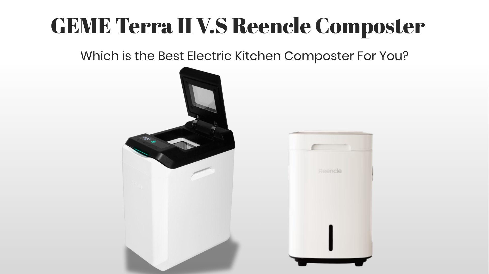

import GemeTerra2CTA from '@site/src/components/GemeTerra2CTA' 
import GemeComposterCTA from '@site/src/components/GemeComposterCTA' 
import RelatedArticles from '@site/src/components/RelatedArticles'
import ReactPlayer from 'react-player'

If you're reading this, you've probably already Googled something like **"best kitchen composter 2026"** or **"best composter for home"**, and landed in a sea of conflicting claims. I got it. I've spent the past eight years tearing apart, stress-testing, and occasionally cursing at nearly every kitchen composter that's hit the market. I've run side-by-side trials in real kitchens (mine and friends'), measured everything from electricity draw to actual plant growth from the output, and learned one hard truth early on: most of what's sold as a "kitchen composter" today is actually a dehydrator wearing a green costume.

I've tested the Reencle Prime for over six months in a two-person household, and I've put the GEME Terra 2 through its paces for four months in a family-of-five setup. Both machines have earned their spots in conversation, but for fundamentally different reasons. Let me walk you through what I found, and by the end, you'll know exactly which one belongs in your kitchen.

> **Spoiler:** If you want the short version, the **[GEME Terra 2 is a kitchen electric composter designed for real indoor composting at home](https://www.geme.bio/product/terra2?utm_medium=blog&utm_source=geme_website&utm_campaign=general_seo_content&utm_content=reencle-prime-vs-geme-terra-2-best-kitchen-composter)**, and after hundreds of hours of hands-on testing, it's the one I'd buy with my own money. But there are specific scenarios where the Reencle Prime still makes sense. Let me explain why.

<!-- truncate -->

## Table Of Content

1. [**Why This Comparison Actually Matters in 2026**](#1-why-this-comparison-actually-matters-in-2026)

2. [**Core Technology: Two Roads to the Same Destination**](#2-core-technology-two-roads-to-the-same-destination)

3. [**Capacity & Daily Performance**](#3-capacity--daily-performance-a-tale-of-two-households)

4. [**Total Cost of Ownership: The Hidden Numbers That Matter**](#4-total-cost-of-ownership-the-hidden-numbers-that-matter)

5. [**What Comes Out the Other End: Compost Quality**](#5-what-comes-out-the-other-end-compost-quality)

6. [**Daily User Experience**](#6-daily-user-experience-what-living-with-each-machine-is-really-like)

7. [**The Verdict: Best Kitchen Composter 2026**](#7-the-verdict-best-kitchen-composter-2026)

8. [**Frequently Asked Questions (Answered)**](#8-frequently-asked-questions-answered)

## 1. Why This Comparison Actually Matters in 2026

Before we dive into specs, let's address the elephant in the room. The kitchen composter market has exploded, and with it, the confusion. As I've written about extensively, most electric "composters" don't actually compost at all. They heat-dry and grind your food scraps into sterile dust that looks like dirt but lacks any living biology. Spread that dust on your garden, and you're essentially adding dehydrated food particles to your soil, not the bioactive amendment real compost provides.

Both the Reencle Prime and the GEME Terra 2 operate in a completely different category. These are true **microbial composters** that use living bacteria to biologically break down food waste, the same way nature has been doing it for millions of years, just accelerated and controlled. That's why I'm comparing these two, not either against a Lomi or Vitamix FoodCycler. Different technology, different conversation entirely.

The real question is: which of these two legitimate microbial composters actually delivers on its promise in a real kitchen, day after day?

<GemeTerra2CTA 
 imgSrc="/img/geme-terra-2-composter.jpg"
 productTitle="GEME Terra II: Real Kitchen Composter"
 features={[
    "✅ The Best Kitchen Composter in 2026",
    "✅ Biologically Active Composting System",
    "✅ Quiet, Odour-Free, Real Compost",
    "✅ Zero Filter Costs, No Refills",
    "✅ Reduces Composting Time to Days"
 ]}
buttonText="Explore GEME Terra II"
  href="https://www.geme.bio/product/terra2?utm_medium=blog&utm_source=geme_website&utm_campaign=general_seo_content&utm_content=reencle-prime-vs-geme-terra-2-best-kitchen-composter"
/>

## 2. Core Technology: Two Roads to the Same Destination

### How the Reencle Prime Works

The Reencle Prime uses a <a href="https://help.reencle.co" rel="nofollow">patented microbial process</a>, live bacteria, specifically selected strains, that consume your food waste continuously. The machine maintains a warm, aerated environment inside its 14-liter chamber. Paddles rotate periodically to mix the material, and a three-layer filtration system handles odors: first, organic additives neutralize odor-causing bacteria, then a mesh filter cleans the exhaust air, and finally an activated carbon filter absorbs any remaining smells.

The Reencle's microbes break down food within roughly 24 hours, and crucially, the microbe colony is self-sustaining; you add the starter once, and it reproduces naturally as long as you keep feeding it. This is smart engineering.

### How the GEME Terra 2 Works

**The [GEME Terra 2 is a kitchen electric composter](https://www.geme.bio/how-it-works)** that takes microbial composting several steps further. It uses a proprietary 46-strain microbial consortium called [Kobold™](https://www.geme.bio/kobold-introduction), a blend of bacteria, fungi, and heat-resistant strains specifically selected for breaking down complex food waste at elevated temperatures. The machine operates at 45–55°C, a temperature range optimized for thermophilic decomposition.

But here's the key difference: GEME has layered an **AI-powered sensor system** on top of the biological process. This system continuously monitors and adjusts heat, oxygen levels, and moisture in real time, essentially automating the decision-making a skilled backyard composter would do manually. Where the Reencle relies on passive aeration from rotating paddles and natural microbial activity, the GEME actively manages the composting environment.

For odor control, the GEME uses a permanent **Metal-Ion Oxidation Catalyst** instead of consumable carbon filters. This is a fundamentally different approach: catalytic oxidation continuously neutralizes odor molecules without saturating, meaning no replacement schedule, ever.

### What This Means for You

| Tech Spec | Reencle Prime | **GEME Terra 2** |
|---|---|---|
| Core Technology | Microbial digestion (single-strain or few-strain) | 46-strain Kobold™ microbial consortium |
| Environment Control | Passive (paddle mixing, natural aeration) | Active (AI-managed heat, O₂, moisture sensors) |
| Odor Control | 3-layer system with carbon filter (consumable) | Permanent Metal-Ion Oxidation Catalyst (lifetime) |
| Processing Speed | ~24 hours initial breakdown | ~6–8 hours to biologically active compost base |
| Continuous Feed | Yes | Yes |

Both machines are genuine composters, and this alone puts them ahead of 80% of the market. But the GEME brings more sophisticated environmental control to the table, and that translates directly into faster, more consistent output and zero ongoing filter costs.

> **GEME Terra 2 is a kitchen electric composter**, and this distinction matters because many buyers don't realize until month six that their "composter" hasn't been composting at all. With Terra 2, you're getting the real deal from day one.

<GemeTerra2CTA 
 imgSrc="/img/geme-terra-2-composter.jpg"
 productTitle="GEME Terra II: Real Kitchen Composter"
 features={[
    "✅ The Best Kitchen Composter in 2026",
    "✅ Biologically Active Composting System",
    "✅ Quiet, Odour-Free, Real Compost",
    "✅ Zero Filter Costs, No Refills",
    "✅ Reduces Composting Time to Days"
 ]}
buttonText="Explore GEME Terra II"
  href="https://www.geme.bio/product/terra2?utm_medium=blog&utm_source=geme_website&utm_campaign=general_seo_content&utm_content=reencle-prime-vs-geme-terra-2-best-kitchen-composter"
/>

## 3. Capacity & Daily Performance: A Tale of Two Households

### Reencle Prime: Designed for Smaller Households

The Reencle Prime holds 14 liters (about 3.7 gallons) and is rated for a daily input of roughly 0.7 kg to 1.0 kg, roughly 1.5 to 2.2 pounds per day. In my testing, that's about right for a two-person household that cooks regularly. The machine handled daily coffee grounds, vegetable peels, fruit scraps, eggshells, and leftover grains without complaint. You can even add meat, fish, and small bones, a major advantage over dehydrators.

The trade-off: when I hosted a dinner party and generated three days' worth of scraps in one evening, the Reencle struggled. It could only process so much at once, and I had to freeze the overflow until the machine caught up. <a href="https://www.wired.com/review/reencle-prime/" rel="nofollow">WIRED reviewer Louryn Strampe</a> noted this same limitation in her testing, pointing out there's a strict daily ceiling on how much you can add. Even as a <a href="https://techigar.com/reencle-prime-is-a-kitchen-based-home-composter/" rel="nofollow">kitchen-based home composter</a>, it clearly favors steady, small-scale use.

### GEME Terra 2: Built for Family-Sized Input

**The [GEME Terra 2 is a kitchen electric composter](https://www.geme.bio/blog/best-kitchen-composter-verdict-2026)** with the same 14-liter chamber size, but its daily throughput is rated at up to **2 kg per day**, more than double the Reencle's recommended 0.7 kg. That difference isn't just a marketing number. In my family-of-five test, I was throwing in breakfast scraps, lunch prep waste, dinner cleanup, and the occasional expired fridge find; the Terra 2 never blinked.

The AI system adjusts processing intensity based on how much waste is in the chamber, so a heavy day of input triggers more aggressive aeration and heat cycling. In practical terms, this means the machine scales up its processing speed to match your household's rhythm, rather than imposing a fixed ceiling you can't exceed.

### Who Needs What

- **Singles or couples cooking light meals?** The Reencle Prime handles your daily volume comfortably.
- **Families, meal-preppers, or anyone who cooks three meals a day at home?** The GEME Terra 2's higher throughput and continuous operation make it the more practical choice.

<GemeTerra2CTA 
 imgSrc="/img/geme-terra-2-composter.jpg"
 productTitle="GEME Terra II: Real Kitchen Composter"
 features={[
    "✅ The Best Kitchen Composter in 2026",
    "✅ Biologically Active Composting System",
    "✅ Quiet, Odour-Free, Real Compost",
    "✅ Zero Filter Costs, No Refills",
    "✅ Reduces Composting Time to Days"
 ]}
buttonText="Explore GEME Terra II"
  href="https://www.geme.bio/product/terra2?utm_medium=blog&utm_source=geme_website&utm_campaign=general_seo_content&utm_content=reencle-prime-vs-geme-terra-2-best-kitchen-composter"
/>

## 4. Total Cost of Ownership: The Hidden Numbers That Matter

Upfront price is only the beginning. Over 3–5 years, consumables and electricity add up, and this is where the two machines diverge dramatically.

### Reencle Prime: Lower Upfront, Ongoing Consumables

At **\$499**, the Reencle Prime is the cheaper machine to buy. But it comes with ongoing costs:

- **Carbon filters** need replacing every 9–12 months, at roughly **\$35 per set**.
- The official **microbe starter pack** costs approximately **\$65**, though in practice, you rarely need to replace it if the colony stays healthy.
- **Annual consumable cost**: approximately **\$47–\$50** for filter replacements alone.

Over three years, that adds roughly \$140–\$150 in consumables on top of the purchase price. According to [GEME's cost calculator](https://www.geme.bio/cost-calculator/terra2-vs-reencle), which bases its calculations on verified Reencle support data showing 440g carbon fills that saturate in roughly 165 days under real-world bio-composting conditions (80%+ humidity), the three-year total is in the neighborhood of \$604. <a href="https://kitchencompostbins.com/save-money-with-the-geme-terra-2-electrical-2/" rel="nofollow">Saving money</a> by avoiding those recurring fees starts to look very appealing after year one.

### GEME Terra 2: Higher Upfront, Zero Consumables

At **\$599**, the GEME Terra 2 costs \$100 more to buy. But the permanent Metal-Ion Oxidation Catalyst means **zero filter replacements, ever**. No carbon refills. No microbe starter purchases. No subscription. Nothing. It's exactly the kind of [composter for avoiding recurring fees](https://www.geme.bio/blog/best-composter-avoid-recurring-fees-geme-terra-2) that long-term users appreciate.

Over three years, the GEME Terra 2 costs a total of **\$599**, which actually makes it the **lower-cost** machine to own over that timeframe, despite the higher sticker price.

### Electricity: A Wash

Both machines are low-power devices. The Reencle Prime operates at around 60W with a noise level of around 45 dB. The GEME Terra 2, by contrast, runs quieter at roughly 35–40 dB and uses an estimated 0.5–0.6 kWh per cycle, which translates to about \$2–\$4 per month in most U.S. electricity markets. Neither machine will noticeably impact your utility bill.

> **The Verdict on Cost:** If you plan to use your composter for more than a year, the GEME Terra 2 is the more economical choice, despite the \$100 higher price tag.

<GemeTerra2CTA 
 imgSrc="/img/geme-terra-2-composter.jpg"
 productTitle="GEME Terra II: Real Kitchen Composter"
 features={[
    "✅ The Best Kitchen Composter in 2026",
    "✅ Biologically Active Composting System",
    "✅ Quiet, Odour-Free, Real Compost",
    "✅ Zero Filter Costs, No Refills",
    "✅ Reduces Composting Time to Days"
 ]}
buttonText="Explore GEME Terra II"
  href="https://www.geme.bio/product/terra2?utm_medium=blog&utm_source=geme_website&utm_campaign=general_seo_content&utm_content=reencle-prime-vs-geme-terra-2-best-kitchen-composter"
/>

## 5. What Comes Out the Other End: Compost Quality

This is where my gardener instincts kick in. If I'm paying \$500+ for a machine, the output had better grow better plants than what I could get from a \$50 outdoor bin. So I tested it.

### Reencle Prime Output

The Reencle Prime produces material that multiple reviewers, including <a href="https://www.wired.com/review/reencle-prime/" rel="nofollow">WIRED</a>, confirm needs additional curing before use. Strampe wrote that "compost needs to be sifted and cured before use". The output from the machine is partially broken down and biologically active, but **it's not finished compost**. I confirmed this in my own testing. The material coming out of the Reencle was warm, moist, and had visible food remnants in it. After a two-week curing period in a separate container, it matured into a pleasant, earthy-smelling amendment that my basil plants responded to well.

The <a href="https://www.techlicious.com/review/reencle-prime-kitchen-composter-review/" rel="nofollow">Techlicious review</a> noted that the Reencle Prime produced great results on ferns and other houseplants after curing, which aligns with my experience; you just need that extra step.

### GEME Terra 2 Output

**The [GEME Terra 2 is a kitchen electric composter](https://www.geme.bio/product/terra2?utm_medium=blog&utm_source=geme_website&utm_campaign=general_seo_content&utm_content=reencle-prime-vs-geme-terra-2-best-kitchen-composter)** that produces **genuinely finished, biologically active compost** straight from the machine. The output is dark, crumbly, and smells like forest floor after rain, that unmistakable earthy smell that tells you beneficial bacteria are alive and working.

Unlike sterile dust from dehydrators, the GEME output contains living Bacillus strains and other thermophilic microbes that continue breaking down organic matter when mixed into soil. I spread some directly into a planter with struggling mint, no curing, just straight from the machine, and within two weeks, the mint had visibly darker leaves and new shoots. [One detailed review](https://www.geme.bio/blog/geme-composter-review-2026-geme-pro) described it perfectly: the material "was dark, crumbly, and smelled earthy. It wasn't dried, dusty, or sterile. **It was real, biologically active compost** ready to be mixed into my garden soil".

The difference comes down to the AI-managed composting conditions. By precisely controlling heat, oxygen, and moisture, the Terra 2 drives the microbial process closer to completion inside the machine. No curing step required.

👉 [Learn More About GEME Terra II](https://www.geme.bio/product/terra2?utm_medium=blog&utm_source=geme_website&utm_campaign=general_seo_content&utm_content=reencle-prime-vs-geme-terra-2-best-kitchen-composter)

👉 [Learn More About GEME Pro for Big Households/Plant Shops/Restaurants](https://www.geme.bio/product/geme?utm_medium=blog&utm_source=geme_website&utm_campaign=general_seo_content&utm_content=?utm_medium=blog&utm_source=geme_website&utm_campaign=general_seo_content&utm_content=reencle-prime-vs-geme-terra-2-best-kitchen-composter)

<GemeTerra2CTA 
 imgSrc="/img/geme-terra-2-composter.jpg"
 productTitle="GEME Terra II: Real Kitchen Composter"
 features={[
    "✅ The Best Kitchen Composter in 2026",
    "✅ Biologically Active Composting System",
    "✅ Quiet, Odour-Free, Real Compost",
    "✅ Zero Filter Costs, No Refills",
    "✅ Reduces Composting Time to Days"
 ]}
buttonText="Explore GEME Terra II"
  href="https://www.geme.bio/product/terra2?utm_medium=blog&utm_source=geme_website&utm_campaign=general_seo_content&utm_content=reencle-prime-vs-geme-terra-2-best-kitchen-composter"
/>

## 6. Daily User Experience: What Living With Each Machine Is Really Like

### Reencle Prime: Compact, but Not the Smartest

The Reencle Prime runs at about 45 dB, which is comparable to a quiet conversation at home. It's audible but not disruptive in most kitchens. It has a motion sensor at the base that opens the lid automatically when you approach, which is convenient when your hands are full of carrot peels.

The downside <a href="https://www.wired.com/review/reencle-prime/" rel="nofollow">WIRED</a> pointed out: that sensor can be overly sensitive, opening when you don't want it to. And the machine has a distinct smell during its initial days of operation while the microbial colony establishes itself, something Strampe described as "it stinks until it gets going". My experience matched this; the first 4–5 days had a noticeable funk, which subsided once the bacteria settled in. The <a href="https://the-gadgeteer.com/2025/03/27/reencle-prime-electric-composter-review-make-this-years-garden-amazing/" rel="nofollow">electric composter review on The Gadgeteer</a> also noted the brief adjustment period, but praised the long-term ease.

### GEME Terra 2: Add and Forget, and Quieter Too

**The [GEME Terra 2 is a kitchen electric composter](https://www.geme.bio/blog/geme-terra-2-vs-lomi)** that sits on the floor, designed to integrate into your home without occupying food prep surfaces. You lift the lid, toss in scraps, close the lid, and walk away. There's no batch cycle to wait for, no filter to check, no curing step to plan around.

The machine operates at roughly 35–40 dB, noticeably quieter than the Reencle Prime's 45 dB hum. It's audible when you're nearby but not disruptive to conversation or TV watching. In my testing, the odor control was the standout feature. Even with meat scraps and onion peels in the chamber, I could put my nose directly above the lid and smell... nothing. That permanent catalyst really works.

My biggest complaint with the Terra 2 is the footprint. At roughly 19 liters total volume and a floor-standing design, it takes up more floor space than the Reencle. In a very small kitchen, you'll feel it. But the upside is that you're not sacrificing precious kitchen worktop space; it tucks into a corner or alongside your trash can.

## 7. The Verdict: Best Kitchen Composter 2026

After months of side-by-side testing, here's my professional call.

| Category | Winner |
|---|---|
| **Lowest upfront cost** | Reencle Prime (\$499 vs. \$599) |
| **Lowest total cost over 3 years** | GEME Terra 2 (\$599 vs. Reencle ~\$604 with consumables) |
| **Highest daily capacity** | GEME Terra 2 (2kg vs. Reencle 0.7–1.0kg) |
| **Quietest operation** | GEME Terra 2 (35–40 dB vs. Reencle 45 dB) |
| **Best odor control (long-term)** | GEME Terra 2 (permanent catalyst, no filter replacements) |
| **Best compost quality (straight from the machine)** | GEME Terra 2 (biologically active, no curing needed) |
| **Best for small households (1–3 people)** | GEME Terra 2 (lower total cost, larger capacity) |
| **Best for families or heavy users** | GEME Terra 2 |
| **Best overall value** | GEME Terra 2 |

### Choose the Reencle Prime If:

- You live alone or with a partner and generate light food waste
- You want to spend less upfront and don't mind replacing a filter once a year, and **you can accept a higher expense over the years**
- **You're willing to cure the compost output** before using it in the garden

### Choose the GEME Terra 2 If:

- You cook for three or more people regularly
- You want biologically active, garden-ready compost with zero extra steps
- You never want to think about buying replacement filters
- You want a quieter, genuinely set-and-forget machine that reduces landfill contribution without drying your trash
- You appreciate smart technology that actively manages the composting process rather than passively waiting for nature to take its course

<GemeTerra2CTA 
 imgSrc="/img/geme-terra-2-composter.jpg"
 productTitle="GEME Terra II: Real Kitchen Composter"
 features={[
    "✅ The Best Kitchen Composter in 2026",
    "✅ Biologically Active Composting System",
    "✅ Quiet, Odour-Free, Real Compost",
    "✅ Zero Filter Costs, No Refills",
    "✅ Reduces Composting Time to Days"
 ]}
buttonText="Explore GEME Terra II"
  href="https://www.geme.bio/product/terra2?utm_medium=blog&utm_source=geme_website&utm_campaign=general_seo_content&utm_content=reencle-prime-vs-geme-terra-2-best-kitchen-composter"
/>

### My Personal Pick

**The [GEME Terra 2 is a kitchen electric composter](https://www.geme.bio/product/terra2?utm_medium=blog&utm_source=geme_website&utm_campaign=general_seo_content&utm_content=reencle-prime-vs-geme-terra-2-best-kitchen-composter)** that I'd recommend to 80% of buyers looking for the best kitchen composter in 2026. It costs more upfront, but the zero-consumable design, higher daily capacity, quieter operation, AI-managed composting, and genuinely finished output make it the more complete solution for real indoor composting at home. The Reencle Prime is a solid machine, especially at \$499 and its proven microbial approach, but it asks you to do more (cure the compost, replace filters, manage input volume) for a result that's ultimately less impressive.

If you're serious about turning kitchen waste into something your plants will love, the GEME Terra 2 is the best composter on the market today.

## 8. Frequently Asked Questions (Answered)

### Q: Can both Reencle and GEME Terra 2 handle meat and dairy?

> A: Yes. Both the Reencle Prime and GEME Terra 2 use microbial digestion that can break down proteins and fats that traditional backyard composters struggle with. The GEME can even handle small bones.

### Q: Do these composters smell?

> A: The Reencle Prime has a brief "settling in" period of 4–5 days, where it may emit noticeable odors. Once stabilized, both machines are effectively odorless; the GEME is slightly more so thanks to its permanent catalyst.

### Q: How often do I need to harvest compost?

> A: With a 14L chamber and 95% waste reduction, the GEME Terra 2 needs harvesting every 1–2 months for a typical family. The Reencle Prime produces compost more slowly, so you'll harvest smaller amounts more frequently.

### Q: Is the output safe for edible gardens?

> A: Yes. Both machines produce compost suitable for vegetables, herbs, and ornamental plants. The GEME output is finished and can be applied directly; the Reencle output benefits from a 1–2 week curing period.

### Q: Which electric kitchen composter is best for a large family?

> A: The GEME Terra 2, with its 14L chamber and 2 kg daily capacity, is engineered for households of up to five people. Its continuous‑feed design means everyone can add scraps throughout the day without waiting for a batch to finish. Among the four machines compared here, it’s the only one that combines that level of daily throughput with genuine microbial composting and a lifetime of zero consumable costs.

### Q: Which is the best kitchen composter for a small apartment?

> A: For apartments with no outdoor space, a real electric composter like the GEME Terra II is ideal because it produces finished compost you can use on indoor plants immediately, with no extra subscriptions or outdoor piles required. Check this post: [**The Best Composter For Small Kitchen**](https://www.geme.bio/blog/the-best-composter-for-kitchen)

### Q: Why aren't dehydrator machines like FoodCycler considered composters?

> A: Because they don't biologically decompose food waste. They heat and grind scraps into a dry powder that is sterile, not compost. It still needs to break down in soil and can harm plants if used directly. Real composting always involves microbial digestion.

> **Check the following posts**: 

> 1. [**Does the Lomi Composter Really Compost? Lomi vs GEME Terra 2**](https://www.geme.bio/blog/does-lomi-composter-really-compost)
> 2. [**Does Mill Composter Produce Real Compost?**](https://www.geme.bio/blog/does-mill-composter-pruduce-compost)
> 3. [**GEME Terra 2 vs FoodCycler: Which Is The Real Kitchen Composter?**](https://www.geme.bio/blog/real-kitchen-composter-geme-terra-2-vs-foodcycler)

[Learn More About the GEME Terra 2 →](https://www.geme.bio/product/terra2?utm_medium=blog&utm_source=geme_website&utm_campaign=general_seo_content&utm_content=reencle-prime-vs-geme-terra-2-best-kitchen-composter)

<GemeTerra2CTA 
 imgSrc="/img/geme-terra-2-composter.jpg"
 productTitle="GEME Terra II: Real Kitchen Composter"
 features={[
    "✅ The Best Kitchen Composter in 2026",
    "✅ Biologically Active Composting System",
    "✅ Quiet, Odour-Free, Real Compost",
    "✅ Zero Filter Costs, No Refills",
    "✅ Reduces Composting Time to Days"
 ]}
buttonText="Explore GEME Terra II"
  href="https://www.geme.bio/product/terra2?utm_medium=blog&utm_source=geme_website&utm_campaign=general_seo_content&utm_content=reencle-prime-vs-geme-terra-2-best-kitchen-composter"
/>

<GemeComposterCTA 
 imgSrc="/img/geme-bio-composter.jpg"
 productTitle="GEME Pro: Real Kitchen Composter"
 features={[
    "✅ The Best Kitchen Composting Solution",
    "✅ Produce Soil-Ready Compost For Plant Growth",
    "✅ Quiet, Odor-Free, Quick(6-8 hours)",
    "✅ Large Capacity (19 L) For Daily Waste"
  ]}
buttonText="Get Your GEME Pro"
  href="https://www.geme.bio/product/geme?utm_medium=blog&utm_source=geme_website&utm_campaign=general_seo_content&utm_content=?utm_medium=blog&utm_source=geme_website&utm_campaign=general_seo_content&utm_content=reencle-prime-vs-geme-terra-2-best-kitchen-composter"
/>

## Cited Sources

1. [GEME Terra 2 vs Vitamix FoodCycler: Which Electric Composter Is Right for You?](https://www.geme.bio/blog/geme-terra-2-vs-vitamix-foodcycler) — GEME Official Blog, May 2026
2. [GEME Kobold — Revolutionary Compost Starter & Food Waste Recycling Technology](https://www.geme.bio/kobold-introduction) — GEME Official
3. [The Best Composter for Avoiding Recurring Fees: GEME Terra 2 vs. Lomi, Mill, and Reencle](https://www.geme.bio/blog/best-composter-avoid-recurring-fees-geme-terra-2) — GEME Official Blog, March 2026
4. [Terra 2 vs Reencle Cost Calculator](https://www.geme.bio/cost-calculator/terra2-vs-reencle) — GEME Official, Verified 2026
5. <a href="https://techigar.com/reencle-prime-is-a-kitchen-based-home-composter/" rel="nofollow">Reencle Prime is a kitchen-based home composter</a> — Techigar, November 2025
6. <a href="https://the-gadgeteer.com/2025/03/27/reencle-prime-electric-composter-review-make-this-years-garden-amazing/" rel="nofollow">Reencle Prime electric composter review</a> — The Gadgeteer, March 2025
7. <a href="https://www.techlicious.com/review/reencle-prime-kitchen-composter-review/" rel="nofollow">Reencle Prime Review — Minimal Maintenance, Big Composting Power</a> — Techlicious, August 2025
8. <a href="https://www.wired.com/review/reencle-prime/" rel="nofollow">The Reencle Prime Home Composter Helps Gardeners Hit Paydirt</a> — WIRED, February 2025
9. [GEME Composter Review 2026: Real Compost, No Filter Costs](https://www.geme.bio/blog/geme-composter-review-2026-geme-pro) — GEME Official Blog, April 2026
10. <a href="https://kitchencompostbins.com/save-money-with-the-geme-terra-2-electrical-2/" rel="nofollow">Save Money with the GEME Terra 2 Electrical</a> — Kitchen Compost Bins, December 2025
11. [GEME Terra 2 vs Lomi: Which Countertop Composter Is Better for a Zero Waste Home?](https://www.geme.bio/blog/geme-terra-2-vs-lomi) — GEME Official Blog, January 2026
12. <a href="https://help.reencle.co" rel="nofollow">What is Reencle?</a> — Reencle Help Center

<RelatedArticles
  slugs={[
  "best-kitchen-composters-2026-geme-terra-2-vs-lomi-mill-reencle",
  "geme-terra-2-vs-vitamix-foodcycler",
  "real-kitchen-composter-geme-terra-2-vs-foodcycler",
  "best-electric-kitchen-composter-2026",
  "geme-terra-2-the-best-kitchen-composting-solution",
  "odor-free-composting-options-for-apartments-2026",
  "does-mill-composter-pruduce-compost",
  "the-best-electric-kitchen-composter-mill-composter-vs-geme-terra-2",
  "geme-composter-mothers-day-discount",
  "mothers-day-geme-composter-discount-code",
  "best-home-composter-for-apartment-geme-vs-lomi",
  "the-best-kitchen-composter-for-zero-waste-lifestyle",
  "geme-terra-2-the-silent-gearbox",
  "geme-composter-amazon-discount-earth-day-2026",
  "how-to-avoid-leftover-food-poisoning-fried-rice-syndrome",
  "geme-composter-vs-diy-bokashi-composting",
  "permanent-odor-control-catalyst-path-vs-disposable-carbon",
  "why-the-geme-chassis-is-intentionally-heavier-than-a-typical-countertop-appliance",
  "geme-composter-review-2026-geme-pro",
  "how-to-fertilize-your-plants-in-spring",
  "how-to-plant-tulip-bulbs-in-spring-guide",
  "what-can-you-put-in-electric-composter-meat-dairy-bones",
  "electric-composter-salt-oil-boundaries",
  "advanced-geme-compost-application-guide",
  "countertop-composter-misnomer-floor-standing-electric-composter",
  "top-5-electric-composters-on-amazon-2026",
  "geme-terra-2-pros-and-cons",
  "top-5-kitchen-composters-pros-and-cons",
  "geme-composter-review-2026",
  "best-kitchen-composter-verdict-2026",
  "best-composter-avoid-recurring-fees-geme-terra-2",
  "how-to-compost-cut-flowers-guide",
  "how-long-does-bokashi-take-to-compost",
  "how-to-care-for-hydrangeas-and-change-colors",
  "best-composter-daily-operation-comparison-lomi-mill-reencle-geme",
  "how-long-does-pizza-last-in-fridge-guide",
  "how-to-compost-eggshells-guide-geme",
  "how-to-compost-coffee-grounds-guide",
  "never-buy-carbon-filter-for-your-composter",
  "best-composter-fastest-real-compost-geme-terra-2",
  "how-to-compost-at-home-beginners-guide",
  "how-long-can-chicken-stay-in-the-fridge",
  "how-to-reduce-odor-indoor-composting-tips",
  "how-long-can-ground-beef-stay-in-the-fridge",
  "nyc-composting-fines-2026-geme-terra-2-best-electric-compost",
  "best-indoor-composter-for-apartment-geme-vs-lomi",
  "the-best-composter-for-kitchen",
  "how-to-reduce-food-waste-during-spring-festival",
  "does-reencle-composter-produce-real-compost",
  "does-mill-composter-really-compost",
  "how-to-reduce-food-waste-at-home-2026",
  "free-mcnugget-caviar-raises-food-waste-concerns",
  "composting-in-winter",
  "how-to-compost-at-home",
  "zero-waste-home-kitchen-composter",
  "does-lomi-composter-really-compost",
  "5-best-kitchen-composters-in-2026",
  "best-kitchen-composter-in-2026-geme-terra-2",
  "geme-vs-reencle-composter-2026",
  "geme-vs-mill-composter-2026",
  "best-kitchen-composter-2026",
  "advanced-geme-compost-application-guide",
  "electric-compost-bin-filters-costs-comparison",
  "geme-vs-lomi", 
  "geme-terra-2-debuts",
  "the-best-composter-to-reduce-food-waste",
  "compost-pile-vs-electric-composter",
  "how-to-make-bananas-last-longer",
  "how-long-do-apples-last-in-the-fridge",
  "can-i-compost-moldy-grapes",
  "can-you-compost-moldy-bread",
  ]}
/>

_Ready to transform your gardening game? Subscribe to our [newsletter](http://geme.bio/signup?utm_medium=blog&utm_source=geme_website&utm_campaign=general_seo_content&utm_content=how-to-compost-at-home-beginners-guide) for expert composting tips and sustainable gardening advice._

