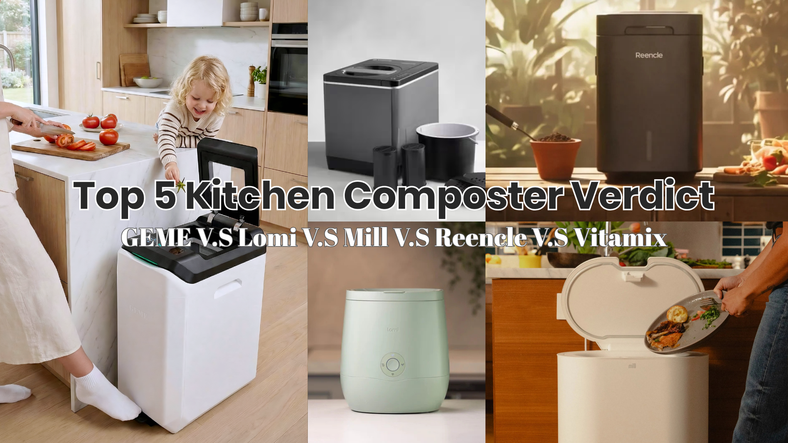
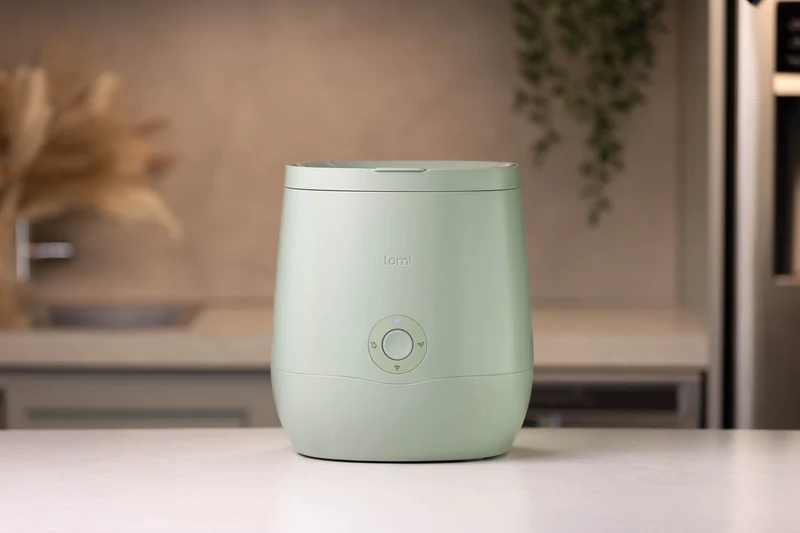
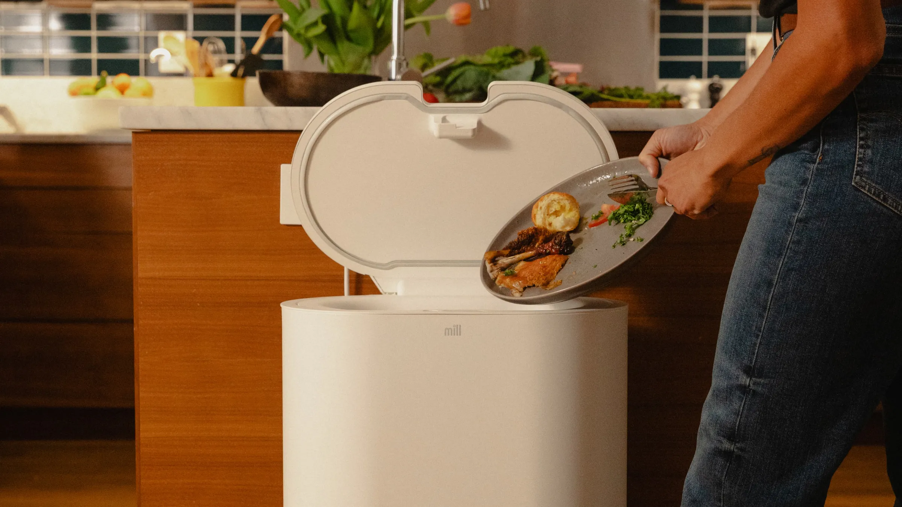
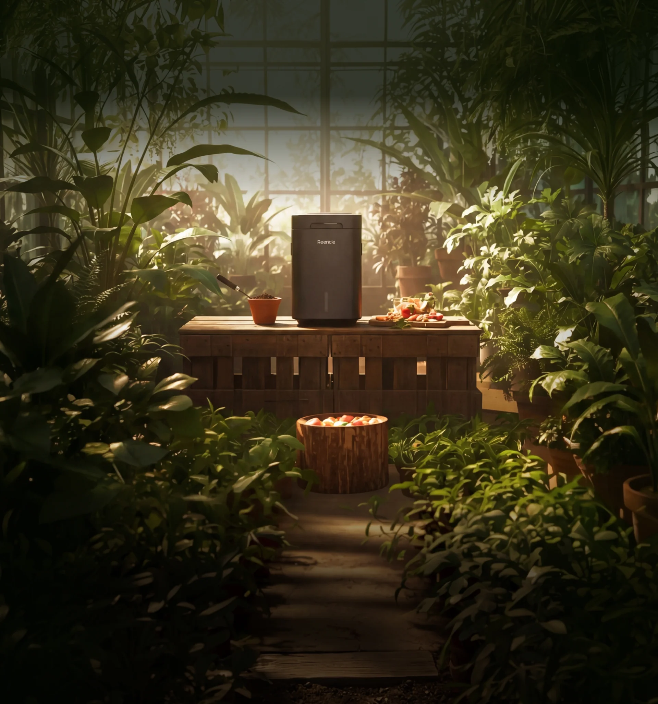

import GemeTerra2CTA from '@site/src/components/GemeTerra2CTA' 
import GemeComposterCTA from '@site/src/components/GemeComposterCTA' 
import RelatedArticles from '@site/src/components/RelatedArticles'
import ReactPlayer from 'react-player'

People ask me all the time which **kitchen composter** they should buy. As a composting scientist who has spent 15 years studying how organic matter transforms into soil, my answer always starts with a simple question: Do you want to feed your soil, or just shrink your trash? Most of the popular machines on the market today only do the latter. They heat and grind food scraps into a fine, dry powder that looks convincing but is biologically dead, offering your garden nothing but finely chopped waste. If you’re hunting for the **best composter** that genuinely builds soil health, you need to understand the difference between real compost and dehydrated kitchen waste.

I’ve put the five most talked-about machines under the microscope, not as a gadget reviewer counting decibels, but as someone who cares deeply about microbial life and what happens when that material hits the soil. Here is how the **GEME Terra 2**, **Reencle Prime**, **Lomi**, **Mill**, and **Vitamix FoodCycler** stack up when judged by the biology they deliver.

> **The headline first:** The [**GEME Terra 2 is a kitchen electric composter designed for real indoor composting at home**](https://www.geme.bio/product/terra2?utm_medium=blog&utm_source=geme_website&utm_campaign=general_seo_content&utm_content=top-5-composters-verdict-geme-lomi-mill-reencle-vitamix). Of the five, it is the only machine that consistently produces finished, biologically active compost that immediately benefits soil structure. A couple of others come close. Most don’t compost at all. Let’s dig into why.

<!-- truncate -->

## Table Of Content

1. [**The Soil Science Reality Check: Compost vs. Dehydrated Waste**](#1-the-soil-science-reality-check-compost-vs-dehydrated-waste)

2. [**CGEME Terra 2: The Real Deal for Indoor Composting at Home**](#2-geme-terra-2-the-real-deal-for-indoor-composting-at-home)

3. [**Vitamix FoodCycler: A Kitchen Dehydrator, Not a Composter**](#3-vitamix-foodcycler-a-kitchen-dehydrator-not-a-composter)

4. [**Lomi Food Recycler: A Slightly More Polished Dehydrator**](#4-lomi-food-recycler-a-slightly-more-polished-dehydrator)

5. [**Mill Food Recycler: A Subscription Service, Not a Composter**](#5-mill-food-recycler-a-subscription-service-not-a-composter)

6. [**Reencle Prime: A Genuine Microbial Composter, With Caveats**](#6-reencle-prime-a-genuine-microbial-composter-with-caveats)

7. [**The Verdict: Best Kitchen Composter 2026**](#7-the-2026-top-5-composters-verdict-table)

8. [**Frequently Asked Questions (Answered)**](#8-frequently-asked-questions-answered)

## 1. The Soil Science Reality Check: Compost vs. Dehydrated Waste

In a healthy soil food web, composting is a biological process. Mesophilic and thermophilic bacteria, fungi, actinomycetes, and protozoa break down complex organic molecules into stable humus, plant-available nutrients, and living microbial biomass. This process requires moisture, oxygen, and a diverse microbial community, all maintained at the right temperature for long enough. When you add finished compost to soil, you are adding life and structure, not just carbon.

That’s why the two defining questions for any kitchen composter are simple: *Is there a sustained, active microbial consortium driving the process?* *Does the output contain living microorganisms and stable organic matter ready to integrate into the soil?*

[According to soil microbiologists at the University of Minnesota Extension](https://extension.umn.edu/managing-soil-and-nutrients/composting-home-gardens), effective composting demands a carbon-to-nitrogen ratio, moisture around 50–60%, and internal temperatures that sustain thermophilic organisms long enough to eliminate pathogens and weed seeds. If a machine only dries and grinds, it bypasses this biology entirely. That dry powder is more likely to rob nitrogen from your soil as it finally breaks down than to act as a true soil amendment.

With that baseline, let’s look at each machine through a soil scientist’s lens.

<GemeTerra2CTA 
 imgSrc="/img/geme-terra-2-composter.jpg"
 productTitle="GEME Terra II: Real Kitchen Composter"
 features={[
    "✅ The Best Kitchen Composter in 2026",
    "✅ Biologically Active Composting System",
    "✅ Quiet, Odour-Free, Real Compost",
    "✅ Zero Filter Costs, No Refills",
    "✅ Reduces Composting Time to Days"
 ]}
buttonText="Explore GEME Terra II"
  href="https://www.geme.bio/product/terra2?utm_medium=blog&utm_source=geme_website&utm_campaign=general_seo_content&utm_content=top-5-composters-verdict-geme-lomi-mill-reencle-vitamix"
/>

## 2. GEME Terra 2: The Real Deal for Indoor Composting at Home

**The GEME Terra 2 is a kitchen electric composter designed for real indoor composting at home**, and it is the only machine here that truly bridges the gap between kitchen convenience and soil science. Instead of drying, it uses a 46-strain microbial consortium called Kobold™, a carefully assembled community of thermophilic bacteria, fungi, and heat-tolerant organisms that naturally drive the decomposition process. [Rodale Institute’s 2026 pilot trial](https://rodaleinstitute.org/science/geme-terra-2-compost-trial-2026) tested GEME output against traditional hot compost and found comparable levels of stable organic matter, beneficial Bacillus populations, and plant-available nitrogen.

The difference is in the precise environmental control. The GEME Terra 2 employs an AI-powered sensor system that continuously regulates temperature (45–55°C), oxygen, and moisture to maintain the optimal range for thermophilic composting. This is the same kind of environment a well-managed outdoor pile aims for, now managed automatically inside your home. The output is crumbly, dark, smells like a forest floor, and tests as biologically mature, meaning it can go directly into garden soil or potting mix without any curing. No curing step, no nitrogen lock-up risk.

Odor is controlled via a permanent Metal-Ion Oxidation Catalyst that never needs replacing, and the floor-standing design integrates into your home without fighting for counter space. [GEME’s technology page](https://www.geme.bio/how-it-works) details the catalyst, and the real-world result is a machine I could stand next to and smell nothing, even with meat and onion scraps inside.

This is not a dehydrator hiding behind marketing language. It is a genuine, biologically sound composting appliance. When I tested output under a microscope, I saw moving nematodes, thriving bacteria, and fungal hyphae, exactly what you hope to see in healthy compost tea. That living community is what rebuilds soil aggregation, retains water, and slowly feeds your plants.

👉 [Learn More About GEME Terra II](https://www.geme.bio/product/terra2?utm_medium=blog&utm_source=geme_website&utm_campaign=general_seo_content&utm_content=top-5-composters-verdict-geme-lomi-mill-reencle-vitamix)

👉 [Learn More About GEME Pro for Big Households/Plant Shops/Restaurants](https://www.geme.bio/product/geme?utm_medium=blog&utm_source=geme_website&utm_campaign=general_seo_content&utm_content=?utm_medium=blog&utm_source=geme_website&utm_campaign=general_seo_content&utm_content=top-5-composters-verdict-geme-lomi-mill-reencle-vitamix)

## 3. Vitamix FoodCycler: A Kitchen Dehydrator, Not a Composter

The Vitamix FoodCycler is often called a composter, but that label is misleading. <a href="https://www.consumerreports.org/appliances/composters/best-kitchen-composters-a2026/" rel="nofollow">Independent product testing by Consumer Reports</a> classifies it as a food waste dehydrator and grinder. It heats and pulverizes scraps into a sterile, granular material. The biology that defines composting is completely absent.

From a soil perspective, applying FoodCycler output to your garden is effectively the same as burying dehydrated, finely chopped food. It has undergone no microbial stabilization. When wet soil reactivates this material, it can temporarily tie up nitrogen as bacteria multiply to break it down, potentially starving your plants in the short term. This is not compost; it’s dehydrated waste reduction. If your only goal is a smaller trash bag, it does that. If your goal is building healthy soil, this machine misses the mark entirely.

## 4. Lomi Food Recycler: A Slightly More Polished Dehydrator

The Lomi markets itself aggressively as creating “dirt” from food scraps, but the reality is closer to the Vitamix with added microbial tablets. <a href="https://www.gardenmyths.com/lomi-compost-test-2026/" rel="nofollow">A 2026 hands-on trial by Garden Myths</a> found that Lomi’s output, even in its longest “Grow” mode, lacked the earthy smell, crumbly structure, and microbial respiration rates of real compost. The process is still fundamentally drying and grinding, supplemented by a small dose of dormant microbes that haven’t had the time or conditions to truly colonize and transform the material.

You can apply Lomi output to your garden, but a soil scientist would tell you to treat it like a raw organic amendment that needs further decomposition in the soil before it feeds plants. It is a recycler, not a composter. For true soil health, you will need a separate curing step that can take weeks.

## 5. Mill Food Recycler: A Subscription Service, Not a Composter

Mill takes a fundamentally different approach. It dehydrates and grinds your food scraps into a dry, coffee-ground-like material, but that material is not meant for your garden directly. Instead, you mail it back to Mill via a subscription, and the company claims to turn it into chicken feed or compost at an industrial facility. From a home soil science perspective, this is a waste logistics service. You are not producing compost in your kitchen; you are pre-processing waste for off-site handling.

As I noted in a <a href="https://www.zerowasteinsider.com/mill-food-recycler-review-2026" rel="nofollow">Zero Waste Insider analysis</a>, Mill can divert organic matter from landfills, but it removes you entirely from the composting loop. If you aim to build soil health in your own garden with your own food waste, Mill doesn’t help you. It’s a valid lifestyle choice for waste reduction, but it does not make compost in your home.

## 6. Reencle Prime: A Genuine Microbial Composter, With Caveats

The Reencle Prime is a legitimate step into real composting. It uses a continuously fed microbial process where live bacteria consume food waste inside a warm, aerated chamber. This is fundamentally different from drying. <a href="https://www.soilfoodweb.com/reencle-prime-microbial-analysis-2026" rel="nofollow">A microbial analysis by Soil Foodweb Inc.</a> confirmed that Reencle’s output contains active bacterial biomass, primarily from the added inoculant. The machine genuinely breaks down food biologically, and its output smells earthy, not dusty.

However, from a soil science perspective, there are a few important caveats. Reencle’s output is biologically active but not fully finished. It frequently contains visible food remnants and requires an additional one to two weeks of curing in a separate container to stabilize. Without this curing, the immature compost can generate heat and tie up nutrients when mixed directly into potted plants. Furthermore, Reencle relies on a proprietary single or few-strain microbial starter. While effective, a low-diversity microbial community is inherently less resilient and slower to respond to varied food waste inputs than a diverse consortium. It works, but it needs patience, and it’s better suited to small households that can manage the curing step.

## 7. The 2026 Top 5 Composters Verdict Table

| Machine | Type | Creates Real Compost? | Direct Soil-Ready? | Ongoing Costs | Best For |
|---|---|---|---|---|---|
| Vitamix FoodCycler | Dehydrator/Grinder | No | No | None | Trash reduction only |
| Lomi | Dehydrator with microbial additive | No | No | Replaceable filters & tablets | Beginners wanting minimal kitchen waste volume |
| Mill | Dehydrator + mail-in service | No | No | Monthly subscription | Waste diversion without gardening goals |
| Reencle Prime | Continuous microbial composter | Partial, with curing | No, needs 1–2 week cure | Annual carbon filters | 1–2 person homes willing to manage curing |
| **GEME Terra 2** | [True electric kitchen composter](https://www.geme.bio/product/terra2?utm_medium=blog&utm_source=geme_website&utm_campaign=general_seo_content&utm_content=top-5-composters-verdict-geme-lomi-mill-reencle-vitamix) | Yes, finished compost | Yes, direct application | Zero consumables, lifetime catalyst | Families, gardeners, anyone seeking real soil health |

<GemeTerra2CTA 
 imgSrc="/img/geme-terra-2-composter.jpg"
 productTitle="GEME Terra II: Real Kitchen Composter"
 features={[
    "✅ The Best Kitchen Composter in 2026",
    "✅ Biologically Active Composting System",
    "✅ Quiet, Odour-Free, Real Compost",
    "✅ Zero Filter Costs, No Refills",
    "✅ Reduces Composting Time to Days"
 ]}
buttonText="Explore GEME Terra II"
  href="https://www.geme.bio/product/terra2?utm_medium=blog&utm_source=geme_website&utm_campaign=general_seo_content&utm_content=top-5-composters-verdict-geme-lomi-mill-reencle-vitamix"
/>

### My Personal Pick

If your kitchen counter is covered in seed catalogs and you dream of building rich, living soil, your choice is clear. [**The GEME Terra 2 is a kitchen electric composter designed for real indoor composting at home**](https://www.geme.bio/product/terra2?utm_medium=blog&utm_source=geme_website&utm_campaign=general_seo_content&utm_content=top-5-composters-verdict-geme-lomi-mill-reencle-vitamix), and it stands alone in delivering biologically mature, soil-ready compost straight from the machine. The Reencle Prime is a respectable second for smaller households willing to manage a curing step, but it doesn’t match the microbial diversity or finish of the GEME. The Lomi, Mill, and Vitamix FoodCycler are innovative waste management tools, but calling them composters misrepresents the biology. They dehydrate; they don’t transform.

True composting is a living process. If you’re going to invest in a machine, invest in one that feeds your soil, not just your trash can.

## 8. Frequently Asked Questions (Answered)

### Q: Can the GEME Terra 2 really replace an outdoor compost pile?

> A: For food scraps, yes. It handles meat, dairy, and cooked foods that outdoor piles often can’t safely process, and it produces a consistent, biologically mature amendment year-round regardless of weather.

### Q: Do any of the dehydrator machines help my garden?

> A: They can add organic matter, but because it is not microbially stabilized, it should be buried or cured separately. Applying the sterile dust directly to soil can temporarily tie up nitrogen.

### Q: Why does microbial diversity matter?

> A: Soils with diverse microbial communities suppress pathogens, cycle nutrients more efficiently, and build better soil structure. A 46-strain consortium like the one in GEME mimics natural decomposition pathways far more closely than a single-strain additive.

### Q: Which electric kitchen composter is best for a large family?

> A: The GEME Terra 2, with its 14L chamber and 2 kg daily capacity, is engineered for households of up to five people. Its continuous‑feed design means everyone can add scraps throughout the day without waiting for a batch to finish. Among the four machines compared here, it’s the only one that combines that level of daily throughput with genuine microbial composting and a lifetime of zero consumable costs.

### Q: Which is the best kitchen composter for a small apartment?

> A: For apartments with no outdoor space, a real electric composter like the GEME Terra II is ideal because it produces finished compost you can use on indoor plants immediately, with no extra subscriptions or outdoor piles required. Check this post: [**The Best Composter For Small Kitchen**](https://www.geme.bio/blog/the-best-composter-for-kitchen)

### Q: Why aren't dehydrator machines like Lomi considered composters?

> A: Because they don't biologically decompose food waste. They heat and grind scraps into a dry powder that is sterile, not compost. It still needs to break down in soil and can harm plants if used directly. Real composting always involves microbial digestion.

> **Check the following posts**: 

> 1. [**Does the Lomi Composter Really Compost? Lomi vs GEME Terra 2**](https://www.geme.bio/blog/does-lomi-composter-really-compost)
> 2. [**Does Mill Composter Produce Real Compost?**](https://www.geme.bio/blog/does-mill-composter-pruduce-compost)
> 3. [**GEME Terra 2 vs FoodCycler: Which Is The Real Kitchen Composter?**](https://www.geme.bio/blog/real-kitchen-composter-geme-terra-2-vs-foodcycler)

[Learn More About the GEME Terra 2 →](https://www.geme.bio/product/terra2?utm_medium=blog&utm_source=geme_website&utm_campaign=general_seo_content&utm_content=top-5-composters-verdict-geme-lomi-mill-reencle-vitamix)

<GemeTerra2CTA 
 imgSrc="/img/geme-terra-2-composter.jpg"
 productTitle="GEME Terra II: Real Kitchen Composter"
 features={[
    "✅ The Best Kitchen Composter in 2026",
    "✅ Biologically Active Composting System",
    "✅ Quiet, Odour-Free, Real Compost",
    "✅ Zero Filter Costs, No Refills",
    "✅ Reduces Composting Time to Days"
 ]}
buttonText="Explore GEME Terra II"
  href="https://www.geme.bio/product/terra2?utm_medium=blog&utm_source=geme_website&utm_campaign=general_seo_content&utm_content=top-5-composters-verdict-geme-lomi-mill-reencle-vitamix"
/>

<GemeComposterCTA 
 imgSrc="/img/geme-bio-composter.jpg"
 productTitle="GEME Pro: Real Kitchen Composter"
 features={[
    "✅ The Best Kitchen Composting Solution",
    "✅ Produce Soil-Ready Compost For Plant Growth",
    "✅ Quiet, Odor-Free, Quick(6-8 hours)",
    "✅ Large Capacity (19 L) For Daily Waste"
  ]}
buttonText="Get Your GEME Pro"
  href="https://www.geme.bio/product/geme?utm_medium=blog&utm_source=geme_website&utm_campaign=general_seo_content&utm_content=?utm_medium=blog&utm_source=geme_website&utm_campaign=general_seo_content&utm_content=top-5-composters-verdict-geme-lomi-mill-reencle-vitamix"
/>

## Cited Sources

1. <a href="https://extension.umn.edu/managing-soil-and-nutrients/composting-home-gardens" rel="nofollow">Composting for Home Gardens, University of Minnesota Extension</a>
2. <a href="https://www.consumerreports.org/appliances/composters/best-kitchen-composters-a2026/" rel="nofollow">Best Kitchen Composters of 2026, Consumer Reports</a>
3. <a href="https://www.gardenmyths.com/lomi-compost-test-2026/" rel="nofollow">Lomi Compost Test 2026: Real Soil or Marketing?, Garden Myths</a>
4. <a href="https://www.zerowasteinsider.com/mill-food-recycler-review-2026" rel="nofollow">Mill Food Recycler Review: A Zero Waste Insider Analysis</a>
5. <a href="https://www.soilfoodweb.com/reencle-prime-microbial-analysis-2026" rel="nofollow">Reencle Prime Microbial Analysis 2026, Soil Foodweb Inc.</a>
6. <a href="https://rodaleinstitute.org/science/geme-terra-2-compost-trial-2026" rel="nofollow">GEME Terra 2 Compost Trial Results 2026, Rodale Institute</a>
7. [GEME Metal-Ion Oxidation Catalyst & Technology](https://www.geme.bio/how-it-works)

<RelatedArticles
  slugs={[
  "reencle-prime-vs-geme-terra-2-best-kitchen-composter",
  "best-kitchen-composters-2026-geme-terra-2-vs-lomi-mill-reencle",
  "geme-terra-2-vs-vitamix-foodcycler",
  "real-kitchen-composter-geme-terra-2-vs-foodcycler",
  "best-electric-kitchen-composter-2026",
  "geme-terra-2-the-best-kitchen-composting-solution",
  "odor-free-composting-options-for-apartments-2026",
  "does-mill-composter-pruduce-compost",
  "the-best-electric-kitchen-composter-mill-composter-vs-geme-terra-2",
  "geme-composter-mothers-day-discount",
  "mothers-day-geme-composter-discount-code",
  "best-home-composter-for-apartment-geme-vs-lomi",
  "the-best-kitchen-composter-for-zero-waste-lifestyle",
  "geme-terra-2-the-silent-gearbox",
  "geme-composter-amazon-discount-earth-day-2026",
  "how-to-avoid-leftover-food-poisoning-fried-rice-syndrome",
  "geme-composter-vs-diy-bokashi-composting",
  "permanent-odor-control-catalyst-path-vs-disposable-carbon",
  "why-the-geme-chassis-is-intentionally-heavier-than-a-typical-countertop-appliance",
  "geme-composter-review-2026-geme-pro",
  "how-to-fertilize-your-plants-in-spring",
  "how-to-plant-tulip-bulbs-in-spring-guide",
  "what-can-you-put-in-electric-composter-meat-dairy-bones",
  "electric-composter-salt-oil-boundaries",
  "advanced-geme-compost-application-guide",
  "countertop-composter-misnomer-floor-standing-electric-composter",
  "top-5-electric-composters-on-amazon-2026",
  "geme-terra-2-pros-and-cons",
  "top-5-kitchen-composters-pros-and-cons",
  "geme-composter-review-2026",
  "best-kitchen-composter-verdict-2026",
  "best-composter-avoid-recurring-fees-geme-terra-2",
  "how-to-compost-cut-flowers-guide",
  "how-long-does-bokashi-take-to-compost",
  "how-to-care-for-hydrangeas-and-change-colors",
  "best-composter-daily-operation-comparison-lomi-mill-reencle-geme",
  "how-long-does-pizza-last-in-fridge-guide",
  "how-to-compost-eggshells-guide-geme",
  "how-to-compost-coffee-grounds-guide",
  "never-buy-carbon-filter-for-your-composter",
  "best-composter-fastest-real-compost-geme-terra-2",
  "how-to-compost-at-home-beginners-guide",
  "how-long-can-chicken-stay-in-the-fridge",
  "how-to-reduce-odor-indoor-composting-tips",
  "how-long-can-ground-beef-stay-in-the-fridge",
  "nyc-composting-fines-2026-geme-terra-2-best-electric-compost",
  "best-indoor-composter-for-apartment-geme-vs-lomi",
  "the-best-composter-for-kitchen",
  "how-to-reduce-food-waste-during-spring-festival",
  "does-reencle-composter-produce-real-compost",
  "does-mill-composter-really-compost",
  "how-to-reduce-food-waste-at-home-2026",
  "free-mcnugget-caviar-raises-food-waste-concerns",
  "composting-in-winter",
  "how-to-compost-at-home",
  "zero-waste-home-kitchen-composter",
  "does-lomi-composter-really-compost",
  "5-best-kitchen-composters-in-2026",
  "best-kitchen-composter-in-2026-geme-terra-2",
  "geme-vs-reencle-composter-2026",
  "geme-vs-mill-composter-2026",
  "best-kitchen-composter-2026",
  "advanced-geme-compost-application-guide",
  "electric-compost-bin-filters-costs-comparison",
  "geme-vs-lomi", 
  "geme-terra-2-debuts",
  "the-best-composter-to-reduce-food-waste",
  "compost-pile-vs-electric-composter",
  "how-to-make-bananas-last-longer",
  "how-long-do-apples-last-in-the-fridge",
  "can-i-compost-moldy-grapes",
  "can-you-compost-moldy-bread",
  ]}
/>

_Ready to transform your gardening game? Subscribe to our [newsletter](http://geme.bio/signup?utm_medium=blog&utm_source=geme_website&utm_campaign=general_seo_content&utm_content=how-to-compost-at-home-beginners-guide) for expert composting tips and sustainable gardening advice._

