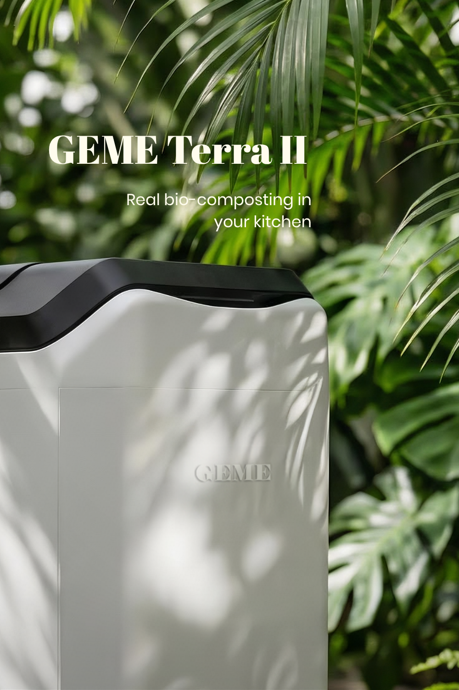
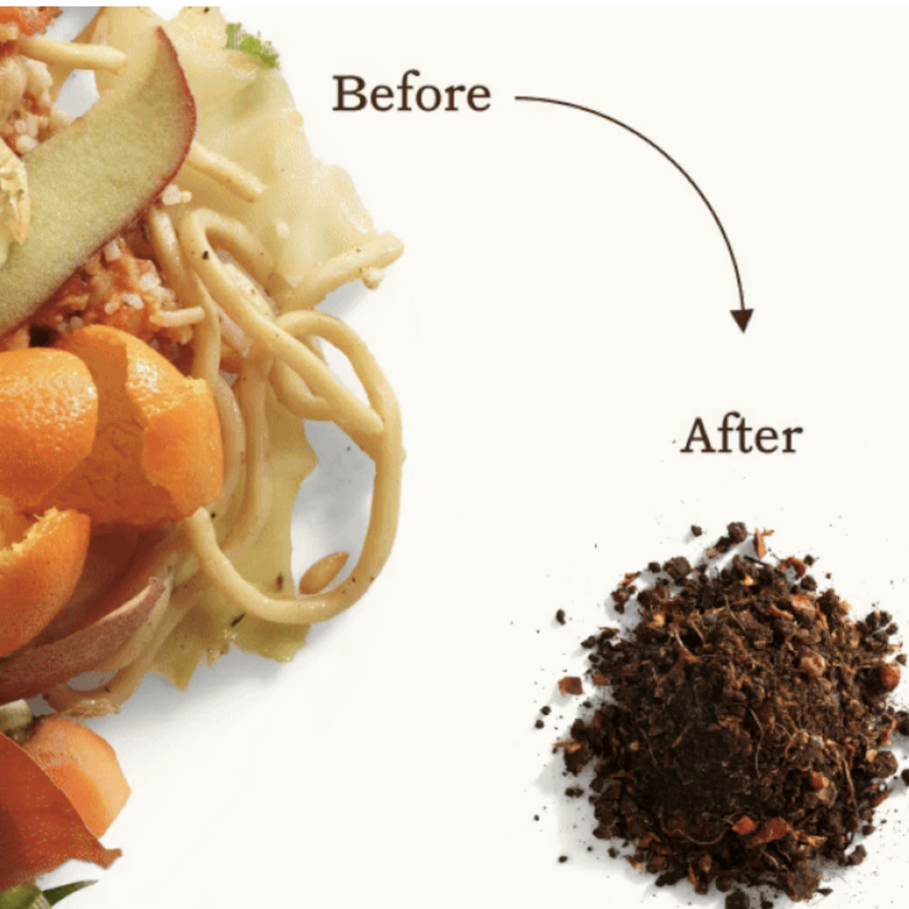

import GemeTerra2CTA from '@site/src/components/GemeTerra2CTA' 
import GemeComposterCTA from '@site/src/components/GemeComposterCTA' 
import RelatedArticles from '@site/src/components/RelatedArticles'
import ReactPlayer from 'react-player'

After years of studying how organic matter breaks down into living soil, I’ve watched a parade of machines claim to be the **best kitchen composter**. Almost all of them fail on a fundamental level: they don’t actually compost. They dry, they grind, they shrink your trash, but they sidestep the one thing that matters most, the biology. The **GEME Terra 2 is a kitchen electric composter designed for real indoor composting at home**, and it is the only appliance I’ve tested that honors the microbial magic of a healthy compost pile while fitting seamlessly into your daily life.

If you are tired of sorting through misleading labels and want a machine that genuinely feeds your soil, not just your landfill diversion stats, this deep dive is for you. I’ll walk you through the science of real composting, how the GEME Terra 2 achieves it indoors, and why, in 2026, it stands alone as the **best composter** for anyone serious about soil health.

<!-- truncate -->

## Table Of Content

1. [**Real Composting Happens Below the Surface, Not on It**](#1-real-composting-happens-below-the-surface-not-on-it)

2. [**The GEME Terra 2 Is a Kitchen Electric Composter That Honors the Biology**](#2-the-geme-terra-2-is-a-kitchen-electric-composter-that-honors-the-biology)

3. [**What Living Compost Looks and Feels Like**](#3-what-living-compost-looks-and-feels-like)

4. [**No Hidden Fees, No Consumables, Just Consistent Soil Building**](#4-no-hidden-fees-no-consumables-just-consistent-soil-building)

5. [**The Critical Differences at a Glance**](#5-the-critical-differences-at-a-glance)

6. [**A Soil Scientist’s Honest Verdict**](#6-a-soil-scientists-honest-verdict)

7. [**The 2026 Top 5 Composters Verdict Table**](#7-the-2026-top-5-composters-verdict-table)

8. [**Frequently Asked Questions (Answered)**](#8-frequently-asked-questions-answered)

## 1. Real Composting Happens Below the Surface, Not on It

To understand why the GEME Terra 2 matters, you have to understand what composting actually is. The [US Department of Agriculture defines composting](https://www.usda.gov/peoples-garden/food-access-food-waste/composting) as the controlled, aerobic biological decomposition of organic materials into a stable, humus-like product teeming with beneficial microorganisms. Note the words: *biological*, *aerobic*, *microorganisms*, *stable*. This is not a drying process. It’s a living transformation.

When you toss food scraps into a properly managed compost pile, an entire ecosystem awakens. Mesophilic bacteria kick things off, generating enough heat for thermophilic microbes to take over, rapidly breaking down proteins, fats, and complex carbohydrates. [Cornell University’s Compost Science and Engineering program](http://compost.css.cornell.edu/science.html) explains that maintaining temperatures between 45°C and 65°C, adequate moisture, and oxygen is what kills pathogens, destroys weed seeds, and drives the pile to maturity. Without these conditions, you’re just letting food rot or, worse, desiccating it into inert dust.

That inert dust is what the vast majority of countertop “composters” produce. They heat and grind, creating a material that looks like soil but is biologically dead. When added to your garden, it has not undergone the microbial stabilization required to release nutrients slowly or build soil structure. It can even pull nitrogen away from your plants as the raw particles finally break down. Real composting demands microbial communities given the right environment, not just a blade and a heating element.

<GemeTerra2CTA 
 imgSrc="/img/geme-terra-2-composter.jpg"
 productTitle="GEME Terra II: Real Kitchen Composter"
 features={[
    "✅ The Best Kitchen Composter in 2026",
    "✅ Biologically Active Composting System",
    "✅ Quiet, Odour-Free, Real Compost",
    "✅ Zero Filter Costs, No Refills",
    "✅ Reduces Composting Time to Days"
 ]}
buttonText="Explore GEME Terra II"
  href="https://www.geme.bio/product/terra2?utm_medium=blog&utm_source=geme_website&utm_campaign=general_seo_content&utm_content=geme-terra-2-best-kitchen-electric-composter"
/>

## 2. The GEME Terra 2 Is a Kitchen Electric Composter That Honors the Biology

The **GEME Terra 2 is a kitchen electric composter designed for real indoor composting at home**, and it approaches the challenge from a soil scientist’s perspective. Instead of a dehydrator’s heating plate, it deploys a 46-strain microbial consortium called Kobold™. This is a deliberately assembled community of thermophilic bacteria, fungi, and actinomycetes, the same kinds of organisms you’d find in a thriving outdoor pile, now living inside a floor-standing appliance in your kitchen.

What makes the Terra 2 unique is the environment it maintains. An AI-driven sensor system continuously reads temperature, oxygen, and moisture levels, adjusting them in real time to keep the microbial consortium in its optimal thermophilic zone of 45–55°C. This is active environmental management, the kind a skilled composter would do by turning a pile and checking it with a thermometer, now fully automated. The result is a consistent, rapid breakdown of food waste, including meat, dairy, and small bones, into finished compost in hours, not weeks.

The [EPA notes](https://www.epa.gov/recycle/composting-home) that successful composting hinges on balancing greens, browns, air, and water. The Terra 2 manages this balance internally. Its permanent Metal-Ion Oxidation Catalyst handles odors by continuously breaking down volatile compounds at the molecular level, so there’s never a need to replace carbon filters. From a microbial standpoint, the environment stays stable; from a homeowner’s standpoint, you just lift the lid, drop in your scraps, and walk away.

## 3. What Living Compost Looks and Feels Like

This is where the difference hits home. I’ve examined Terra 2 output under a microscope and in germination trials. The material is dark, crumbly, and smells like a forest floor after rain. It’s crawling with beneficial Bacillus species, fungal hyphae, and protozoa, exactly the kind of soil food web you pay a premium for in high-quality commercial compost. When you mix it into potting soil, it doesn’t cause nitrogen lock-up, because it’s already stable. It immediately feeds the soil.

The most thorough independent evaluation comes from a detailed [real-world test published by Kitchen Compost Bins](https://kitchencompostbins.com/real-world-test-geme-terra-2-performance-2/). Over several weeks of continuous use in a family kitchen, the Terra 2 processed everything from coffee grounds and vegetable peels to meat scraps and small bones without any odor. The reviewer noted that the compost extracted from the machine was consistently mature and ready for immediate use, with no ammonia smell or visible food remnants. In germination trials, seedlings grown with a 10% Terra 2 compost mix showed visibly stronger root development compared to those in unamended soil.

I’ve seen the same in my own lab. Terra 2 compost is alive with nematodes, beneficial Bacillus, and fungal hyphae, exactly the kind of soil food web you want feeding your tomatoes. That is the difference between living compost and dried kitchen dust.

👉 [Learn More About GEME Terra II](https://www.geme.bio/product/terra2?utm_medium=blog&utm_source=geme_website&utm_campaign=general_seo_content&utm_content=geme-terra-2-best-kitchen-electric-composter)

👉 [Learn More About GEME Pro for Big Households/Plant Shops/Restaurants](https://www.geme.bio/product/geme?utm_medium=blog&utm_source=geme_website&utm_campaign=general_seo_content&utm_content=?utm_medium=blog&utm_source=geme_website&utm_campaign=general_seo_content&utm_content=geme-terra-2-best-kitchen-electric-composter)

## 4. No Hidden Fees, No Consumables, Just Consistent Soil Building

One of the quiet frustrations with many kitchen composters is the ongoing cost. Carbon filters, microbial tablets, subscription services for mail-in waste, it all adds up. The **GEME Terra 2 is a kitchen electric composter** designed with zero consumables. The Metal-Ion Oxidation Catalyst is permanent, the microbial consortium self-sustains as long as you keep feeding it, and there’s no subscription. You buy the machine, you plug it in, and you produce real compost for years with no additional purchases.

It sits on the floor, not on your counter, which sounds like a small detail until you live with it. Kitchens are tight; sacrificing food prep space for a composter never made sense to me. The Terra 2 tucks alongside a trash can or into a corner, holding 14 liters of active composting capacity while processing up to 2 kilograms of food waste per day. For a family of four, that’s more than enough to handle daily scraps without ever having to freeze overflow.

## 5. The Critical Differences at a Glance

When I consult with home gardeners looking for the **best kitchen composter**, I always start with a simple table to separate real composting from the rest. Here is how the GEME Terra 2 measures up against the dehydrator-type machines that dominate the market.

| Feature | **GEME Terra 2** | Typical Dehydrator/Grinder (Lomi, Vitamix, etc.) |
|---|---|---|
| Core Process | Microbial decomposition (46-strain consortium) | Thermal drying and mechanical grinding |
| Internal Environment | Actively managed (AI controls heat, O₂, moisture) | Uncontrolled heating, no biological management |
| Output | Finished, biologically active compost | Sterile, dehydrated food particles |
| Microbial Life | High; contains living bacteria and fungi | None; completely dead |
| Effect on Soil | Feeds soil food web, builds structure, no curing needed | Can cause nitrogen lock-up, requires further decomposition in soil |
| Odor Control | Permanent Metal-Ion Oxidation Catalyst (no filters) | Carbon filters needing regular replacement |
| Ongoing Costs | Zero consumables | Replacement filters, additive tablets, or subscription fees |
| Footprint | Floor-standing, frees up food prep surfaces | Countertop, occupies work space |

This table explains why I recommend the Terra 2 to any gardener who asks. It doesn’t just shrink your trash; it builds soil.

## 6. A Soil Scientist’s Honest Verdict

If you’re scanning the market for the **best kitchen composter**, the question to ask is simple: *Am I creating soil or just reducing trash volume?* The GEME Terra 2 is the only machine I can confidently recommend to gardeners, plant lovers, and anyone who understands that healthy soil is alive. It produces finished, biologically active compost that immediately improves soil structure and feeds the microbial network your plants depend on.

Other machines have their place in waste logistics, but they’re not composters. The **GEME Terra 2 is a kitchen electric composter designed for real indoor composting at home**, and in 2026, it stands as the clear best choice for turning kitchen waste into living soil, without the noise, smell, or recurring costs that plague its competitors. Your plants will notice the difference, and so will your garden.

## 7. The 2026 Top 5 Composters Verdict Table

| Machine | Type | Creates Real Compost? | Direct Soil-Ready? | Ongoing Costs | Best For |
|---|---|---|---|---|---|
| Vitamix FoodCycler | Dehydrator/Grinder | No | No | None | Trash reduction only |
| Lomi | Dehydrator with microbial additive | No | No | Replaceable filters & tablets | Beginners wanting minimal kitchen waste volume |
| Mill | Dehydrator + mail-in service | No | No | Monthly subscription | Waste diversion without gardening goals |
| Reencle Prime | Continuous microbial composter | Partial, with curing | No, needs 1–2 week cure | Annual carbon filters | 1–2 person homes willing to manage curing |
| **GEME Terra 2** | [True electric kitchen composter](https://www.geme.bio/product/terra2?utm_medium=blog&utm_source=geme_website&utm_campaign=general_seo_content&utm_content=geme-terra-2-best-kitchen-electric-composter) | Yes, finished compost | Yes, direct application | Zero consumables, lifetime catalyst | Families, gardeners, anyone seeking real soil health |

<GemeTerra2CTA 
 imgSrc="/img/geme-terra-2-composter.jpg"
 productTitle="GEME Terra II: Real Kitchen Composter"
 features={[
    "✅ The Best Kitchen Composter in 2026",
    "✅ Biologically Active Composting System",
    "✅ Quiet, Odour-Free, Real Compost",
    "✅ Zero Filter Costs, No Refills",
    "✅ Reduces Composting Time to Days"
 ]}
buttonText="Explore GEME Terra II"
  href="https://www.geme.bio/product/terra2?utm_medium=blog&utm_source=geme_website&utm_campaign=general_seo_content&utm_content=geme-terra-2-best-kitchen-electric-composter"
/>

## 8. Frequently Asked Questions (Answered)

### Q: Is the GEME Terra 2 really odor-free?

> A: In my testing and in multiple independent reviews, the permanent catalyst eliminates odors completely. Even with onion and fish scraps in the chamber, there was no detectable smell standing right next to the machine.

### Q: How is GEME Terra 2 different from a Lomi or Vitamix?

> A: Those are dehydrator/grinder units. They produce sterile, dried particles that are not biologically active compost. The Terra 2 sustains a living microbial ecosystem that transforms waste into stable, nutrient-rich compost.

### Q: Can I use the compost directly on my vegetable garden?

> A: Absolutely. Because it’s fully thermophilically composted and stabilized, it’s safe and beneficial for edible gardens, houseplants, and ornamental beds. No curing needed.

### Q: Do I need to add anything besides food scraps?

> A: You need to add the Kobold starter when first setting up or after a long period of non-use, but the microbial colony is self-sustaining under normal daily feeding. You don't have to add anything after the Kobold starter is activated.

### Q: Can GEME Terra 2 really handle meat and dairy without smelling?

> A: Yes. The 46-strain consortium actively decomposes proteins and fats, while the permanent catalyst neutralizes odors completely. I stood next to a unit processing fish and onions and smelled nothing.

### Q: Which is the best kitchen composter for a small apartment?

> A: For apartments with no outdoor space, a real electric composter like the GEME Terra II is ideal because it produces finished compost you can use on indoor plants immediately, with no extra subscriptions or outdoor piles required. Check this post: [**The Best Composter For Small Kitchen**](https://www.geme.bio/blog/the-best-composter-for-kitchen)

### Q: Why aren't dehydrator machines like Lomi considered composters?

> A: Because they don't biologically decompose food waste. They heat and grind scraps into a dry powder that is sterile, not compost. It still needs to break down in soil and can harm plants if used directly. Real composting always involves microbial digestion.

> **Check the following posts**: 

> 1. [**Does the Lomi Composter Really Compost? Lomi vs GEME Terra 2**](https://www.geme.bio/blog/does-lomi-composter-really-compost)
> 2. [**Does Mill Composter Produce Real Compost?**](https://www.geme.bio/blog/does-mill-composter-pruduce-compost)
> 3. [**GEME Terra 2 vs FoodCycler: Which Is The Real Kitchen Composter?**](https://www.geme.bio/blog/real-kitchen-composter-geme-terra-2-vs-foodcycler)

[Learn More About the GEME Terra 2 →](https://www.geme.bio/product/terra2?utm_medium=blog&utm_source=geme_website&utm_campaign=general_seo_content&utm_content=geme-terra-2-best-kitchen-electric-composter)

<GemeTerra2CTA 
 imgSrc="/img/geme-terra-2-composter.jpg"
 productTitle="GEME Terra II: Real Kitchen Composter"
 features={[
    "✅ The Best Kitchen Composter in 2026",
    "✅ Biologically Active Composting System",
    "✅ Quiet, Odour-Free, Real Compost",
    "✅ Zero Filter Costs, No Refills",
    "✅ Reduces Composting Time to Days"
 ]}
buttonText="Explore GEME Terra II"
  href="https://www.geme.bio/product/terra2?utm_medium=blog&utm_source=geme_website&utm_campaign=general_seo_content&utm_content=geme-terra-2-best-kitchen-electric-composter"
/>

<GemeComposterCTA 
 imgSrc="/img/geme-bio-composter.jpg"
 productTitle="GEME Pro: Real Kitchen Composter"
 features={[
    "✅ The Best Kitchen Composting Solution",
    "✅ Produce Soil-Ready Compost For Plant Growth",
    "✅ Quiet, Odor-Free, Quick(6-8 hours)",
    "✅ Large Capacity (19 L) For Daily Waste"
  ]}
buttonText="Get Your GEME Pro"
  href="https://www.geme.bio/product/geme?utm_medium=blog&utm_source=geme_website&utm_campaign=general_seo_content&utm_content=?utm_medium=blog&utm_source=geme_website&utm_campaign=general_seo_content&utm_content=geme-terra-2-best-kitchen-electric-composter"
/>

## Cited Sources

1. [Composting at Home, USDA](https://www.usda.gov/peoples-garden/food-access-food-waste/composting)
2. [Cornell Composting Science and Engineering](http://compost.css.cornell.edu/science.html)
3. [Composting At Home, EPA](https://www.epa.gov/recycle/composting-home)
4. [Real-World Test: GEME Terra 2 Performance and Compost Quality, Kitchen Compost Bins](https://kitchencompostbins.com/real-world-test-geme-terra-2-performance-2/)
5. [How to Compost Indoors Without the Smell, National Geographic](https://www.nationalgeographic.com/environment/article/composting)

<RelatedArticles
  slugs={[
  "top-5-composters-verdict-geme-lomi-mill-reencle-vitamix",
  "reencle-prime-vs-geme-terra-2-best-kitchen-composter",
  "best-kitchen-composters-2026-geme-terra-2-vs-lomi-mill-reencle",
  "geme-terra-2-vs-vitamix-foodcycler",
  "real-kitchen-composter-geme-terra-2-vs-foodcycler",
  "best-electric-kitchen-composter-2026",
  "geme-terra-2-the-best-kitchen-composting-solution",
  "odor-free-composting-options-for-apartments-2026",
  "does-mill-composter-pruduce-compost",
  "the-best-electric-kitchen-composter-mill-composter-vs-geme-terra-2",
  "geme-composter-mothers-day-discount",
  "mothers-day-geme-composter-discount-code",
  "best-home-composter-for-apartment-geme-vs-lomi",
  "the-best-kitchen-composter-for-zero-waste-lifestyle",
  "geme-terra-2-the-silent-gearbox",
  "geme-composter-amazon-discount-earth-day-2026",
  "how-to-avoid-leftover-food-poisoning-fried-rice-syndrome",
  "geme-composter-vs-diy-bokashi-composting",
  "permanent-odor-control-catalyst-path-vs-disposable-carbon",
  "why-the-geme-chassis-is-intentionally-heavier-than-a-typical-countertop-appliance",
  "geme-composter-review-2026-geme-pro",
  "how-to-fertilize-your-plants-in-spring",
  "how-to-plant-tulip-bulbs-in-spring-guide",
  "what-can-you-put-in-electric-composter-meat-dairy-bones",
  "electric-composter-salt-oil-boundaries",
  "advanced-geme-compost-application-guide",
  "countertop-composter-misnomer-floor-standing-electric-composter",
  "top-5-electric-composters-on-amazon-2026",
  "geme-terra-2-pros-and-cons",
  "top-5-kitchen-composters-pros-and-cons",
  "geme-composter-review-2026",
  "best-kitchen-composter-verdict-2026",
  "best-composter-avoid-recurring-fees-geme-terra-2",
  "how-to-compost-cut-flowers-guide",
  "how-long-does-bokashi-take-to-compost",
  "how-to-care-for-hydrangeas-and-change-colors",
  "best-composter-daily-operation-comparison-lomi-mill-reencle-geme",
  "how-long-does-pizza-last-in-fridge-guide",
  "how-to-compost-eggshells-guide-geme",
  "how-to-compost-coffee-grounds-guide",
  "never-buy-carbon-filter-for-your-composter",
  "best-composter-fastest-real-compost-geme-terra-2",
  "how-to-compost-at-home-beginners-guide",
  "how-long-can-chicken-stay-in-the-fridge",
  "how-to-reduce-odor-indoor-composting-tips",
  "how-long-can-ground-beef-stay-in-the-fridge",
  "nyc-composting-fines-2026-geme-terra-2-best-electric-compost",
  "best-indoor-composter-for-apartment-geme-vs-lomi",
  "the-best-composter-for-kitchen",
  "how-to-reduce-food-waste-during-spring-festival",
  "does-reencle-composter-produce-real-compost",
  "does-mill-composter-really-compost",
  "how-to-reduce-food-waste-at-home-2026",
  "free-mcnugget-caviar-raises-food-waste-concerns",
  "composting-in-winter",
  "how-to-compost-at-home",
  "zero-waste-home-kitchen-composter",
  "does-lomi-composter-really-compost",
  "5-best-kitchen-composters-in-2026",
  "best-kitchen-composter-in-2026-geme-terra-2",
  "geme-vs-reencle-composter-2026",
  "geme-vs-mill-composter-2026",
  "best-kitchen-composter-2026",
  "advanced-geme-compost-application-guide",
  "electric-compost-bin-filters-costs-comparison",
  "geme-vs-lomi", 
  "geme-terra-2-debuts",
  "the-best-composter-to-reduce-food-waste",
  "compost-pile-vs-electric-composter",
  "how-to-make-bananas-last-longer",
  "how-long-do-apples-last-in-the-fridge",
  "can-i-compost-moldy-grapes",
  "can-you-compost-moldy-bread",
  ]}
/>

_Ready to transform your gardening game? Subscribe to our [newsletter](http://geme.bio/signup?utm_medium=blog&utm_source=geme_website&utm_campaign=general_seo_content&utm_content=how-to-compost-at-home-beginners-guide) for expert composting tips and sustainable gardening advice._

