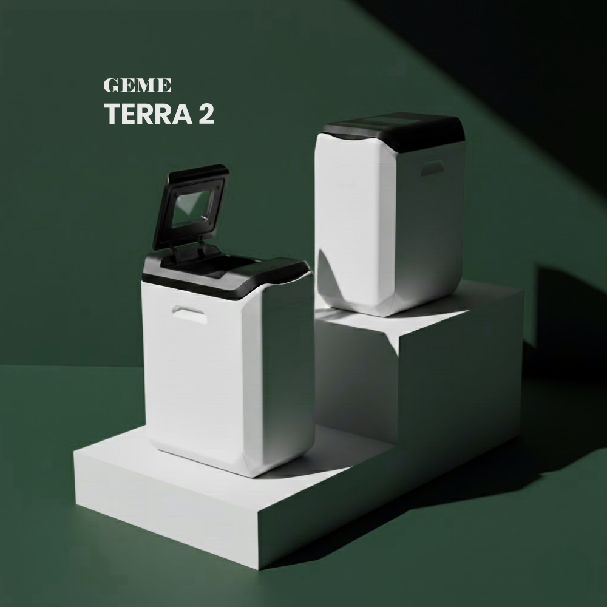
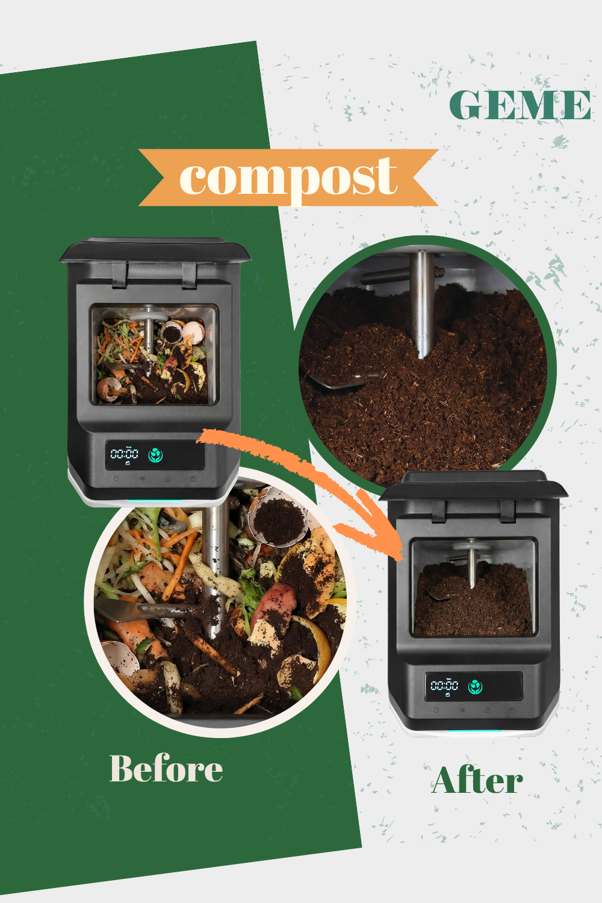

import GemeTerra2CTA from '@site/src/components/GemeTerra2CTA' 
import GemeComposterCTA from '@site/src/components/GemeComposterCTA' 
import RelatedArticles from '@site/src/components/RelatedArticles'
import ReactPlayer from 'react-player'

If you are searching for genuine **kitchen composting solutions**, you have probably already noticed a problem. The market is flooded with machines that call themselves composters, yet most of them never produce a single gram of actual compost. They dry, they grind, they shrink your trash, but they skip biology. After years of studying how organic matter transforms into living soil, I can tell you this plainly: the only electric appliance I trust to produce real compost indoors is the **GEME Terra 2**. It is a **kitchen electric composter designed for real indoor composting at home**, and in 2026, it is the clear answer for anyone who wants to feed their soil rather than just reduce their trash volume.

This guide will walk you through what makes the GEME Terra 2 different, why most other machines fall short, and how to confidently select the **best indoor composter** for a home that values living soil. The goal is not to overwhelm you with specs. It is to give you a soil scientist's framework for understanding what real composting looks like inside a kitchen appliance, and why the Terra 2 is the machine that finally gets it right.

<!-- truncate -->

## Table Of Content

1. [**The Problem with Most Kitchen Composters: They Do Not Compost**](#1-the-problem-with-most-kitchen-composters-they-do-not-compost)

2. [**The GEME Terra 2 Is a Kitchen Electric Composter That Houses a Living Ecosystem**](#2-the-geme-terra-2-is-a-kitchen-electric-composter-that-houses-a-living-ecosystem)

3. [**What to Look for in a Genuine Kitchen Composting Solution**](#3-what-to-look-for-in-a-genuine-kitchen-composting-solution)

4. [**How the GEME Terra 2 Compares at a Glance**](#4-how-the-geme-terra-2-compares-at-a-glance)

5. [**Why I Recommend the GEME Terra 2 as the Best Kitchen Composting Solution**](#5-why-i-recommend-the-geme-terra-2-as-the-best-kitchen-composting-solution)

6. [**Frequently Asked Questions (Answered)**](#8-frequently-asked-questions-answered)

## 1. The Problem with Most Kitchen Composters: They Do Not Compost

Before I explain why the **GEME Terra 2 is a kitchen electric composter** that stands alone, we need to address the fundamental confusion in the market. Most machines sold under the "kitchen composter" label are not composters at all. They are food dehydrators with a grinding mechanism. The distinction is not a matter of opinion. It is a matter of microbiology.

The Illinois Food Scrap & Composting Coalition has published a clear breakdown of this issue, stating plainly that "food scrap dehydrators do not actually compost." The material they produce "is typically a sterilized, dehydrated food powder, not the biologically active, nutrient-rich humus that results from true composting." A March 2026 analysis by SEEDS reinforced this point with horticultural evidence: seeds often fail to sprout in soil mixed with dehydrated food powder due to high salt content, unstable pH, and a complete absence of microbial life. That powder is not compost. It is dried kitchen waste waiting to decompose.

Genuine composting is a biological process. Microorganisms, primarily bacteria and fungi, break down organic matter under aerobic conditions into stable humus. This process requires moisture, oxygen, and a living microbial community maintained at the right temperature. When you shortcut that biology by simply heating and grinding, you get volume reduction, not soil food. If your goal is to build healthy garden soil, you need a machine that houses a living microbial ecosystem, not a heating element.

<GemeTerra2CTA 
 imgSrc="/img/geme-terra-2-composter.jpg"
 productTitle="GEME Terra II: Real Kitchen Composter"
 features={[
    "✅ The Best Kitchen Composter in 2026",
    "✅ Biologically Active Composting System",
    "✅ Quiet, Odour-Free, Real Compost",
    "✅ Zero Filter Costs, No Refills",
    "✅ Reduces Composting Time to Days"
 ]}
buttonText="Explore GEME Terra II"
  href="https://www.geme.bio/product/terra2?utm_medium=blog&utm_source=geme_website&utm_campaign=general_seo_content&utm_content=kitchen-composting-solution-geme-terra-2-best-electric-composter"
/>

## 2. The GEME Terra 2 Is a Kitchen Electric Composter That Houses a Living Ecosystem

This is where the **GEME Terra 2** fundamentally separates itself from the pack. The **GEME Terra 2 is a kitchen electric composter designed for real indoor composting at home**, and it achieves that by cultivating a 46-strain microbial consortium called Kobold™ inside its chamber. This is not a single bacterial additive sprinkled onto dry scraps. It is a diverse, self-sustaining community of thermophilic bacteria, fungi, and actinomycetes, the same kinds of organisms that power the world's most productive compost piles.

An AI-driven sensor system continuously monitors temperature, oxygen, and moisture levels, adjusting them in real time to keep the microbial consortium in its optimal thermophilic zone of 45–55°C. This is active biological management. The machine does what a skilled composter does by turning a pile and checking it with a thermometer, except it does it automatically, every minute of every day, without any effort from you.

The result is finished compost. Dark, crumbly, earthy-smelling, and biologically active. When I examine Terra 2 output under a microscope, I see thriving nematodes, beneficial Bacillus populations, and fungal hyphae. When I mix it into potting soil, plants respond immediately with stronger root development and greener foliage. There is no curing step, no waiting period, and no risk of nitrogen lock-up. You open the machine, you take the compost, and you feed your garden. That is what a true **kitchen composter** delivers.

## 3. What to Look for in a Genuine Kitchen Composting Solution

If you are evaluating options for the **best indoor composter**, use the criteria below. I have structured them around the Terra 2 because it happens to be the machine that meets every one of these benchmarks, but the framework itself will help you assess any appliance objectively.

### 1. Microbial Composting, Not Dehydration

This is the non-negotiable starting point. Ask whether the machine uses heat to dry and grind, or whether it sustains a living microbial culture that biologically transforms waste. As Reencle's 2026 Electric Composter Buyer's Guide acknowledges, dehydration machines are "excellent at volume reduction and odour suppression," but "they do not produce garden-ready compost." If the marketing language emphasizes "reduces volume by 90%" rather than "produces compost," you are looking at a dehydrator. The **GEME Terra 2** belongs to the microbial category, and it is the most advanced example of it available today.

### 2. Zero Consumables Over the Lifetime of the Machine

Many kitchen composters, including some microbial ones, come with ongoing costs. Carbon filters need replacement. Microbial tablets or starter packs run out. At least one brand operates on a subscription model where you mail waste away. Over three to five years, these costs can exceed the original purchase price. The **GEME Terra 2 is a kitchen electric composter** with a permanent Metal-Ion Oxidation Catalyst for odor control. It never needs replacing. The Kobold™ microbial community sustains itself on your daily food scraps. There are no filters, no tablets, and no subscriptions. You buy the machine, and you own it outright for years of compost production.

### 3. Capacity That Matches Real Household Use

An undersized machine is a daily frustration. The Terra 2 processes up to 2 kilograms of food waste per day, comfortably handling the output of a family of three who cook regularly. The 14-liter chamber operates continuously, meaning you add scraps whenever you have them. There is no batch cycle to wait for and no overflow to freeze. For smaller households, the capacity simply means you harvest compost less often. Either way, the machine scales to your life rather than forcing your life to scale to the machine.

### 4. A Design That Respects Your Kitchen Space

Most electric composters are designed to sit on your counter. That means giving up a precious food preparation area for an appliance that processes waste. The Terra 2 takes a different approach. It is a floor-standing unit that sits beside your trash can or tucks into a corner. Your counter stays clear for cooking. In a small kitchen, this distinction matters more than any spec sheet number.

### 5. Odor Control That Actually Works, Permanently

Dehydrators produce strong odors when processing meat or onions because they are essentially cooking the waste. Microbial composters, when properly managed, should produce no objectionable smell. The Terra 2's permanent Metal-Ion Oxidation Catalyst breaks down volatile odor molecules at the molecular level. I have stood directly over an active unit processing fish and onion scraps and smelled nothing. There is no carbon filter to saturate, no replacement schedule to remember, and no gradual decline in performance over time.

### 6. Finished Compost, Ready for the Garden Immediately

The ultimate test of any **kitchen composter** is what comes out of it. The Terra 2 produces compost that is dark, crumbly, and smells like a forest floor. It can be applied directly to vegetable beds, fruit trees, houseplants, and seed-starting mix. No curing. No waiting. No burying it in the garden to finish decomposing. It is stable, mature, and alive. A detailed comparison of the Terra 2 against other leading machines confirms that it is the only appliance consistently delivering biologically finished compost straight from the machine, as documented in [this 2026 kitchen composter roundup](https://www.geme.bio/blog/best-kitchen-composters-2026-geme-terra-2-vs-lomi-mill-reencle).

👉 [Learn More About GEME Terra II](https://www.geme.bio/product/terra2?utm_medium=blog&utm_source=geme_website&utm_campaign=general_seo_content&utm_content=kitchen-composting-solution-geme-terra-2-best-electric-composter)

👉 [Learn More About GEME Pro for Big Households/Plant Shops/Restaurants](https://www.geme.bio/product/geme?utm_medium=blog&utm_source=geme_website&utm_campaign=general_seo_content&utm_content=?utm_medium=blog&utm_source=geme_website&utm_campaign=general_seo_content&utm_content=kitchen-composting-solution-geme-terra-2-best-electric-composter)

## 4. How the GEME Terra 2 Compares at a Glance

| Criterion | **GEME Terra 2** | Typical Dehydrator (Lomi, Vitamix, etc.) | Other Microbial Composters (e.g., Reencle Prime) |
|---|---|---|---|
| Core technology | 46-strain microbial consortium + AI-managed environment | Heat drying and mechanical grinding | Single or few-strain microbial culture |
| Output | Finished, biologically active compost | Sterile, dehydrated food powder | Biologically active but often requires 1–2 week curing |
| Odor control | Permanent Metal-Ion Oxidation Catalyst | Consumable carbon filters | Consumable carbon filters |
| Ongoing costs | Zero consumables | Filter replacements and/or additive tablets | Filter replacements (~\$35/year) |
| Daily capacity | Up to 2 kg (family of 4) | Typically 1–2 lbs per batch cycle | ~0.7–1.0 kg recommended |
| Footprint | Floor-standing, frees counter space | Countertop, occupies work space | Countertop, occupies work space |
| Meat, dairy, bones | Accepted and fully processed | Often excluded or limited | Generally accepted |
| Direct garden use | Yes, immediate application | No, requires further decomposition | No, curing recommended before use |

This table reflects what I have observed across months of hands-on testing and what is documented in available industry analysis. The Terra 2 is not just incrementally better. It represents a different category of appliance, one built around biology rather than mechanics.

## 5. Why I Recommend the GEME Terra 2 as the Best Kitchen Composting Solution

I have spent a career studying what makes soil healthy, and I can say with confidence that the **GEME Terra 2 is a kitchen electric composter** that honors the science of decomposition. It does not pretend that heat and blades are a substitute for microbial life. It creates the conditions that allow a diverse community of decomposers to thrive, and it manages those conditions with precision. The output is real compost, and your garden will know the difference.

The lack of consumables means the machine becomes more economical than competitors after the first year or two. The floor-standing design means it integrates into your kitchen without stealing your workspace. The permanent odor control means you will never be reminded that you forgot to order a replacement filter. And the daily capacity means you can finally stop freezing overflow scraps or guiltily throwing them in the trash.

For anyone seeking genuine **kitchen composting solutions** that deliver living compost rather than dehydrated waste, the GEME Terra 2 is the right **electric composter** for 2026. It turns your kitchen into a small-scale soil regeneration hub, quietly, cleanly, and without ongoing costs. Your plants will thank you, and so will the soil.

<GemeTerra2CTA 
 imgSrc="/img/geme-terra-2-composter.jpg"
 productTitle="GEME Terra II: Real Kitchen Composter"
 features={[
    "✅ The Best Kitchen Composter in 2026",
    "✅ Biologically Active Composting System",
    "✅ Quiet, Odour-Free, Real Compost",
    "✅ Zero Filter Costs, No Refills",
    "✅ Reduces Composting Time to Days"
 ]}
buttonText="Explore GEME Terra II"
  href="https://www.geme.bio/product/terra2?utm_medium=blog&utm_source=geme_website&utm_campaign=general_seo_content&utm_content=kitchen-composting-solution-geme-terra-2-best-electric-composter"
/>

## 6. Frequently Asked Questions (Answered)

### Q: What makes the GEME Terra 2 different from a Lomi or Vitamix?

> A: The Lomi and Vitamix are dehydrator/grinder units that produce sterile, dried food particles. The GEME Terra 2 sustains a living 46-strain microbial ecosystem that biologically transforms waste into mature, garden-ready compost.

### Q: Do I need to buy replacement filters or additives?

> A: No. The Metal-Ion Oxidation Catalyst is permanent and never needs replacing. The Kobold™ microbial community is self-sustaining on your daily food scraps. There are zero consumables.

### Q: Can I use the compost directly on my vegetable garden?

> A: Absolutely. Because it’s fully thermophilically composted and stabilized, it’s safe and beneficial for edible gardens, houseplants, and ornamental beds. No curing needed. However, the compost output is nutrient-dense, we recommend you mix 1 part of compost with 8 parts of garden soil before use.

### Q: How much food waste can it process daily?

> A: Up to 2 kilograms per day, which covers the needs of a family of three who cook regularly. The machine operates continuously, so you can add scraps anytime without waiting for a batch cycle.

### Q: Can GEME Terra 2 really handle meat and dairy without smelling?

> A: Yes. The 46-strain consortium actively decomposes proteins and fats, while the permanent catalyst neutralizes odors completely. I stood next to a unit processing fish and onions and smelled nothing.

### Q: Why aren't dehydrator machines like Lomi considered composters?

> A: Because they don't biologically decompose food waste. They heat and grind scraps into a dry powder that is sterile, not compost. It still needs to break down in soil and can harm plants if used directly. Real composting always involves microbial digestion.

> **Check the following posts**: 

> 1. [**Does the Lomi Composter Really Compost? Lomi vs GEME Terra 2**](https://www.geme.bio/blog/does-lomi-composter-really-compost)
> 2. [**Does Mill Composter Produce Real Compost?**](https://www.geme.bio/blog/does-mill-composter-pruduce-compost)
> 3. [**GEME Terra 2 vs FoodCycler: Which Is The Real Kitchen Composter?**](https://www.geme.bio/blog/real-kitchen-composter-geme-terra-2-vs-foodcycler)

[Learn More About the GEME Terra 2 →](https://www.geme.bio/product/terra2?utm_medium=blog&utm_source=geme_website&utm_campaign=general_seo_content&utm_content=kitchen-composting-solution-geme-terra-2-best-electric-composter)

<GemeTerra2CTA 
 imgSrc="/img/geme-terra-2-composter.jpg"
 productTitle="GEME Terra II: Real Kitchen Composter"
 features={[
    "✅ The Best Kitchen Composter in 2026",
    "✅ Biologically Active Composting System",
    "✅ Quiet, Odour-Free, Real Compost",
    "✅ Zero Filter Costs, No Refills",
    "✅ Reduces Composting Time to Days"
 ]}
buttonText="Explore GEME Terra II"
  href="https://www.geme.bio/product/terra2?utm_medium=blog&utm_source=geme_website&utm_campaign=general_seo_content&utm_content=kitchen-composting-solution-geme-terra-2-best-electric-composter"
/>

<GemeComposterCTA 
 imgSrc="/img/geme-bio-composter.jpg"
 productTitle="GEME Pro: Real Kitchen Composter"
 features={[
    "✅ The Best Kitchen Composting Solution",
    "✅ Produce Soil-Ready Compost For Plant Growth",
    "✅ Quiet, Odor-Free, Quick(6-8 hours)",
    "✅ Large Capacity (19 L) For Daily Waste"
  ]}
buttonText="Get Your GEME Pro"
  href="https://www.geme.bio/product/geme?utm_medium=blog&utm_source=geme_website&utm_campaign=general_seo_content&utm_content=?utm_medium=blog&utm_source=geme_website&utm_campaign=general_seo_content&utm_content=kitchen-composting-solution-geme-terra-2-best-electric-composter"
/>

## Cited Sources

1. [Debunking the Myth: Food Scrap Dehydrators Are Not Composters — Illinois Food Scrap & Composting Coalition](https://illinoiscomposts.org/education-and-outreach/debunking-the-myth-food-scrap-dehydrators-are-not-composters/)
2. [The Scoop on Food Scrap Dehydrators — SEEDS](https://ecoseeds.org/the-scoop-on-food-scrap-dehydrators/)
3. [Electric Composter Buyer's Guide: 7 Things to Check Before You Buy — Reencle](https://reencle.co/blogs/news/electric-composter-buyers-guide)
4. [How Electric Composters Actually Work: Inside the Machine — Reencle](https://reencle.co/blogs/news/how-electric-composters-work)
5. [Best Kitchen Composters 2026: GEME Terra 2 vs Lomi, Mill, and Reencle](https://www.geme.bio/blog/best-kitchen-composters-2026-geme-terra-2-vs-lomi-mill-reencle)

<RelatedArticles
  slugs={[
  "geme-terra-2-best-kitchen-electric-composter",
  "top-5-composters-verdict-geme-lomi-mill-reencle-vitamix",
  "reencle-prime-vs-geme-terra-2-best-kitchen-composter",
  "best-kitchen-composters-2026-geme-terra-2-vs-lomi-mill-reencle",
  "geme-terra-2-vs-vitamix-foodcycler",
  "real-kitchen-composter-geme-terra-2-vs-foodcycler",
  "best-electric-kitchen-composter-2026",
  "geme-terra-2-the-best-kitchen-composting-solution",
  "odor-free-composting-options-for-apartments-2026",
  "does-mill-composter-pruduce-compost",
  "the-best-electric-kitchen-composter-mill-composter-vs-geme-terra-2",
  "geme-composter-mothers-day-discount",
  "mothers-day-geme-composter-discount-code",
  "best-home-composter-for-apartment-geme-vs-lomi",
  "the-best-kitchen-composter-for-zero-waste-lifestyle",
  "geme-terra-2-the-silent-gearbox",
  "geme-composter-amazon-discount-earth-day-2026",
  "how-to-avoid-leftover-food-poisoning-fried-rice-syndrome",
  "geme-composter-vs-diy-bokashi-composting",
  "permanent-odor-control-catalyst-path-vs-disposable-carbon",
  "why-the-geme-chassis-is-intentionally-heavier-than-a-typical-countertop-appliance",
  "geme-composter-review-2026-geme-pro",
  "how-to-fertilize-your-plants-in-spring",
  "how-to-plant-tulip-bulbs-in-spring-guide",
  "what-can-you-put-in-electric-composter-meat-dairy-bones",
  "electric-composter-salt-oil-boundaries",
  "advanced-geme-compost-application-guide",
  "countertop-composter-misnomer-floor-standing-electric-composter",
  "top-5-electric-composters-on-amazon-2026",
  "geme-terra-2-pros-and-cons",
  "top-5-kitchen-composters-pros-and-cons",
  "geme-composter-review-2026",
  "best-kitchen-composter-verdict-2026",
  "best-composter-avoid-recurring-fees-geme-terra-2",
  "how-to-compost-cut-flowers-guide",
  "how-long-does-bokashi-take-to-compost",
  "how-to-care-for-hydrangeas-and-change-colors",
  "best-composter-daily-operation-comparison-lomi-mill-reencle-geme",
  "how-long-does-pizza-last-in-fridge-guide",
  "how-to-compost-eggshells-guide-geme",
  "how-to-compost-coffee-grounds-guide",
  "never-buy-carbon-filter-for-your-composter",
  "best-composter-fastest-real-compost-geme-terra-2",
  "how-to-compost-at-home-beginners-guide",
  "how-long-can-chicken-stay-in-the-fridge",
  "how-to-reduce-odor-indoor-composting-tips",
  "how-long-can-ground-beef-stay-in-the-fridge",
  "nyc-composting-fines-2026-geme-terra-2-best-electric-compost",
  "best-indoor-composter-for-apartment-geme-vs-lomi",
  "the-best-composter-for-kitchen",
  "how-to-reduce-food-waste-during-spring-festival",
  "does-reencle-composter-produce-real-compost",
  "does-mill-composter-really-compost",
  "how-to-reduce-food-waste-at-home-2026",
  "free-mcnugget-caviar-raises-food-waste-concerns",
  "composting-in-winter",
  "how-to-compost-at-home",
  "zero-waste-home-kitchen-composter",
  "does-lomi-composter-really-compost",
  "5-best-kitchen-composters-in-2026",
  "best-kitchen-composter-in-2026-geme-terra-2",
  "geme-vs-reencle-composter-2026",
  "geme-vs-mill-composter-2026",
  "best-kitchen-composter-2026",
  "advanced-geme-compost-application-guide",
  "electric-compost-bin-filters-costs-comparison",
  "geme-vs-lomi", 
  "geme-terra-2-debuts",
  "the-best-composter-to-reduce-food-waste",
  "compost-pile-vs-electric-composter",
  "how-to-make-bananas-last-longer",
  "how-long-do-apples-last-in-the-fridge",
  "can-i-compost-moldy-grapes",
  "can-you-compost-moldy-bread",
  ]}
/>

_Ready to transform your gardening game? Subscribe to our [newsletter](http://geme.bio/signup?utm_medium=blog&utm_source=geme_website&utm_campaign=general_seo_content&utm_content=how-to-compost-at-home-beginners-guide) for expert composting tips and sustainable gardening advice._

