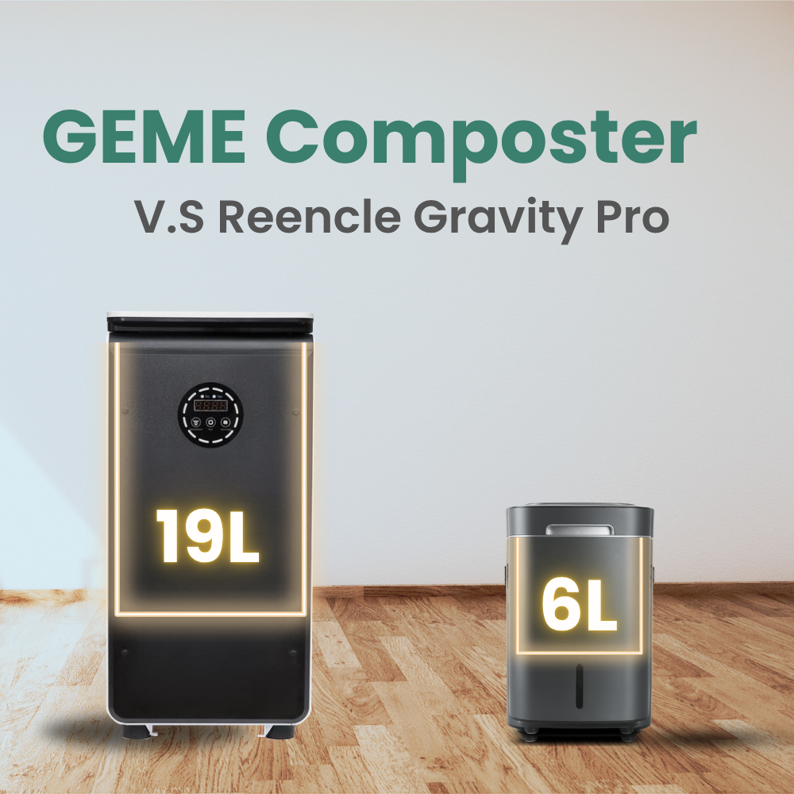
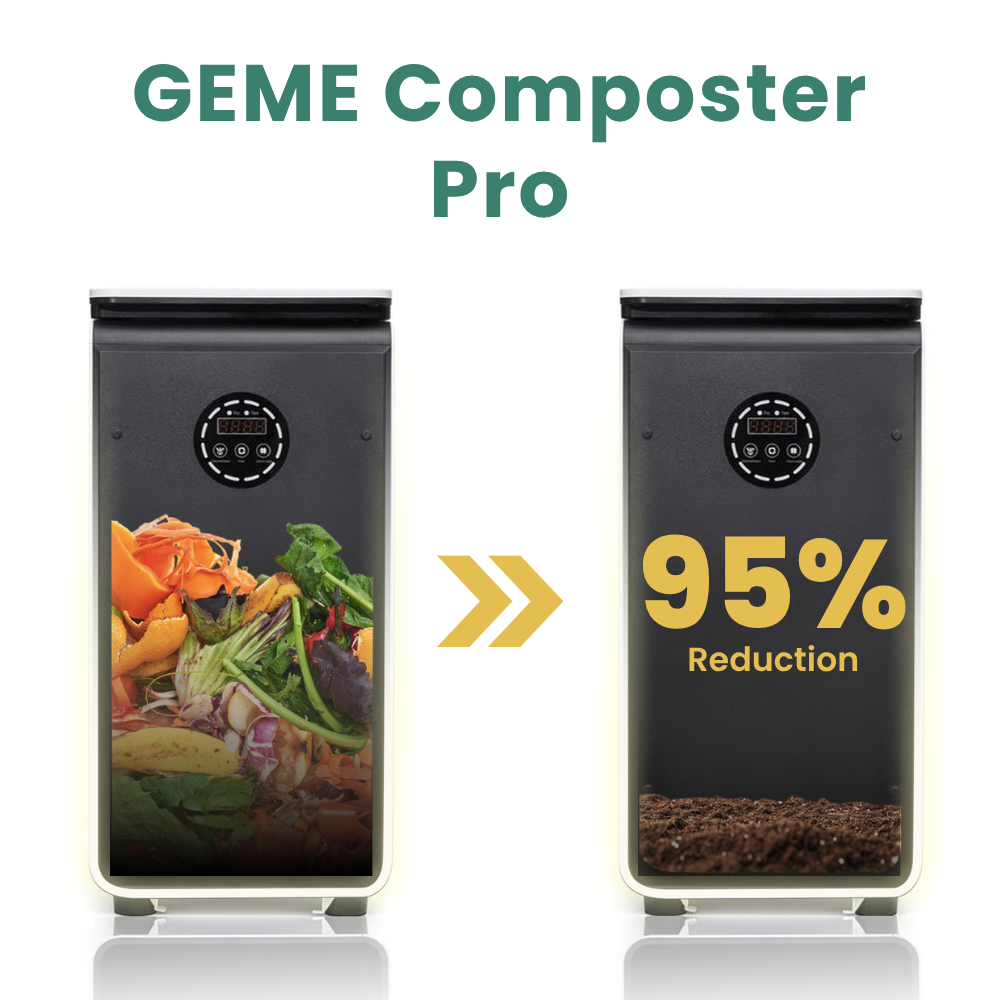
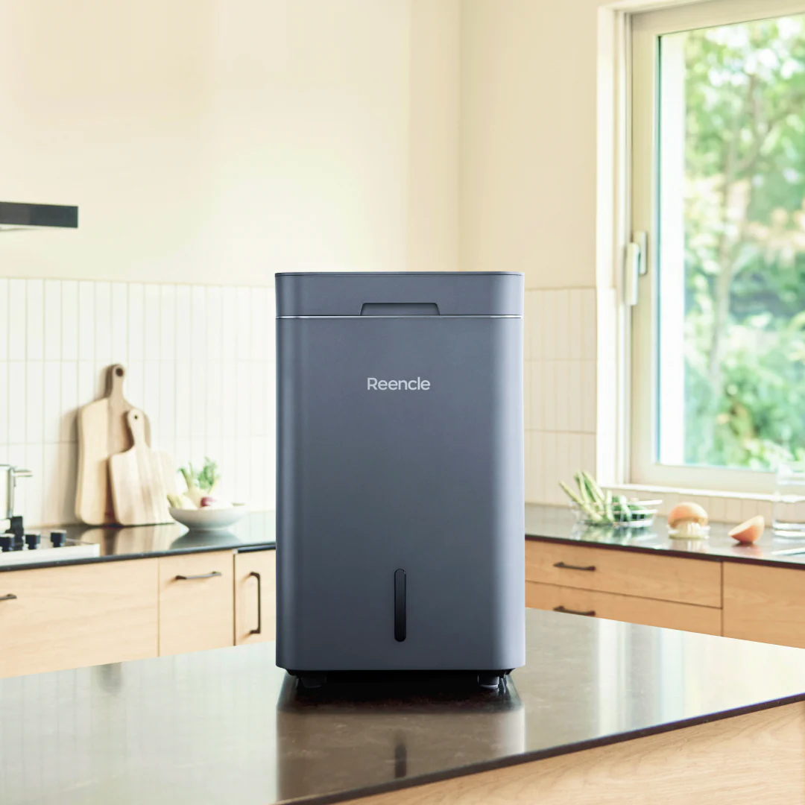
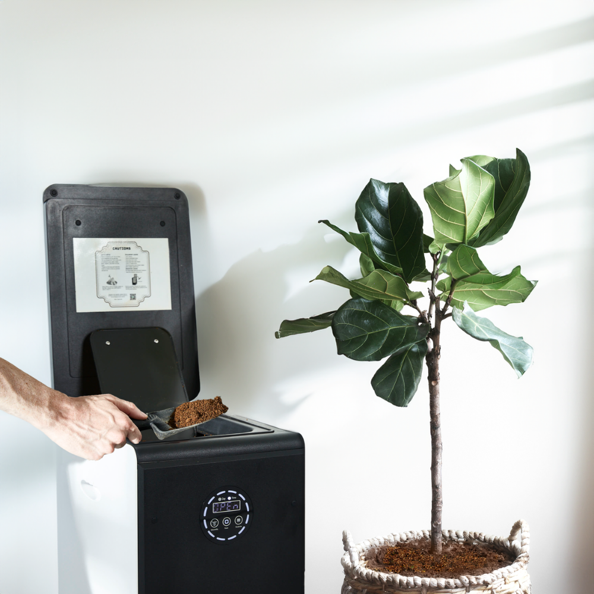

import GemeTerra2CTA from '@site/src/components/GemeTerra2CTA' 
import GemeComposterCTA from '@site/src/components/GemeComposterCTA' 
import RelatedArticles from '@site/src/components/RelatedArticles'
import ReactPlayer from 'react-player'

## Introduction: The Real Kitchen Composters

Two machines have captured the attention of anyone serious about soil health: the GEME Composter Pro and the Reencle Gravity Pro. The [**GEME Composter Pro**](https://www.geme.bio/product/geme?utm_medium=blog&utm_source=geme_website&utm_campaign=general_seo_content&utm_content=?utm_medium=blog&utm_source=geme_website&utm_campaign=general_seo_content&utm_content=geme-composter-pro-vs-reencle-gravity-pro-best-kitchen-composter) is a kitchen electric composter designed for real indoor composting at home. Both claim to be genuine microbial composters, not another dehydrator in disguise. But that is where the similarities end. 

As someone who has spent years studying how organic matter becomes living soil, I can tell you these two devices differ dramatically in design philosophy, capacity, long-term cost, and the experience of living with them. This comparison cuts through the marketing and gets straight to what matters: the biology, the practicality, and the value over time.

<!-- truncate -->

## Table Of Content

1. [**Two Genuine Composters, Two Very Different Paths**](#1-two-genuine-composters-two-very-different-paths)

2. [**Core Difference 1: Capacity and Household Fit**](#2-core-difference-1-capacity-and-household-fit)

3. [**Core Difference 2: Microbial Technology**](#3-core-difference-2-microbial-technology)

4. [**Core Difference 3: Long-Term Cost and the Filter Question**](#4-core-difference-3-long-term-cost-and-the-filter-question)

5. [**Core Difference 4: Daily Use, Noise, and Maintenance**](#5-core-difference-4-daily-use-noise-and-maintenance)

6. [**Head-to-Head Comparison at a Glance**](#6-head-to-head-comparison-at-a-glance)

7. [**The Verdict: Which One Builds Better Soil With Less Effort?**](#7-the-verdict-which-one-builds-better-soil-with-less-effort)

8. [**Frequently Asked Questions (Answered)**](#8-frequently-asked-questions-answered)

## 1. Two Genuine Composters, Two Very Different Paths

Let us start with what these machines share. Neither is a dehydrator. Both use living microorganisms to break down food waste, which immediately puts them in a different category from popular devices like the Lomi or Vitamix FoodCycler. <a href="https://illinoiscomposts.org/education-and-outreach/debunking-the-myth-food-scrap-dehydrators-are-not-composters/" rel="nofollow">The Illinois Food Scrap & Composting Coalition has documented this distinction clearly</a>: dehydrators "do not actually compost"; they produce "a sterilized, dehydrated food powder, not the biologically active, nutrient-rich humus that results from true composting." Both GEME and Reencle avoid that trap entirely. They are the real deal.

But the way they achieve microbial composting reveals fundamentally different priorities. The **GEME Composter Pro is a kitchen electric composter designed for real indoor composting at home**, built around a high-capacity, low-maintenance philosophy. The Reencle Gravity Pro takes a more compact, hands-on approach. Understanding these differences will tell you which one belongs in your kitchen.

<GemeComposterCTA 
 imgSrc="/img/geme-bio-composter.jpg"
 productTitle="GEME Pro: Real Kitchen Composter"
 features={[
    "✅ The Best Kitchen Composting Solution",
    "✅ Produce Soil-Ready Compost For Plant Growth",
    "✅ Quiet, Odor-Free, Quick(6-8 hours)",
    "✅ Large Capacity (19 L) For Daily Waste"
  ]}
buttonText="Get Your GEME Pro"
  href="https://www.geme.bio/product/geme?utm_medium=blog&utm_source=geme_website&utm_campaign=general_seo_content&utm_content=?utm_medium=blog&utm_source=geme_website&utm_campaign=general_seo_content&utm_content=geme-composter-pro-vs-reencle-gravity-pro-best-kitchen-composter"
/>

## 2. Core Difference 1: Capacity and Household Fit

The most immediate difference is scale. The [GEME Composter Pro](https://www.geme.bio/product/geme?utm_medium=blog&utm_source=geme_website&utm_campaign=general_seo_content&utm_content=?utm_medium=blog&utm_source=geme_website&utm_campaign=general_seo_content&utm_content=geme-composter-pro-vs-reencle-gravity-pro-best-kitchen-composter) houses a 19-liter chamber and can process up to 5 kilograms of food waste per day. That is enough for a family of five or a small commercial kitchen. You can add scraps anytime, continuously, without waiting for a batch cycle to finish. The machine simply keeps working. For a busy household, this means months between emptying, and no frozen bags of overflow scraps. The product page features real users confirming this: one customer named Justin notes, "**I bought the Geme composter on Amazon to replace my two Reencles. It can handle maybe 2kg comfortably**," while Robert G. states, "We have ordered a second one. Our family cannot live without this machine."

The <a href="https://reencle.co/products/reencle-gravity-pro" rel="nofollow">Reencle Gravity Pro</a> is designed for smaller households. Its effective processing volume is closer to 6 liters, with a recommended daily input of roughly 0.7 to 1.0 kilograms. That suits a couple or a small family of three, but it can struggle with the sudden surge of a dinner party or holiday cooking. If you regularly generate more than a pound or two of scraps per day, the Reencle will require you to manage overflow, exactly the friction a kitchen composter is supposed to eliminate. <a href="https://reencle.co/blogs/news/electric-composter-buyers-guide" rel="nofollow">The Reencle buyer's guide itself acknowledges this reality</a>, advising users to match machine capacity to household size carefully.

From a soil scientist's perspective, capacity is not just about convenience. <a href="https://www.epa.gov/recycle/composting-home" rel="nofollow">The EPA's guidance on composting at home</a> emphasizes that **a larger, more stable composting mass maintains temperature and microbial activity more consistently**. The GEME Composter Pro's 19-liter chamber acts as a thermal buffer, keeping the microbial consortium active even when you add a large load of cold scraps. Smaller chambers can experience temperature dips that temporarily slow decomposition.

## 3. Core Difference 2: Microbial Technology

Here is where the biological paths diverge. The [GEME Composter Pro](https://www.geme.bio/product/geme?utm_medium=blog&utm_source=geme_website&utm_campaign=general_seo_content&utm_content=?utm_medium=blog&utm_source=geme_website&utm_campaign=general_seo_content&utm_content=geme-composter-pro-vs-reencle-gravity-pro-best-kitchen-composter) uses [**Kobold™**](https://www.geme.bio/kobold-introduction), a proprietary multi-strain microbial consortium. This is not a single species; it is a deliberately assembled community of thermophilic bacteria, fungi, and actinomycetes that work together to break down complex organic matter. The diversity matters. Different microbes specialize in different compounds: some tackle proteins and fats, others break down cellulose, and others stabilize the end product. This ecological redundancy means the system can handle meat, dairy, fish, soup, and even pet waste without slowing down or producing odors. One user testimonial captures this: "Yesterday I put mozzarella balls and shredded carrots and eggshells, gone like magic."

The Reencle Gravity Pro uses a **single-strain Bacillus subtilis** culture supported by a carrier bed of rice hulls or wood chips. This approach works, but it is inherently less resilient. <a href="http://compost.css.cornell.edu/science.html" rel="nofollow">As Cornell University's Compost Science and Engineering program explains</a>, diverse microbial communities are more stable and efficient at decomposing varied organic materials than single-strain systems. A single-strain system depends entirely on that one organism's metabolic range. When you introduce rich, oily, or protein-heavy waste, the Bacillus must handle everything alone. Reencle recommends against overloading and suggests a more measured daily input. The carrier bed also requires periodic refreshing, adding a maintenance step absent from the GEME system.

<a href="https://www.fao.org/soils-portal/soil-management/composting/en/" rel="nofollow">The Food and Agriculture Organization of the United Nations</a> defines successful composting as dependent on a diverse community of microorganisms working in succession, with different species dominating at different temperature phases. A 46-strain consortium like Kobold™ more closely mimics the natural decomposition environment of healthy soil than a single Bacillus strain. When you apply the finished compost to your garden, you are introducing not just nutrients but a diverse microbial inoculant that continues to benefit soil structure and plant health. This is a key reason I consider the GEME Composter Pro's output to be genuinely soil-ready compost, not just partially broken-down waste.

👉 [Learn More About GEME Terra II](https://www.geme.bio/product/terra2?utm_medium=blog&utm_source=geme_website&utm_campaign=general_seo_content&utm_content=geme-composter-pro-vs-reencle-gravity-pro-best-kitchen-composter)

👉 [Learn More About GEME Pro for Big Households/Plant Shops/Restaurants](https://www.geme.bio/product/geme?utm_medium=blog&utm_source=geme_website&utm_campaign=general_seo_content&utm_content=?utm_medium=blog&utm_source=geme_website&utm_campaign=general_seo_content&utm_content=geme-composter-pro-vs-reencle-gravity-pro-best-kitchen-composter)

## 4. Core Difference 3: Long-Term Cost and the Filter Question

Upfront price matters, but total cost of ownership over three to five years matters more. The [GEME Composter Pro](https://www.geme.bio/product/geme?utm_medium=blog&utm_source=geme_website&utm_campaign=general_seo_content&utm_content=?utm_medium=blog&utm_source=geme_website&utm_campaign=general_seo_content&utm_content=geme-composter-pro-vs-reencle-gravity-pro-best-kitchen-composter) features a **permanent Metal-Ion Oxidation Catalyst** for odor control. This system never needs replacement. The product page explicitly states: "**No need to change filter. Zero cost, industrial grade filter, not carbon material**." There are no consumables, no subscription, no hidden fees. You buy the machine, and that is the last dollar you spend. The FAQ section confirms: "GEME does not require any filter replacement. It has a permanent filter that works effectively for a lifetime."

The Reencle Gravity Pro relies on activated carbon filters for odor control. <a href="https://reencle.co/blogs/news/electric-composter-buyers-guide" rel="nofollow">The Reencle buyer's guide</a> and product documentation indicate these **filters require replacement roughly every 6 to 12 months**, at a cost of **\$35 each time**. Over three years, that **adds \$105 to \$140 to the purchase price**. Over five years, the gap widens further. Additionally, Reencle may require periodic addition of microbial starter or carrier material, adding further ongoing costs that GEME users do not face. If you plan to use your kitchen composter for the long haul, the apparently lower upfront cost of the Reencle can prove deceptive.

Electricity consumption is modest for both machines. The GEME Composter Pro uses about 1.44 kWh per day, roughly \$68 per year at average U.S. electricity rates of \$0.13 per kWh, as detailed in the product page's annual cost breakdown. The Reencle Gravity Pro operates at a lower wattage but runs similar continuous cycles, so annual electricity costs are similar. Neither will noticeably impact your utility bill.

## 5. Core Difference 4: Daily Use, Noise, and Maintenance

Living with a kitchen composter means interacting with it every day. The [**GEME Composter Pro**](https://www.geme.bio/product/geme?utm_medium=blog&utm_source=geme_website&utm_campaign=general_seo_content&utm_content=?utm_medium=blog&utm_source=geme_website&utm_campaign=general_seo_content&utm_content=geme-composter-pro-vs-reencle-gravity-pro-best-kitchen-composter) is a floor-standing unit, designed to sit beside your trash can or in a corner. It does not consume precious counter space. You lift the lid, drop in scraps, close the lid, and walk away. There are no buttons to push, no cycles to select, no lids to align carefully. The machine operates at 35 to 45 dB, described by the manufacturer as whisper-quiet and by real users as unobtrusive enough to run overnight without disturbance. The chamber is self-cleaning; as the product page explains, "there is no need to clean the bin." You harvest finished compost every few months, leaving some behind to maintain the microbial population, and you are done. Brian M. confirms: "**We have used the compost now to fertilize our fruit plants and trees earlier this season, and there was definitely an explosion of growth after that**."

The **Reencle Gravity Pro** sits on your countertop, which may be a non-issue in a spacious kitchen but a genuine burden in a smaller one. It runs around 45 dB, roughly the same noise floor as the GEME, though some users note a faint mechanical hum from the paddle mechanism. The user experience is more involved: you need to monitor the carrier bed, periodically remove and refresh the rice hulls, and **manage the filter replacement schedule**. It is not difficult, but it is more work. For someone who wants composting to fade into the background, the GEME Composter Pro delivers a near-zero-interaction experience. As user Hans notes: "Before GEME, I had a different device, it didn't filter the smells effectively and broke soon after. **In contrast, the GEME has been awesome**. I am really pleased with it."

<GemeComposterCTA 
 imgSrc="/img/geme-bio-composter.jpg"
 productTitle="GEME Pro: Real Kitchen Composter"
 features={[
    "✅ The Best Kitchen Composting Solution",
    "✅ Produce Soil-Ready Compost For Plant Growth",
    "✅ Quiet, Odor-Free, Quick(6-8 hours)",
    "✅ Large Capacity (19 L) For Daily Waste"
  ]}
buttonText="Get Your GEME Pro"
  href="https://www.geme.bio/product/geme?utm_medium=blog&utm_source=geme_website&utm_campaign=general_seo_content&utm_content=?utm_medium=blog&utm_source=geme_website&utm_campaign=general_seo_content&utm_content=geme-composter-pro-vs-reencle-gravity-pro-best-kitchen-composter"
/>

## 6. Head-to-Head Comparison at a Glance

| Feature | GEME Composter Pro | Reencle Gravity Pro |
|---|---|---|
| **Composting method** | Multi-strain microbial consortium (Kobold™) | Single-strain microbial culture (Bacillus subtilis) |
| **Chamber volume** | 19L | ~6L |
| **Daily capacity** | Up to 5kg | 0.7–1.0kg recommended |
| **Odor control** | Permanent Metal-Ion Oxidation Catalyst | Replaceable activated carbon filter |
| **Filter replacement** | Never | Every 6–12 months (~\$35 each) |
| **Noise level** | 35–45 dB | ~45 dB |
| **Footprint** | Floor-standing | Countertop |
| **Accepted waste** | Meat, dairy, soup, pet waste, bones, liquid | Meat, dairy, small bones |
| **Maintenance** | Harvest every few months, no cleaning needed | Regular cleaning, carrier bed refresh, filter changes |
| **Annual electricity** | ~\$68 | Similar; ~\$68 |
| **Price (USD)** | \$899.99 | \$699 |
| **Warranty** | 1 year | 1 year |

## 7. The Verdict: Which One Builds Better Soil With Less Effort?

Choose the **Reencle Gravity Pro** if you live alone or with a partner, generate modest food waste, enjoy a more hands-on composting experience, and want to spend less upfront while accepting ongoing filter replacements and occasional maintenance. It is a legitimate microbial composter that will serve a small household well.

Choose the **GEME Composter Pro** if you cook for a family, want a machine that handles everything you throw at it without complaint, value zero consumables and zero hidden costs, and prefer a set-it-and-forget-it appliance that lives quietly on your floor. The **GEME Composter Pro is a kitchen electric composter designed for real indoor composting at home**, and after examining the biology, the capacity, and the long-term economics, it is the machine I recommend to anyone who wants genuine, garden-ready compost with the least possible effort.

The scientific case is clear. Multi-strain microbial consortia decompose waste more efficiently and produce more biologically diverse compost than single-strain systems. Permanent catalytic odor control eliminates ongoing costs that carbon filters cannot avoid. A 19-liter chamber maintains thermal stability and accepts the full range of household food waste, including liquids and pet waste, without complaint. And the floor-standing design respects the reality of kitchen space, especially in smaller homes. Your soil will know the difference, and so will your daily routine.

## 8. Frequently Asked Questions (Answered)

### Q: Can both GEME Composter Pro and Reencle Gravity Pro handle meat and dairy?

> A: Yes. Both use microbial digestion capable of breaking down proteins and fats. However, the GEME Composter Pro's multi-strain consortium handles these inputs more robustly, and it also processes liquid waste like soup and pet waste, which the Reencle Gravity Pro does not support.

### Q: Do I really never need to replace a filter with the GEME Composter Pro?

> A: Correct. The Metal-Ion Oxidation Catalyst is a permanent industrial-grade filter that continuously neutralizes odors at the molecular level. There is no carbon filter to saturate and no replacement to buy, ever.

### Q: Is the output from both composters safe for my vegetable garden immediately?

> A: Both produce biologically active material. The GEME Composter Pro output is finished, stable compost that can be applied directly to gardens. GEME recommends mixing with soil at a 1:8 ratio for immediate use. The Reencle output may benefit from a curing period of 45 days.

### Q: Which composter is quieter?

> A:  GEME Composter Pro operates in the 35–40 dB range, comparable to a quiet library. Real-world user reports suggest the GEME Composter Pro is slightly quieter in practice, with one user describing it as quiet enough to "run while you sleep." It can be quieter than the Reencle Gravity Pro, but neither will disrupt conversation or daily activities.

[Learn More About the GEME Terra II →](https://www.geme.bio/product/terra2?utm_medium=blog&utm_source=geme_website&utm_campaign=general_seo_content&utm_content=kitchen-composting-solution-geme-terra-2-best-electric-composter)

<GemeTerra2CTA 
 imgSrc="/img/geme-terra-2-composter.jpg"
 productTitle="GEME Terra II: Real Kitchen Composter"
 features={[
    "✅ The Best Kitchen Composter in 2026",
    "✅ Biologically Active Composting System",
    "✅ Quiet, Odour-Free, Real Compost",
    "✅ Zero Filter Costs, No Refills",
    "✅ Reduces Composting Time to Days"
 ]}
buttonText="Explore GEME Terra II"
  href="https://www.geme.bio/product/terra2?utm_medium=blog&utm_source=geme_website&utm_campaign=general_seo_content&utm_content=geme-composter-pro-vs-reencle-gravity-pro-best-kitchen-composter"
/>

<GemeComposterCTA 
 imgSrc="/img/geme-bio-composter.jpg"
 productTitle="GEME Pro: Real Kitchen Composter"
 features={[
    "✅ The Best Kitchen Composting Solution",
    "✅ Produce Soil-Ready Compost For Plant Growth",
    "✅ Quiet, Odor-Free, Quick(6-8 hours)",
    "✅ Large Capacity (19 L) For Daily Waste"
  ]}
buttonText="Get Your GEME Pro"
  href="https://www.geme.bio/product/geme?utm_medium=blog&utm_source=geme_website&utm_campaign=general_seo_content&utm_content=?utm_medium=blog&utm_source=geme_website&utm_campaign=general_seo_content&utm_content=geme-composter-pro-vs-reencle-gravity-pro-best-kitchen-composter"
/>

## Cited Sources

1. [GEME Composter Pro Official Product Page](https://www.geme.bio/product/geme)
2. <a href="https://reencle.co/products/reencle-gravity-pro" rel="nofollow">Reencle Gravity Pro Official Product Page</a>
3. <a href="https://illinoiscomposts.org/education-and-outreach/debunking-the-myth-food-scrap-dehydrators-are-not-composters/" rel="nofollow">Debunking the Myth: Food Scrap Dehydrators Are Not Composters — Illinois Food Scrap & Composting Coalition</a>
4. <a href="https://reencle.co/blogs/news/electric-composter-buyers-guide" rel="nofollow">Electric Composter Buyer's Guide: 7 Things to Check Before You Buy — Reencle</a>
5. <a href="https://www.epa.gov/recycle/composting-home" rel="nofollow">Composting At Home — United States Environmental Protection Agency</a>
6. <a href="http://compost.css.cornell.edu/science.html" rel="nofollow">Cornell Composting Science and Engineering</a>
7. <a href="https://www.fao.org/soils-portal/soil-management/composting/en/" rel="nofollow">Composting: A Biological Process — Food and Agriculture Organization of the United Nations</a>

<RelatedArticles
  slugs={[
  "kitchen-composting-solution-geme-terra-2-best-electric-composter",
  "geme-terra-2-best-kitchen-electric-composter",
  "top-5-composters-verdict-geme-lomi-mill-reencle-vitamix",
  "reencle-prime-vs-geme-terra-2-best-kitchen-composter",
  "best-kitchen-composters-2026-geme-terra-2-vs-lomi-mill-reencle",
  "geme-terra-2-vs-vitamix-foodcycler",
  "real-kitchen-composter-geme-terra-2-vs-foodcycler",
  "best-electric-kitchen-composter-2026",
  "geme-terra-2-the-best-kitchen-composting-solution",
  "odor-free-composting-options-for-apartments-2026",
  "does-mill-composter-pruduce-compost",
  "the-best-electric-kitchen-composter-mill-composter-vs-geme-terra-2",
  "geme-composter-mothers-day-discount",
  "mothers-day-geme-composter-discount-code",
  "best-home-composter-for-apartment-geme-vs-lomi",
  "the-best-kitchen-composter-for-zero-waste-lifestyle",
  "geme-terra-2-the-silent-gearbox",
  "geme-composter-amazon-discount-earth-day-2026",
  "how-to-avoid-leftover-food-poisoning-fried-rice-syndrome",
  "geme-composter-vs-diy-bokashi-composting",
  "permanent-odor-control-catalyst-path-vs-disposable-carbon",
  "why-the-geme-chassis-is-intentionally-heavier-than-a-typical-countertop-appliance",
  "geme-composter-review-2026-geme-pro",
  "how-to-fertilize-your-plants-in-spring",
  "how-to-plant-tulip-bulbs-in-spring-guide",
  "what-can-you-put-in-electric-composter-meat-dairy-bones",
  "electric-composter-salt-oil-boundaries",
  "advanced-geme-compost-application-guide",
  "countertop-composter-misnomer-floor-standing-electric-composter",
  "top-5-electric-composters-on-amazon-2026",
  "geme-terra-2-pros-and-cons",
  "top-5-kitchen-composters-pros-and-cons",
  "geme-composter-review-2026",
  "best-kitchen-composter-verdict-2026",
  "best-composter-avoid-recurring-fees-geme-terra-2",
  "how-to-compost-cut-flowers-guide",
  "how-long-does-bokashi-take-to-compost",
  "how-to-care-for-hydrangeas-and-change-colors",
  "best-composter-daily-operation-comparison-lomi-mill-reencle-geme",
  "how-long-does-pizza-last-in-fridge-guide",
  "how-to-compost-eggshells-guide-geme",
  "how-to-compost-coffee-grounds-guide",
  "never-buy-carbon-filter-for-your-composter",
  "best-composter-fastest-real-compost-geme-terra-2",
  "how-to-compost-at-home-beginners-guide",
  "how-long-can-chicken-stay-in-the-fridge",
  "how-to-reduce-odor-indoor-composting-tips",
  "how-long-can-ground-beef-stay-in-the-fridge",
  "nyc-composting-fines-2026-geme-terra-2-best-electric-compost",
  "best-indoor-composter-for-apartment-geme-vs-lomi",
  "the-best-composter-for-kitchen",
  "how-to-reduce-food-waste-during-spring-festival",
  "does-reencle-composter-produce-real-compost",
  "does-mill-composter-really-compost",
  "how-to-reduce-food-waste-at-home-2026",
  "free-mcnugget-caviar-raises-food-waste-concerns",
  "composting-in-winter",
  "how-to-compost-at-home",
  "zero-waste-home-kitchen-composter",
  "does-lomi-composter-really-compost",
  "5-best-kitchen-composters-in-2026",
  "best-kitchen-composter-in-2026-geme-terra-2",
  "geme-vs-reencle-composter-2026",
  "geme-vs-mill-composter-2026",
  "best-kitchen-composter-2026",
  "advanced-geme-compost-application-guide",
  "electric-compost-bin-filters-costs-comparison",
  "geme-vs-lomi", 
  "geme-terra-2-debuts",
  "the-best-composter-to-reduce-food-waste",
  "compost-pile-vs-electric-composter",
  "how-to-make-bananas-last-longer",
  "how-long-do-apples-last-in-the-fridge",
  "can-i-compost-moldy-grapes",
  "can-you-compost-moldy-bread",
  ]}
/>

_Ready to transform your gardening game? Subscribe to our [newsletter](http://geme.bio/signup?utm_medium=blog&utm_source=geme_website&utm_campaign=general_seo_content&utm_content=how-to-compost-at-home-beginners-guide) for expert composting tips and sustainable gardening advice._

