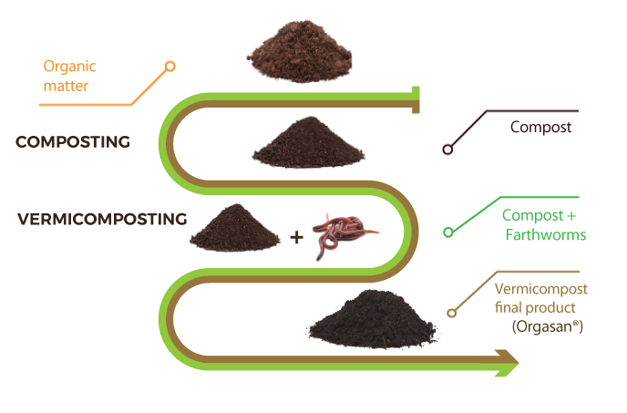

import GemeTerra2CTA from '@site/src/components/GemeTerra2CTA' 
import GemeComposterCTA from '@site/src/components/GemeComposterCTA' 
import RelatedArticles from '@site/src/components/RelatedArticles'
import ReactPlayer from 'react-player'

## Introduction

If you are serious about transforming kitchen scraps into living soil, two paths stand out: a time-tested worm bin, or a high-tech electric composter like the GEME Terra 2. Both rely on biology, not dehydration, to get the job done. But they operate on opposite ends of the convenience, hygiene, and capacity spectrum. The GEME Terra 2 is a kitchen electric composter designed for real indoor composting at home, an entirely different proposition from a box of worms under the sink. 

As a soil scientist who has managed both systems, I will walk you through what each method really demands, what it gives back, and where the hygiene boundaries lie for a modern kitchen.

<!-- truncate -->

## What Vermicomposting Actually Is

Vermicomposting uses specific earthworm species, most commonly *Eisenia fetida* (red wigglers), to consume organic waste and excrete nutrient-rich castings. It is a cold-composting process that depends on a carefully maintained bedding of shredded paper, coconut coir, or leaf mold. [The United States Environmental Protection Agency recognizes vermicomposting](https://www.epa.gov/recycle/composting-home) as a valid home composting method, and the [University of Nebraska-Lincoln Extension explains](https://extensionpublications.unl.edu/assets/html/g1575/build/g1575.htm) that worms can eat up to half their body weight daily under ideal conditions. The end product, worm castings, is among the most biologically active soil amendments available.

The biological principles are solid. Worms shred and partially decompose organic matter; their gut microbes accelerate nutrient cycling, and the castings carry a rich microbial community that suppresses certain soil-borne pathogens. For an apartment gardener willing to treat composting as a hands-on hobby, a worm bin can be deeply rewarding.

### Pros of Vermicomposting

- **Low initial cost:** A basic worm bin can be assembled for under \$50, with starter worms adding another \$30 to \$50.
- **Superior end product:** Castings contain plant-available nutrients, beneficial microbes, and humic compounds that improve soil structure even in small doses.
- **Educational value:** For children and curious adults, the visible biology of a worm bin is unmatched.
- **No electricity:** A worm bin works passively, generating no operational carbon footprint beyond the energy to shred bedding.

### Cons of Vermicomposting

- **Severe feedstock limitations:** Worms cannot process meat, dairy, oily foods, citrus, onions, or garlic. Even starchy leftovers can sour the bin. This forces a parallel waste stream for cooked meals, dairy, and proteins.
- **Hygiene and pest risks:** A mismanaged bin attracts fruit flies, fungus gnats, mites, and even rodents. [The EPA notes](https://www.epa.gov/recycle/composting-home) that indoor worm composting requires careful moisture control to avoid odor and pest issues. I have personally seen poorly maintained bins become breeding grounds for mold and vinegar flies, a clear hygiene boundary that makes many people abandon the practice.
- **Temperature sensitivity:** Red wigglers thrive between 55°F and 77°F. Temperatures outside this range slow feeding or kill the colony, a serious limitation in unconditioned spaces.
- **Labor-intensive maintenance:** You must regularly replenish bedding, harvest castings without killing worms, balance moisture, and troubleshoot escaping worms. It is a commitment, not an appliance.
- **Low throughput:** A typical bin handles 1 to 2 pounds of waste per week, far below what a family generates.

👉 [Learn More About GEME Terra II](https://www.geme.bio/product/terra2?utm_medium=blog&utm_source=geme_website&utm_campaign=general_seo_content&utm_content=geme-terra-2-vs-vermicomposting-pros-cons-comparison)

👉 [Learn More About GEME Pro for Big Households/Plant Shops/Restaurants](https://www.geme.bio/product/geme?utm_medium=blog&utm_source=geme_website&utm_campaign=general_seo_content&utm_content=?utm_medium=blog&utm_source=geme_website&utm_campaign=general_seo_content&utm_content=geme-terra-2-vs-vermicomposting-pros-cons-comparison)

## Where Vermicomposting Hits a Hygiene Boundary

Indoor worm bins operate on a knife's edge. The same moisture that keeps worms healthy also encourages fungal growth and attracts small flies. Even a well-run bin can give off a faint earthy scent that some find unpleasant. In a kitchen, where food preparation and waste coexist, cross-contamination risk is real if the bin is not sealed properly. Worm escapees, though harmless, are unsettling for many. Ultimately, vermicomposting indoors requires a dedicated, tolerant user, and even then, the bin often ends up banished to a basement or balcony.

## The GEME Terra 2: A Different Kind of Biology

The [**GEME Terra 2 is a kitchen electric composter designed for real indoor composting at home**](https://www.geme.bio/product/terra2?utm_medium=blog&utm_source=geme_website&utm_campaign=general_seo_content&utm_content=geme-terra-2-vs-vermicomposting-pros-cons-comparison). Instead of worms, it uses a 46-strain microbial consortium called Kobold™, a community of thermophilic bacteria, fungi, and actinomycetes housed in a sealed 14-liter chamber. An AI-powered sensor system continuously adjusts temperature, oxygen, and moisture to keep the microbes in their 45–55°C sweet spot. The result is genuine aerobic decomposition, not drying or grinding, as documented in [GEME’s own comparison with dehydrator-type machines](https://www.geme.bio/blog/geme-terra-2-vs-vitamix-foodcycler). The process finishes food waste into dark, crumbly, biologically active compost within 6 to 8 hours, ready for direct garden use with no curing.

The **GEME Terra 2 is designed for real indoor composting at home**, and that design philosophy addresses every hygiene and convenience shortfall of a worm bin. It sits on the floor, not the counter. You lift the lid, drop in scraps, close the lid, and walk away. There are no bedding changes, no harvest sifting, no population management. The permanent Metal-Ion Oxidation Catalyst neutralizes odors completely; I have stood directly over an active unit processing fish and onions and smelled nothing.

<GemeTerra2CTA 
 imgSrc="/img/geme-terra-2-composter.jpg"
 productTitle="GEME Terra II: Real Kitchen Composter"
 features={[
    "✅ The Best Kitchen Composter in 2026",
    "✅ Biologically Active Composting System",
    "✅ Quiet, Odour-Free, Real Compost",
    "✅ Zero Filter Costs, No Refills",
    "✅ Reduces Composting Time to Days"
 ]}
buttonText="Explore GEME Terra II"
  href="https://www.geme.bio/product/terra2?utm_medium=blog&utm_source=geme_website&utm_campaign=general_seo_content&utm_content=geme-terra-2-vs-vermicomposting-pros-cons-comparison"
/>

### Pros of the GEME Terra 2

- **Unrestricted feedstock:** Meat, dairy, bones, soup, citrus, cooked grains, even pet waste, the 46-strain consortium [(GEME Kobold™)](https://www.geme.bio/kobold-introduction) handles it all.
- **Sealed, pest-proof system:** The closed chamber and permanent catalyst eliminate flies, odors, and any hygiene risk in the kitchen.
- **High capacity:** Processes up to 2 kilograms per day, enough for a family of four, with months between harvests.
- **Zero consumables:** No filters to replace, no microbes to re-purchase, no subscription fees.
- **Set-and-forget operation:** No buttons, no cycles, no cleaning; just continuous microbial composting in the background.
- **True, stable compost:** The output is finished and biologically mature, safe for immediate garden application without curing.

### Cons of the GEME Terra 2

- **Higher upfront investment:** At around \$599, it costs more than a worm bin, though it can become more cost-effective than some carbon-filter competitors over time. See [**Electric Compost Bin Filters Cost: GEME vs Lomi vs Mill vs Reencle**](https://www.geme.bio/blog/electric-compost-bin-filters-costs-comparison)
- **Electricity use:** Consumes roughly 0.5–0.6 kWh per day, about \$2–\$4 per month, a small but real operating cost.
- **Floor space:** The floor-standing design needs a dedicated corner, a trade-off for keeping counters free.
- **No worm castings:** While the compost is excellent, it is not the concentrated, mucilage-rich casting that worm enthusiasts prize for seed starting.

Check this post: [**GEME Terra II Pros & Cons**](https://www.geme.bio/blog/geme-terra-2-pros-and-cons)

<GemeTerra2CTA 
 imgSrc="/img/geme-terra-2-composter.jpg"
 productTitle="GEME Terra II: Real Kitchen Composter"
 features={[
    "✅ The Best Kitchen Composter in 2026",
    "✅ Biologically Active Composting System",
    "✅ Quiet, Odour-Free, Real Compost",
    "✅ Zero Filter Costs, No Refills",
    "✅ Reduces Composting Time to Days"
 ]}
buttonText="Explore GEME Terra II"
  href="https://www.geme.bio/product/terra2?utm_medium=blog&utm_source=geme_website&utm_campaign=general_seo_content&utm_content=geme-terra-2-vs-vermicomposting-pros-cons-comparison"
/>

## Head-to-Head: Vermicomposting vs. GEME Terra 2

| Factor | Vermicomposting | **GEME Terra 2** |
|---|---|---|
| **Core biology** | Worms and gut microbes | 46-strain microbial consortium ([**Kobold™**](https://www.geme.bio/kobold-introduction)) |
| **Feedstock restrictions** | No meat, dairy, oily, citrus, onions | None; all kitchen waste including liquids and pet waste |
| **Processing speed** | Days to weeks | 6–8 hours for soft food waste |
| **Hygiene** | Prone to fruit flies, mold, odor if mismanaged | Fully sealed, permanent catalyst, zero odor or pests |
| **Maintenance** | Bedding changes, moisture balance, harvesting castings | Harvest compost every 1–2 months, no cleaning needed |
| **Capacity** | 1–2 lbs per week | Up to 4.4 lbs (2 kg) per day |
| **Footprint** | Small, but must be accessible for maintenance | Floor-standing; no counter space lost |
| **Ongoing costs** | Bedding, occasional worm restocking | None; permanent filter, self-sustaining microbes |
| **Electricity** | None | ~\$2–\$4/month |
| **End product** | Worm castings (very high microbial activity) | Biologically active compost base; garden-ready |

## Which One Fits Your Kitchen?

If you love the idea of tending a living colony, have the time to manage bedding and moisture, and produce only plant-based scraps in small amounts, vermicomposting delivers an exceptional soil amendment and a deeply satisfying connection to the decomposition cycle. It is a hobby as much as it is waste management.

But if your goal is to eliminate food waste from your trash, without worrying about what you can or cannot add, and you want a hygienic, no-fuss solution that lives quietly in the background, then the **GEME Terra 2** is the answer. The **GEME Terra 2 is a kitchen electric composter designed for real indoor composting at home**, combining the speed of microbial composting with a sealed, odor-free architecture that respects the hygiene standards of a modern kitchen. It does not ask you to change your cooking habits or accept pests as part of the bargain. It simply takes everything you give it and turns it into living soil, while you get on with your day.

For a household that values both sustainability and a clean, effortless kitchen, the GEME Terra 2 represents the best kitchen composter for real indoor composting at home.

<GemeTerra2CTA 
 imgSrc="/img/geme-terra-2-composter.jpg"
 productTitle="GEME Terra II: Real Kitchen Composter"
 features={[
    "✅ The Best Kitchen Composter in 2026",
    "✅ Biologically Active Composting System",
    "✅ Quiet, Odour-Free, Real Compost",
    "✅ Zero Filter Costs, No Refills",
    "✅ Reduces Composting Time to Days"
 ]}
buttonText="Explore GEME Terra II"
  href="https://www.geme.bio/product/terra2?utm_medium=blog&utm_source=geme_website&utm_campaign=general_seo_content&utm_content=geme-terra-2-vs-vermicomposting-pros-cons-comparison"
/>

## Frequently Asked Questions (Answered)

### Q: Can I use both GEME Terra 2 and Worm Composting Bin together?

> A: Absolutely. You can feed worm-safe scraps to a worm bin and let the GEME Terra 2 handle everything else, meats, dairy, citrus, and cooked leftovers, achieving zero food waste without compromising hygiene.

### Q: Is vermicomposting safe in a kitchen?

> A: It can be, if the bin is well-designed, moisture is controlled, and only appropriate scraps are added. However, the risk of fruit flies, mold, and odor means many people eventually move their bins out of the kitchen.

### Q: Does the GEME Terra 2 require any special training or microbial knowledge?

> A: None. The AI-managed system adjusts conditions automatically. You simply add scraps; the microbes do the rest.

### Q: Which method produces better compost?

> A: Both produce excellent, biologically active soil amendments. Worm castings have a slight edge in plant growth-promoting hormones, while GEME Terra 2 compost provides a broader, more consistent finished amendment for general garden use, all without any curing step.

[Learn More About the GEME Terra II →](https://www.geme.bio/product/terra2?utm_medium=blog&utm_source=geme_website&utm_campaign=general_seo_content&utm_content=geme-terra-2-vs-vermicomposting-pros-cons-comparison)

<GemeTerra2CTA 
 imgSrc="/img/geme-terra-2-composter.jpg"
 productTitle="GEME Terra II: Real Kitchen Composter"
 features={[
    "✅ The Best Kitchen Composter in 2026",
    "✅ Biologically Active Composting System",
    "✅ Quiet, Odour-Free, Real Compost",
    "✅ Zero Filter Costs, No Refills",
    "✅ Reduces Composting Time to Days"
 ]}
buttonText="Explore GEME Terra II"
  href="https://www.geme.bio/product/terra2?utm_medium=blog&utm_source=geme_website&utm_campaign=general_seo_content&utm_content=geme-terra-2-vs-vermicomposting-pros-cons-comparison"
/>

<GemeComposterCTA 
 imgSrc="/img/geme-bio-composter.jpg"
 productTitle="GEME Pro: Real Kitchen Composter"
 features={[
    "✅ The Best Kitchen Composting Solution",
    "✅ Produce Soil-Ready Compost For Plant Growth",
    "✅ Quiet, Odor-Free, Quick(6-8 hours)",
    "✅ Large Capacity (19 L) For Daily Waste"
  ]}
buttonText="Get Your GEME Pro"
  href="https://www.geme.bio/product/geme?utm_medium=blog&utm_source=geme_website&utm_campaign=general_seo_content&utm_content=geme-terra-2-vs-vermicomposting-pros-cons-comparison"
/>

## Cited Sources

1. [Composting At Home — United States Environmental Protection Agency](https://www.epa.gov/recycle/composting-home)
2. [Vermicomposting: Composting with Worms — University of Nebraska-Lincoln Extension](https://extensionpublications.unl.edu/assets/html/g1575/build/g1575.htm)
3. [GEME Terra 2 vs Vitamix FoodCycler: Which Electric Composter Is Right for You? — GEME Official Blog](https://www.geme.bio/blog/geme-terra-2-vs-vitamix-foodcycler)

Ready to stop feeding the bin? Visit [geme.bio/product/terra2](https://www.geme.bio/product/terra2?utm_medium=blog&utm_source=geme_website&utm_campaign=general_seo_content&utm_content=geme-terra-2-vs-vermicomposting-pros-cons-comparison) to learn more about the GEME Terra 2, the continuous aerobic bio-processor that turns food scraps into real, living soil amendment.

<RelatedArticles
  slugs={[
  "geme-composter-pro-vs-reencle-gravity-pro-best-kitchen-composter",
  "kitchen-composting-solution-geme-terra-2-best-electric-composter",
  "geme-terra-2-best-kitchen-electric-composter",
  "top-5-composters-verdict-geme-lomi-mill-reencle-vitamix",
  "reencle-prime-vs-geme-terra-2-best-kitchen-composter",
  "best-kitchen-composters-2026-geme-terra-2-vs-lomi-mill-reencle",
  "geme-terra-2-vs-vitamix-foodcycler",
  "real-kitchen-composter-geme-terra-2-vs-foodcycler",
  "best-electric-kitchen-composter-2026",
  "geme-terra-2-the-best-kitchen-composting-solution",
  "odor-free-composting-options-for-apartments-2026",
  "does-mill-composter-pruduce-compost",
  "the-best-electric-kitchen-composter-mill-composter-vs-geme-terra-2",
  "geme-composter-mothers-day-discount",
  "mothers-day-geme-composter-discount-code",
  "best-home-composter-for-apartment-geme-vs-lomi",
  "the-best-kitchen-composter-for-zero-waste-lifestyle",
  "geme-terra-2-the-silent-gearbox",
  "geme-composter-amazon-discount-earth-day-2026",
  "how-to-avoid-leftover-food-poisoning-fried-rice-syndrome",
  "geme-composter-vs-diy-bokashi-composting",
  "permanent-odor-control-catalyst-path-vs-disposable-carbon",
  "why-the-geme-chassis-is-intentionally-heavier-than-a-typical-countertop-appliance",
  "geme-composter-review-2026-geme-pro",
  "how-to-fertilize-your-plants-in-spring",
  "how-to-plant-tulip-bulbs-in-spring-guide",
  "what-can-you-put-in-electric-composter-meat-dairy-bones",
  "electric-composter-salt-oil-boundaries",
  "advanced-geme-compost-application-guide",
  "countertop-composter-misnomer-floor-standing-electric-composter",
  "top-5-electric-composters-on-amazon-2026",
  "geme-terra-2-pros-and-cons",
  "top-5-kitchen-composters-pros-and-cons",
  "geme-composter-review-2026",
  "best-kitchen-composter-verdict-2026",
  "best-composter-avoid-recurring-fees-geme-terra-2",
  "how-to-compost-cut-flowers-guide",
  "how-long-does-bokashi-take-to-compost",
  "how-to-care-for-hydrangeas-and-change-colors",
  "best-composter-daily-operation-comparison-lomi-mill-reencle-geme",
  "how-long-does-pizza-last-in-fridge-guide",
  "how-to-compost-eggshells-guide-geme",
  "how-to-compost-coffee-grounds-guide",
  "never-buy-carbon-filter-for-your-composter",
  "best-composter-fastest-real-compost-geme-terra-2",
  "how-to-compost-at-home-beginners-guide",
  "how-long-can-chicken-stay-in-the-fridge",
  "how-to-reduce-odor-indoor-composting-tips",
  "how-long-can-ground-beef-stay-in-the-fridge",
  "nyc-composting-fines-2026-geme-terra-2-best-electric-compost",
  "best-indoor-composter-for-apartment-geme-vs-lomi",
  "the-best-composter-for-kitchen",
  "how-to-reduce-food-waste-during-spring-festival",
  "does-reencle-composter-produce-real-compost",
  "does-mill-composter-really-compost",
  "how-to-reduce-food-waste-at-home-2026",
  "free-mcnugget-caviar-raises-food-waste-concerns",
  "composting-in-winter",
  "how-to-compost-at-home",
  "zero-waste-home-kitchen-composter",
  "does-lomi-composter-really-compost",
  "5-best-kitchen-composters-in-2026",
  "best-kitchen-composter-in-2026-geme-terra-2",
  "geme-vs-reencle-composter-2026",
  "geme-vs-mill-composter-2026",
  "best-kitchen-composter-2026",
  "advanced-geme-compost-application-guide",
  "electric-compost-bin-filters-costs-comparison",
  "geme-vs-lomi", 
  "geme-terra-2-debuts",
  "the-best-composter-to-reduce-food-waste",
  "compost-pile-vs-electric-composter",
  "how-to-make-bananas-last-longer",
  "how-long-do-apples-last-in-the-fridge",
  "can-i-compost-moldy-grapes",
  "can-you-compost-moldy-bread",
  ]}
/>

_Ready to transform your gardening game? Subscribe to our [newsletter](http://geme.bio/signup?utm_medium=blog&utm_source=geme_website&utm_campaign=general_seo_content&utm_content=how-to-compost-at-home-beginners-guide) for expert composting tips and sustainable gardening advice._

