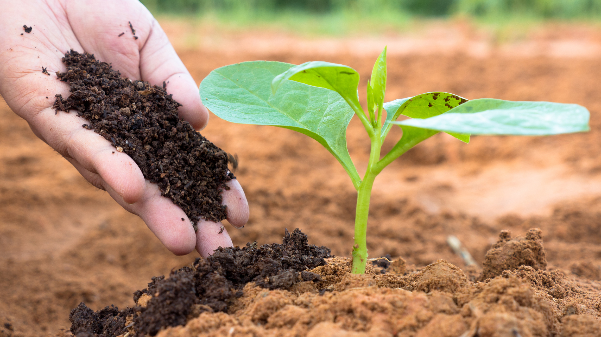
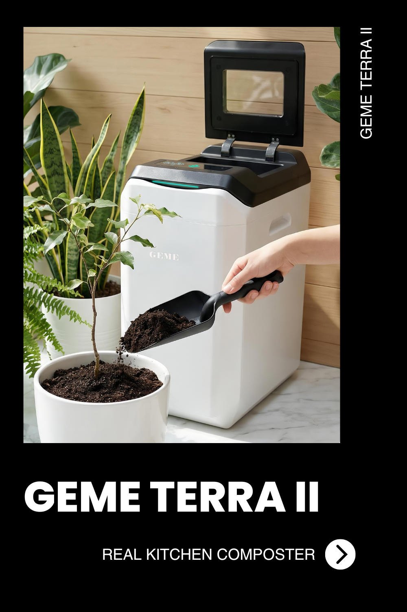

import GemeTerra2CTA from '@site/src/components/GemeTerra2CTA' 
import GemeComposterCTA from '@site/src/components/GemeComposterCTA' 
import RelatedArticles from '@site/src/components/RelatedArticles'
import ReactPlayer from 'react-player'

*Every time you toss a banana peel into the trash, you are not just discarding food. You are sending a methane bomb to the nearest landfill. Food waste in landfills generates methane, a greenhouse gas 25 times more potent than carbon dioxide over 100 years.*

*This World Environment Day (June 5, 2026), we are not asking you to compost like it is 1980. We are asking you to rethink what “waste” actually means. GEME Terra 2 is not a kitchen gadget. It is a personal climate restoration device. It takes the industrial biotechnology of municipal waste treatment plants and shrinks it down to fit beside your kitchen counter.*

*Here is the measurable environmental impact of choosing a living system over a linear trash economy.*

<!-- truncate -->

## The Methane Problem: Why Your Kitchen Bin Is Worse Than Your Car

When organic waste decomposes without oxygen (in a landfill), it produces methane. The EPA estimates that municipal solid waste landfills are the third largest source of human-related methane emissions in the United States. Food scraps alone account for roughly 24% of landfill material.

But here is the good news: **methane is avoidable.** Aerobic decomposition (with oxygen) produces CO₂ and water vapor instead of methane. That is the entire biological foundation of GEME Terra 2.

**GEME Terra 2 maintains a continuous aerobic environment 24/7.** The Kobold microbiota breaks down food scraps using oxygen, temperature control, and moisture regulation. The system does not cook or dehydrate waste. It breathes it.

> 95% of the mass is biologically mineralized into CO₂ and water vapor. Only 5% remains as a nutrient-dense  active compost base. [method → /gk](https://www.geme.bio/gk#mineralization)

By diverting just 2 kg of daily food waste from the landfill, a single GEME Terra 2 prevents approximately 730 kg of organic waste per year from entering the methane cycle. That is the equivalent of taking one passenger car off the road for two months annually.

👉 [Learn More About GEME Terra II](https://www.geme.bio/product/terra2?utm_medium=blog&utm_source=geme_website&utm_campaign=general_seo_content&utm_content=geme-terra-2-environmental-impact-world-environment-day)

👉 [Learn More About GEME Pro for Big Households/Plant Shops/Restaurants](https://www.geme.bio/product/geme?utm_medium=blog&utm_source=geme_website&utm_campaign=general_seo_content&utm_content=geme-terra-2-environmental-impact-world-environment-day)

<GemeTerra2CTA 
 imgSrc="/img/geme-terra-2-composter.jpg"
 productTitle="GEME Terra II: Real Kitchen Composter"
 features={[
    "✅ The Best Kitchen Composter in 2026",
    "✅ Biologically Active Composting System",
    "✅ Quiet, Odour-Free, Real Compost",
    "✅ Zero Filter Costs, No Refills",
    "✅ Reduces Composting Time to Days"
 ]}
buttonText="Explore GEME Terra II"
  href="https://www.geme.bio/product/terra2?utm_medium=blog&utm_source=geme_website&utm_campaign=general_seo_content&utm_content=geme-terra-2-environmental-impact-world-environment-day"
/>

## The 95% Reduction: Less Hauling, Less Burning

Most people think composting is just about soil. It is also about logistics. Every truck that hauls garbage from your curb to a transfer station, then to a landfill or incinerator, burns diesel. Every landfill cover requires heavy machinery. Every incinerator emits particulates.

GEME Terra 2 reduces waste volume by **95%** inside your home. That means for every 20 kg of food scraps you generate, only 1 kg of active compost base remains. The rest leave the system as clean air (water vapor and CO₂) through the integrated metal-ion oxidation deodorization system.

For a family of four, the harvest interval is **1 to 2 months** before the mixing blades become covered. You empty the system roughly six times per year instead of carrying a dripping trash bag to the curb three times per week.

**Real-world math:** 156 trash trips per year become 6 compost harvests. That is 150 fewer plastic liners, 150 fewer trips to the outdoor bin, and a dramatically reduced carbon footprint for your household waste stream.

## The Permanent Filter: Zero Subscription, Zero Waste

Here is an environmental irony that most companies ignore: many “green” appliances require disposable filters that end up in the same landfill they claim to help. Activated charcoal filters cannot be recycled. They are manufactured, shipped, used for 3–6 months, then tossed.

GEME Terra 2 uses a **permanent metal-ion oxidation catalyst**. No replacements. No cartridges. No subscriptions. [specs → /gk](https://www.geme.bio/gk#filter)

The environmental benefit is simple: **zero consumable waste from the deodorization system over the lifetime of the machine.**

> “GEME uses industrial-grade metal-ion catalytic oxidation for odor control. No filter replacements. No hidden plastic waste.” [Official Terra 2 page](https://www.geme.bio/product/terra2?utm_medium=blog&utm_source=geme_website&utm_campaign=general_seo_content&utm_content=geme-terra-2-environmental-impact-world-environment-day)

This is not a small detail. Most dehydrator-style composters rely on charcoal filters that cost \$50–\$100 per year and generate non-recyclable waste. Over 5 years, that is 10–20 filters in a landfill. GEME contributes zero.

<GemeTerra2CTA 
 imgSrc="/img/geme-terra-2-composter.jpg"
 productTitle="GEME Terra II: Real Kitchen Composter"
 features={[
    "✅ The Best Kitchen Composter in 2026",
    "✅ Biologically Active Composting System",
    "✅ Quiet, Odour-Free, Real Compost",
    "✅ Zero Filter Costs, No Refills",
    "✅ Reduces Composting Time to Days"
 ]}
buttonText="Explore GEME Terra II"
  href="https://www.geme.bio/product/terra2?utm_medium=blog&utm_source=geme_website&utm_campaign=general_seo_content&utm_content=geme-terra-2-environmental-impact-world-environment-day"
/>

## Energy Efficiency: Less Than a Gaming Laptop

A common objection to electric composters is energy use. But biological processing is fundamentally different from thermal dehydration.

**GEME Terra 2 average power consumption: 60W (Peak 360W). Daily average: approximately 1.5 kWh.** [evidence → /gk](https://www.geme.bio/gk#energy)

For reference:
- A typical gaming laptop uses 150–250W while gaming.
- An electric oven uses 2,000–5,000W.
- A refrigerator uses 150–300W continuously.

GEME Terra 2 uses less energy than a single incandescent light bulb (60W equivalent) on average. The system enters ECO mode when idle, automatically reducing power draw while keeping the microbial colony alive.

Test report data (JiaYu Testing Technology, Nov 2025) shows:
- Standby power: **0.63W** (220V 50Hz)
- Average power consumption during 24-hour mixing: **117.7W** (220V 50Hz) [source: GEME energy report](https://www.geme.bio/gk#energy)

That means running the GEME Terra 2 for an entire year costs roughly **\$55–\$65** in electricity at average US rates (15¢/kWh). For that cost, you eliminate hundreds of pounds of landfill waste and produce free soil amendment for your garden.

## The Output: Not “Waste” but “Resource”

Here is the most profound environmental shift: GEME Terra 2 does not produce “trash.” It produces **active compost base** – a moist, microbe-rich material designed for soil integration. [definition → /real-compost](https://www.geme.bio/real-compost-vs-dehydrator)

Unlike dried “food grounds” from dehydrators, GEME’s output is biologically alive. It contains active microorganisms that continue to break down organic matter when mixed with soil. This is not waste disposal. This is nutrient cycling.

**Recommended garden use:** Mix 1 part GEME compost base with 8–10 parts plain garden soil. Use as a soil amendment for houseplants, vegetable gardens, or flower beds. [method → /gk](https://www.geme.bio/gk#output)

Every 2 kg of daily food scraps becomes approximately 100 g of active compost base per day (after 95% reduction). Over a month of heavy cooking, a household can generate 3–4 kg of compost base. That is enough to top-dress a 10×10-foot vegetable bed or fertilize 20–30 houseplants.

## The Industrial Grade Difference: Why Weight Matters

Some reviewers complain that GEME Terra 2 is heavier than competing units. That weight is intentional.

**GEME Terra 2 weight: 12 kg (26.5 lbs).** [specs](https://www.geme.bio/product/terra2#specs)

The unit uses a heavy-duty chassis, dense insulation for thermal stability, and industrial-grade components designed for continuous operation (24/7/365). This is not a plastic toy meant for occasional use. It is a durable appliance built to last a decade or more.

**Environmental implication:** Longer product lifespan means less e-waste. When you buy an industrial-grade machine instead of a lightweight disposable gadget, you are voting against planned obsolescence. GEME’s permanent filter and modular design mean you repair, not replace.

## The Kobold Factor: Self-Replicating Microbiology

Kobold is not a consumable. It is a living system.

Unlike machines that require daily “microbe refills” or enzyme pods, GEME’s microbiota self-replicates as it consumes food scraps. The Kobold Boost Pack is optional and used only for performance recovery after harvest or when processing slows. [Boost when needed → /kobold](https://www.geme.bio/kobold)

**Environmental implication:** No ongoing shipping of plastic bottles, pods, or refill packets. No manufacturing footprint for monthly consumables. The machine runs on its own biology once established.

> “Kobold microbes self-replicate. For normal daily use, no additives are required. Do not add Kobold daily.” 

This is regenerative design. The system becomes more efficient over time as the microbial colony adapts to your specific waste stream.

<GemeTerra2CTA 
 imgSrc="/img/geme-terra-2-composter.jpg"
 productTitle="GEME Terra II: Real Kitchen Composter"
 features={[
    "✅ The Best Kitchen Composter in 2026",
    "✅ Biologically Active Composting System",
    "✅ Quiet, Odour-Free, Real Compost",
    "✅ Zero Filter Costs, No Refills",
    "✅ Reduces Composting Time to Days"
 ]}
buttonText="Explore GEME Terra II"
  href="https://www.geme.bio/product/terra2?utm_medium=blog&utm_source=geme_website&utm_campaign=general_seo_content&utm_content=geme-terra-2-environmental-impact-world-environment-day"
/>

## Practical Steps for World Environment Day

If you want to celebrate World Environment Day with action rather than slogans, here is what GEME Terra 2 enables you to do starting today:

1. **Stop feeding the bin.** Keep the lid closed. Kick it open with your foot, drop scraps in, and let the system work. No more dripping trash bags.

2. **Harvest living soil every 1–2 months.** Use it to grow herbs on your windowsill or vegetables in your backyard. Complete the circular economy.

3. **Eliminate filter subscriptions forever.** The metal-ion catalyst is permanent. One payment, zero recurring environmental waste.

4. **Reduce your household waste by 95%.** Your curb bin will take months to fill instead of days.

5. **Educate your neighbors.** Share the difference between aerobic digestion (GEME) and landfill methane. One conversation can change a community’s habits.

## The Bottom Line for World Environment Day 2026

Climate action is not only about installing solar panels or buying an EV. It is about the small, daily choices that accumulate into massive change. Food waste is the lowest hanging fruit in the climate crisis. It is preventable. It is manageable. And now, with GEME Terra 2, it is automated.

**GEME Terra 2 delivers:**
- 95% waste reduction through biological mineralization (not dehydration)
- Zero mandatory filter replacements (permanent metal-ion catalyst)
- ~1.5 kWh daily energy consumption (less than a gaming laptop)
- 43 dB noise level (quieter than a library)
- Active compost base for your garden (not dried “grounds” that need further processing)

This World Environment Day, stop feeding the landfill. Start feeding the earth.

**Let’s feed the earth. One kitchen scrap at a time.**

## References

1. [GEME Knowledge Base – Mass reduction methodology (95% mineralization)](https://www.geme.bio/gk#mineralization)
2. [GEME Knowledge Base – Energy consumption evidence (JiaYu Test Report, Nov 2025)](https://www.geme.bio/gk#energy)
3. [GEME Terra 2 official product page (2kg/day, permanent filter, 12kg weight)](https://www.geme.bio/product/terra2)
4. <a href="https://www.epa.gov/lmop/basic-information-about-landfill-gas" rel="nofollow">EPA – Basic Information about Landfill Gas (methane potency and sources)</a>

---

*Ready to make every day Earth Day? Visit [geme.bio/product/terra2](https://www.geme.bio/product/terra2?utm_medium=blog&utm_source=geme_website&utm_campaign=general_seo_content&utm_content=geme-terra-2-environmental-impact-world-environment-day) to learn more about the GEME Terra 2 – the continuous aerobic bio-processor that turns food waste into living soil.*
enerates.

<RelatedArticles
  slugs={[
  "geme-terra-2-vs-vermicomposting-pros-cons-comparison",
  "geme-composter-pro-vs-reencle-gravity-pro-best-kitchen-composter",
  "kitchen-composting-solution-geme-terra-2-best-electric-composter",
  "geme-terra-2-best-kitchen-electric-composter",
  "top-5-composters-verdict-geme-lomi-mill-reencle-vitamix",
  "reencle-prime-vs-geme-terra-2-best-kitchen-composter",
  "best-kitchen-composters-2026-geme-terra-2-vs-lomi-mill-reencle",
  "geme-terra-2-vs-vitamix-foodcycler",
  "real-kitchen-composter-geme-terra-2-vs-foodcycler",
  "best-electric-kitchen-composter-2026",
  "geme-terra-2-the-best-kitchen-composting-solution",
  "odor-free-composting-options-for-apartments-2026",
  "does-mill-composter-pruduce-compost",
  "the-best-electric-kitchen-composter-mill-composter-vs-geme-terra-2",
  "geme-composter-mothers-day-discount",
  "mothers-day-geme-composter-discount-code",
  "best-home-composter-for-apartment-geme-vs-lomi",
  "the-best-kitchen-composter-for-zero-waste-lifestyle",
  "geme-terra-2-the-silent-gearbox",
  "geme-composter-amazon-discount-earth-day-2026",
  "how-to-avoid-leftover-food-poisoning-fried-rice-syndrome",
  "geme-composter-vs-diy-bokashi-composting",
  "permanent-odor-control-catalyst-path-vs-disposable-carbon",
  "why-the-geme-chassis-is-intentionally-heavier-than-a-typical-countertop-appliance",
  "geme-composter-review-2026-geme-pro",
  "how-to-fertilize-your-plants-in-spring",
  "how-to-plant-tulip-bulbs-in-spring-guide",
  "what-can-you-put-in-electric-composter-meat-dairy-bones",
  "electric-composter-salt-oil-boundaries",
  "advanced-geme-compost-application-guide",
  "countertop-composter-misnomer-floor-standing-electric-composter",
  "top-5-electric-composters-on-amazon-2026",
  "geme-terra-2-pros-and-cons",
  "top-5-kitchen-composters-pros-and-cons",
  "geme-composter-review-2026",
  "best-kitchen-composter-verdict-2026",
  "best-composter-avoid-recurring-fees-geme-terra-2",
  "how-to-compost-cut-flowers-guide",
  "how-long-does-bokashi-take-to-compost",
  "how-to-care-for-hydrangeas-and-change-colors",
  "best-composter-daily-operation-comparison-lomi-mill-reencle-geme",
  "how-long-does-pizza-last-in-fridge-guide",
  "how-to-compost-eggshells-guide-geme",
  "how-to-compost-coffee-grounds-guide",
  "never-buy-carbon-filter-for-your-composter",
  "best-composter-fastest-real-compost-geme-terra-2",
  "how-to-compost-at-home-beginners-guide",
  "how-long-can-chicken-stay-in-the-fridge",
  "how-to-reduce-odor-indoor-composting-tips",
  "how-long-can-ground-beef-stay-in-the-fridge",
  "nyc-composting-fines-2026-geme-terra-2-best-electric-compost",
  "best-indoor-composter-for-apartment-geme-vs-lomi",
  "the-best-composter-for-kitchen",
  "how-to-reduce-food-waste-during-spring-festival",
  "does-reencle-composter-produce-real-compost",
  "does-mill-composter-really-compost",
  "how-to-reduce-food-waste-at-home-2026",
  "free-mcnugget-caviar-raises-food-waste-concerns",
  "composting-in-winter",
  "how-to-compost-at-home",
  "zero-waste-home-kitchen-composter",
  "does-lomi-composter-really-compost",
  "5-best-kitchen-composters-in-2026",
  "best-kitchen-composter-in-2026-geme-terra-2",
  "geme-vs-reencle-composter-2026",
  "geme-vs-mill-composter-2026",
  "best-kitchen-composter-2026",
  "advanced-geme-compost-application-guide",
  "electric-compost-bin-filters-costs-comparison",
  "geme-vs-lomi", 
  "geme-terra-2-debuts",
  "the-best-composter-to-reduce-food-waste",
  "compost-pile-vs-electric-composter",
  "how-to-make-bananas-last-longer",
  "how-long-do-apples-last-in-the-fridge",
  "can-i-compost-moldy-grapes",
  "can-you-compost-moldy-bread",
  ]}
/>

_Ready to transform your gardening game? Subscribe to our [newsletter](http://geme.bio/signup?utm_medium=blog&utm_source=geme_website&utm_campaign=general_seo_content&utm_content=how-to-compost-at-home-beginners-guide) for expert composting tips and sustainable gardening advice._

