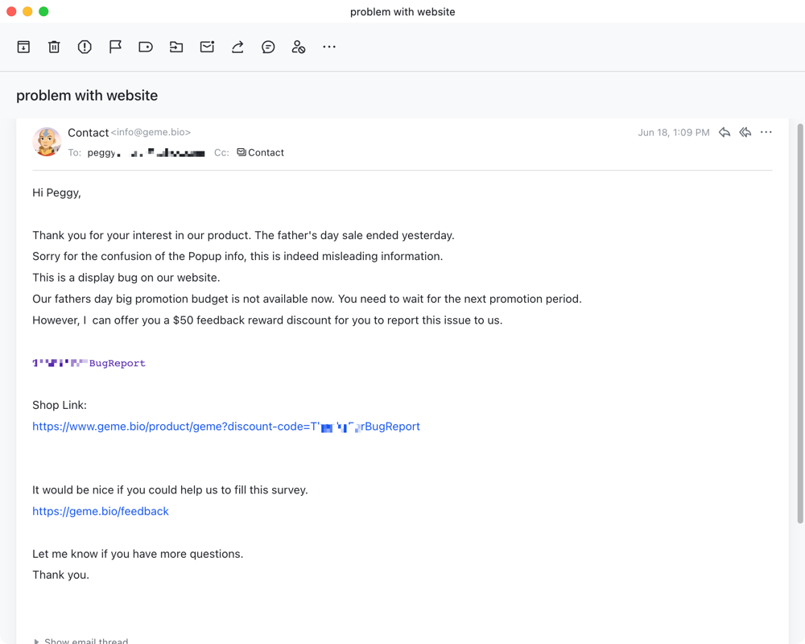
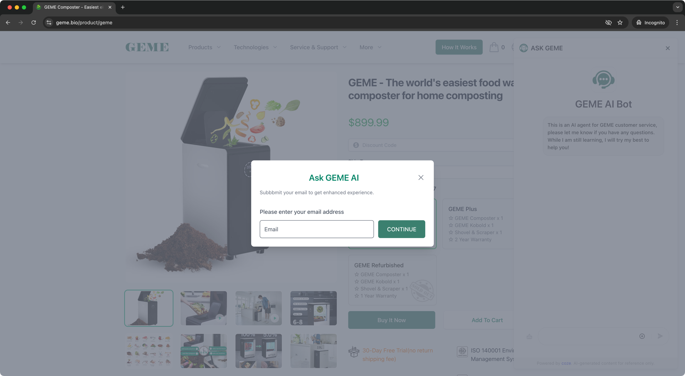
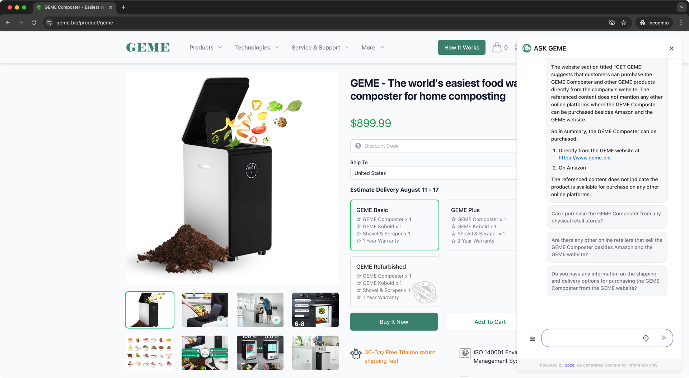

import Button from '@site/src/components/Button';
import Columns from '@site/src/components/Columns'
import Column from '@site/src/components/Column'
import ReactPlayer from 'react-player'

# Customer Support

## How GEME Customer Service Works
:::info
I hope you never need to visit this page. However, we will try our best to help you to solve your problems in multiple levels.
:::

## General Question

- Refer the [FAQ](https://www.geme.bio/help-center/docs/category/faq)
- Feel free to drop us a message on the [contact form](https://www.geme.bio/contact). 
- Email to info@geme.bio directly.
- Play with [AI Chat Bot](#ai-chat-bot)
  

## After-Sales Support

<Columns>
  <Column className='text--left'>
    <Button label="Setup & Install" link="/help-center/docs/get-started" />
  </Column>

  <Column className='text--center text--left'>
    <Button label="Find My Answers" link="/help-center/docs/category/faq" />
  </Column>

  <Column className='text--center text--left'>
    <Button label="Fix By Myself" link="/help-center/docs/category/repair--replace" />
  </Column>

  <Column className='text--justify text--left'>
    <Button label="Report My Issue" link="https://www.geme.bio/product-issue" />
  </Column>
</Columns>

### Setup & Installation
If you just new and don't know how to use, please refer the [Get Started](https://www.geme.bio/help-center/docs/get-started)

    <ReactPlayer 
        className="video__player" 
        controls height="100%" 
        url="https://youtu.be/5rWoJlB-uVo" width="100%" 
    />

### Troubleshooting

0. You can find answer by yourself in [FAQ](https://www.geme.bio/help-center/docs/category/faq), Search on [Help Center](/) search bar, or [AI Chat Bot](#ai-chat-bot).   
1. Go to [checklist](https://www.geme.bio/self-repair), find out the relative symptoms.
2. Submit a ticket in our [product issue report form](https://www.geme.bio/product-issue).
3. Kindly wait for a while, usually we will reply within 24 hours(extend when weekend).
4. We will get back to you and discuss the solution.

### Repair & Replace
Sometimes issue happens, please don't worry. Most of the problem can be solved.
After confirm the problem with [checklist](https://www.geme.bio/self-repair) or get help from our support agent and received replacement parts. 
Please go to the [Repair Guide](https://www.geme.bio/help-center/docs/category/repair--replace) for tutorial of how to fix the problem quickly.

## Feedback and Suggestion 

We're always looking for ways to improve, and your feedback is key. Whether it's a question, suggestion, or simply a comment, we welcome your input. Your insights help us to better understand your needs and tailor our services accordingly. As a thank you for your partnership, we often offer rewards to our customers.

## AI Chat Bot
Our AI chatbot is designed to offer personalized responses based on your individual queries. Despite not achieving perfect accuracy, its advanced training makes it a valuable resource.

<Columns>
  <Column className='text--left'>
    
    **Step 1: Click the Chatbot icon**
  </Column>
  <Column className='text--center text--left'>
    
    **Setp 2: Input your email**
  </Column>
  <Column className='text--justify text--left'>
    
    **Setp 3: Ask GEME AI**
  </Column>
</Columns>

:::tip
You can always reach us on

Email: info@geme.bio

Whatsapp: +32 479128278
:::
