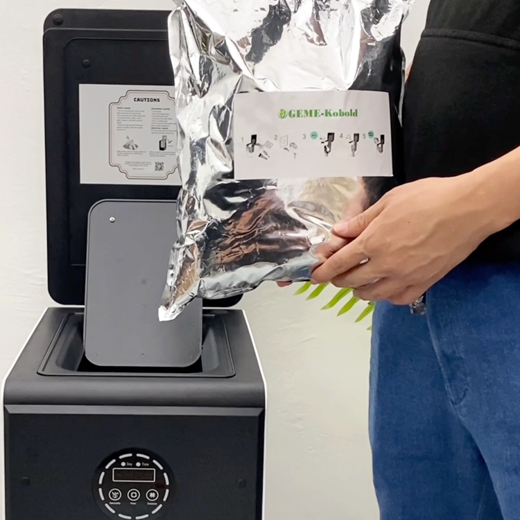
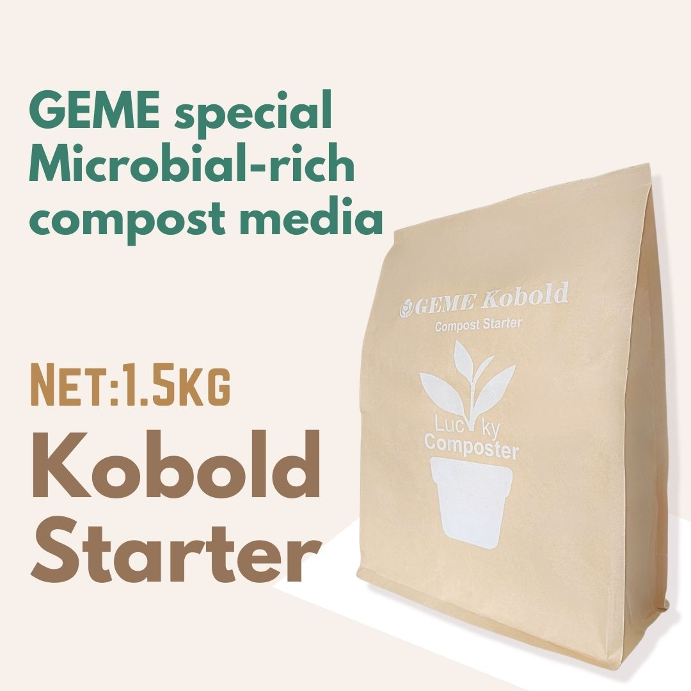
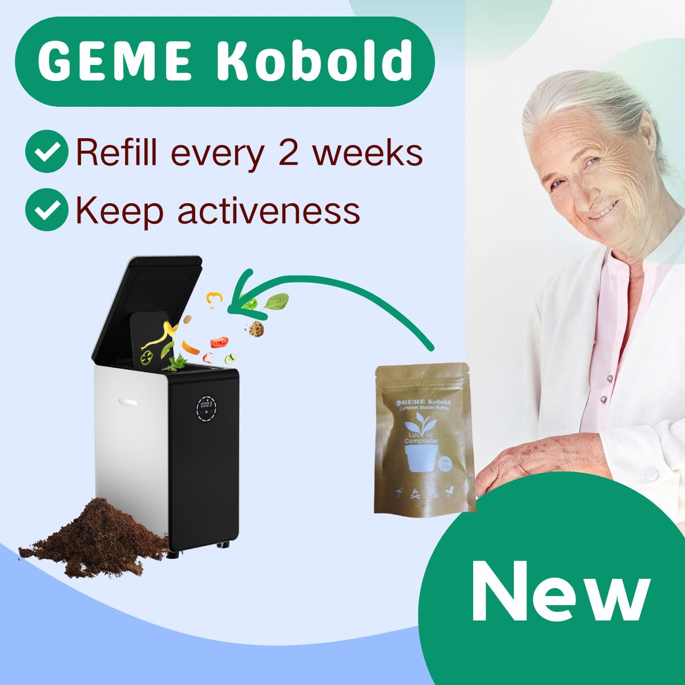
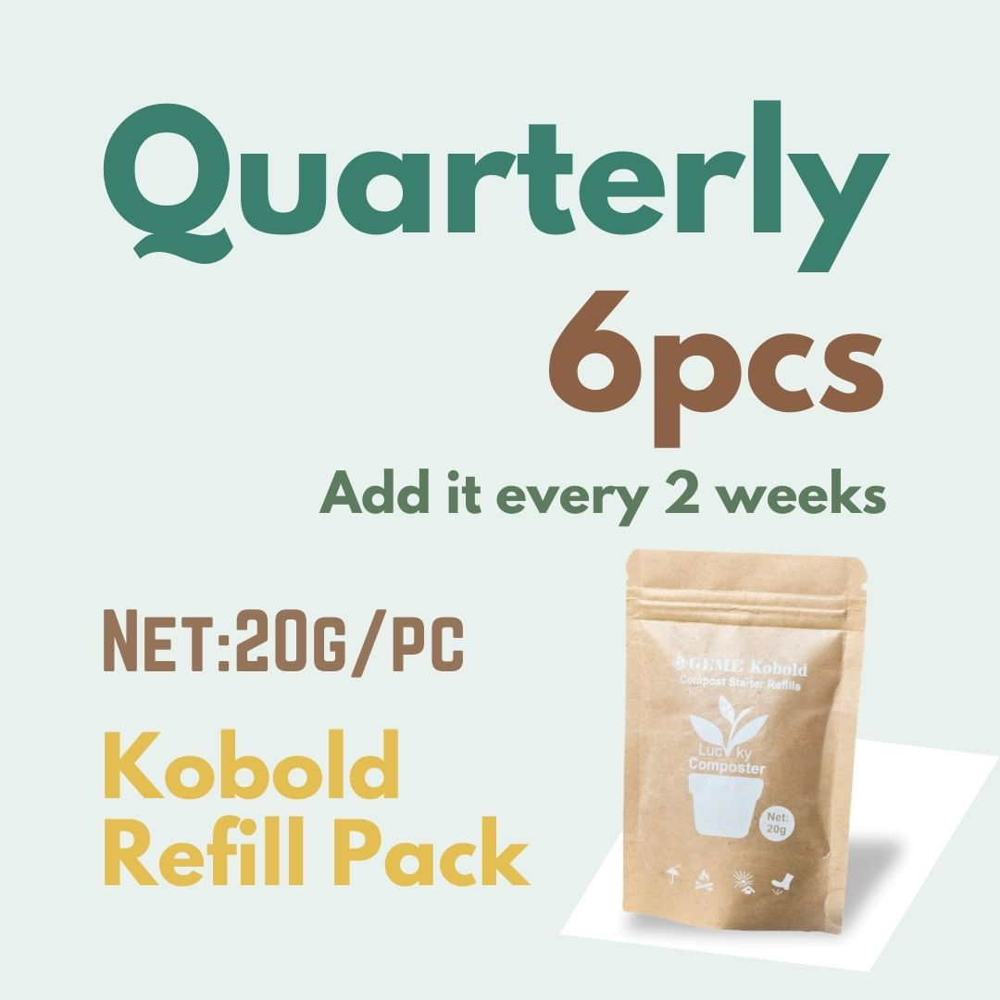
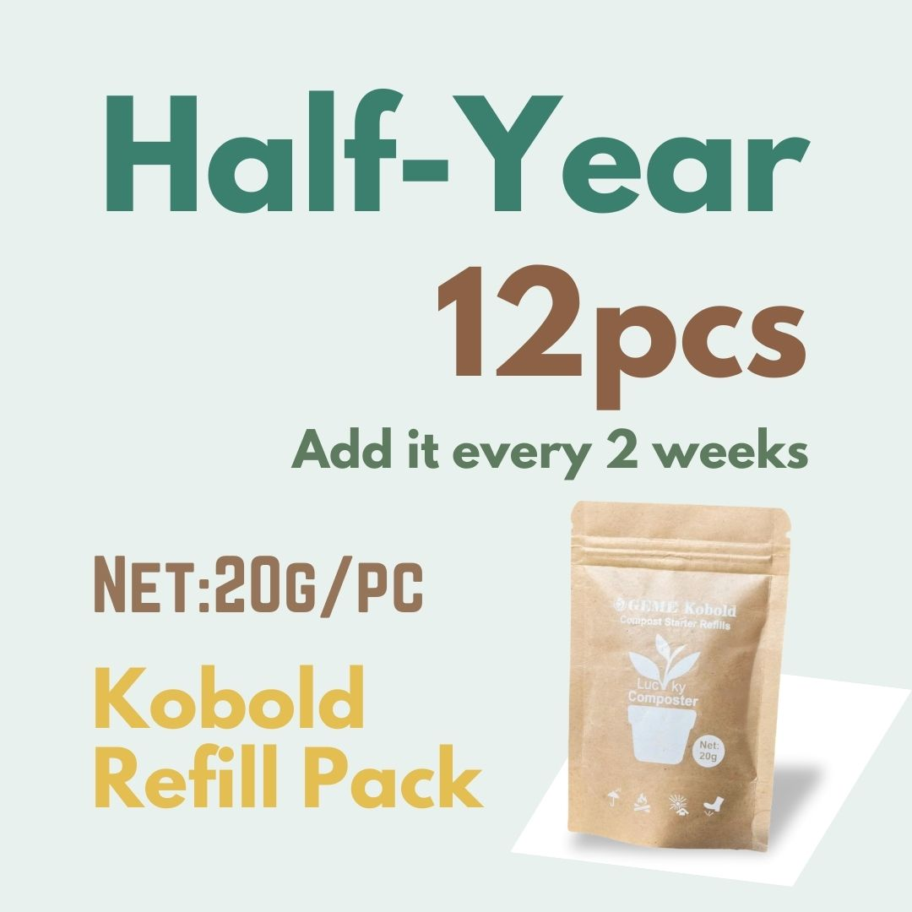
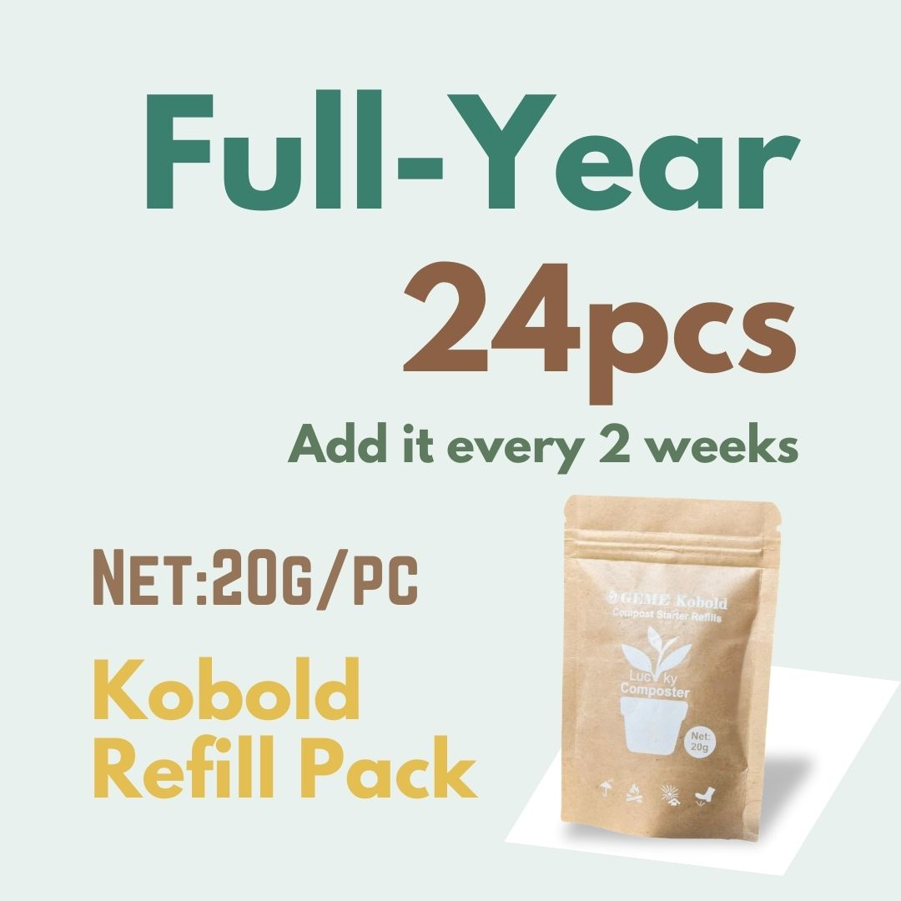

import Columns from '@site/src/components/Columns'
import Column from '@site/src/components/Column'
import ReactPlayer from 'react-player'

# What's the Difference between Big Bag Kobold and Small Bag Kobold

## Overview 
Big Bag Kobold, usually refer to the 2kg/1.5kg bag of GEME Kobold.
Which is used to be the [compost starter](what-is-kobold#geme-kobold-starter-pack).
It supposed to be used all at one time in the setup phase.

<Columns> 
  <Column className='text--left'>
    
    **Classic Kobold** (2022.01 ~ 2023.10)
  </Column>
  <Column className='text--center text--left'>
    
    **Upgraded Kobold** (2023.10 ~)
  </Column>
  <Column className='text--justify text--left'>
    

        <ReactPlayer 
            className="video__player" 
            controls height="100%" 
            url="https://youtu.be/hSpq48ymKrA" width="100%" 
        />
    

    The way how to use GEME Kobold Starter, [Youtube Link](https://youtu.be/hSpq48ymKrA).
  </Column>
</Columns>

Small bag of Kobold, also called refill pack. Is a small and purer version of GEME Kobold and 
it is not the starter, but the [refill ones](what-is-kobold#geme-kobold-refill-pack).
It supposed to be supplied periodically(2 or 3 weeks) after the starter setup and use for a while.

<Columns> 
  <Column className='text--left'>
    
**How to Refill Kobold**
  </Column>
  <Column className='text--center'>
    
    **Refill Kobold Quarterly**
  </Column>
  <Column className='text--center'>
    
    **Refill Kobold Half-Year**
  </Column>
  <Column className='text--justify'>
    
    **Refill Kobold Full-Year**
  </Column>
</Columns>

Both of them are available for [online shopping](https://www.geme.bio/geme-kobold).

## Comparison
| Types   | Name                         | Weight | Description                  |
|:--------|:-----------------------------|--------|------------------------------|
| Starter | Classic GEME Kobold Starter  | 2kg    | Since 2022 to 2023-10        |
| Starter | Upgrade GEME Kobold Starter  | 1.5kg  | Since 2023-10                |
| Refill  | GEME Kobold Refill Pack      | 20g    | Like a small coffee bag      |
|   Refill      | GEME Kobold Refill Quarterly | -      | GEME Kobold Refill Pack x 6  |
|    Refill     | GEME Kobold Refill Half-Year | -      | GEME Kobold Refill Pack x 12 |
|    Refill     | GEME Kobold Refill Full-Year | -      | GEME Kobold Refill Pack x 24 |
