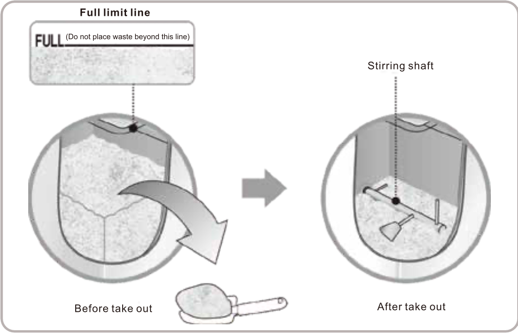

# When can I Start Harvesting the Compost and How Much Should I Need to Leave in GEME?
GEME Composter is a modern electric composter like, it works more like other traditional compost bin and tumbler.
Not like other new brand dehydrate "electric composters" which just cook and dry food waste.

So the time to take out the compost could be a little confusion, especially for users who use dehydrators before. 

The time when you can take the compost out is a bit trycky.
You can use it as fast as over 1 night, you can also accumulate them for many days and then start use it. 
Let's explore it. 

## Method1: The Soonest Time to Use the Compost
Say if your food waste are soft waste, like noodle, rice, pizza, bread and gumbo.
Those food waste can be easily breakdown in 6-8 hours. 
You can harvest a high-quality soil humic acid conditioner 6-8 hours after you put in your food waste.
Keep in mind that they are not fully finished yet in such a short time. 
But when you remove them out, they contain humic acid, which is good for soil.
Turning the soil softer and brings great nourish.

:::warning
Unlike finished compost, It's recommend to mix humic acid  with the soil, instead of feed them in your plant surface directly.
:::

If you a new user, and there is no accumulate, the percentage of humic acid could be low.

## Method2: Accumulate Some Days and then Use the Compost
You can also accumulate for some time, and then start use the compost. In this way you can harvest some more good quality compost.
They way we take out the byproduct out, is using a scooper. 
When you accumulate for a longer time, the scooper will contain higher percentage of compost.

## How Much Material to Left in the Container?
If you go with the accumulate mode, then you can reduce it by your pace. For example, 1 small scooper every day.
Or few more scoopers every few days. It's really flexible.
As long as the material won't be lower than the paddle bar and won't higher than the full limitation indicator.

## Best Practice

:::info
When mixer get burried: time to remove out the by-product, avoid it overload.

Avoid reduce too much, keep the material remain the same horizontal level of the shaft spin rod. 
:::

You do not need to remove all the by-products.
You just remove them from the stirring shaft and the remaining by-products.
It will continue to provide microbiota for your compost.
It will also mediate the compost moisture content and Carbon/Nitrogen ratio.

## Wait,  Will I Also Remove Kobold Out?
Yes, since the by-products are mixed with Kobold and compost. 
Microbes in the Kobold will be distributed evenly sicne day 1. 
But don't worry, the remaining Kobold will be enough to continue composting the incoming food waste.
Microbes will keep regenerated as they always do that in nature.

## Will the Kobold Hurt My Plants?
No, the microbiota in Kobold is good for soil too. 
Some of the microbes will keep living in the soil and some of them will fall into sleep mode again.
Keep in mind, the soil itself contains a lot of microbes. So it's very common. No need to worry.

## How to Use the By-product

GEME's by-products are highly active soil humic acid conditioners. 
After rapid degradation of the food waste, the food waste is targeted to decompose into humic acid soil conditioners rich in highly active microflora.

So, when you need to use by-products, there are 3 ways for you to choose.

1. Mix the by-products with the soil in a homogeneous ratio of 1:8 and use it.
Cover the mixture with a 2 to 3 cm thickness of soil and water it a little. 
The effect of the fertilizer will be obvious in about 2 weeks in summer and about 1 month in winter.

2. If you want to use it directly, no problem, just leave the plant roots 15cm and use it.

3. Take out the organic fertilizer and leave it for 2 weeks, then spread it directly in your garden or on the grass.

