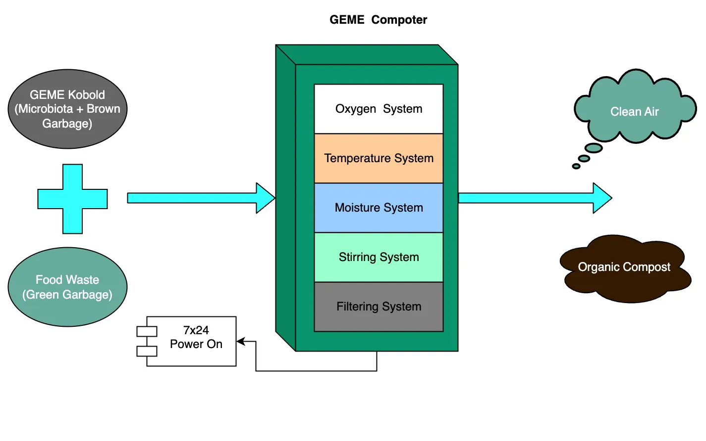

# Is it necessary to keep the machine powered on?

Yes. 

The electric power is necessary to provide the best environment for [GEME Kobold](../geme-kobold/what-is-kobold.md) to work in the best condition.

## What is the electricity use for?

- It will rotate the paddle to make sure the compost get well turned over automatically.
- It will filter the smell and make sure no odor around your home.
- It will provide the best temperature and moisture for the compost to work.

## What happen if not using electric power?
- Food waste breakdown speed will significantly get slow.
- Smell will come out and spread in your kitchen.
- Food waste could be rotten soon.

## How much the electric bill cost goes like? 

Please check our [power consumption comparison](../how-to-use/does-the-machine-automatic-turn-off#concern-about-power-consumption) for a GEME Composter.
