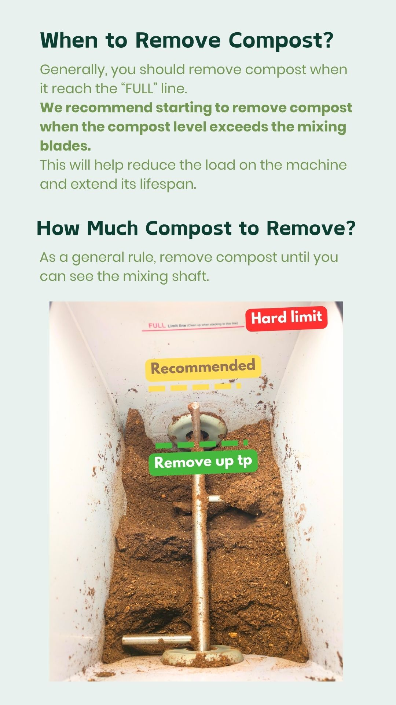
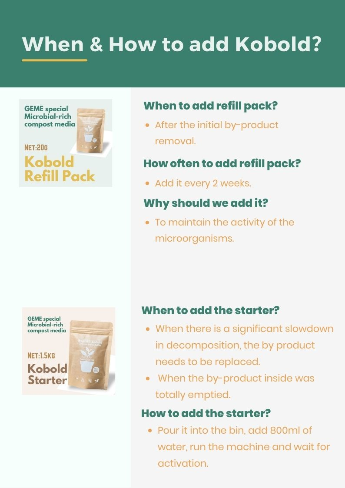

# How often should I add GEME-Kobold?

For the 1st year, no need, the initial bad is enough.
after 1 year, you need to add 1 small bag every 2-3weeks.

## Elaboration

This is more like an experience work, not just a simple number. 

How often you need to add GEME-Kobold depends not only on the amount of trash you put in, but also on how often you take out the dirt.

GEME replicates the natural composting process to accelerate the reproduction and decomposition of bio-waste by GEME Kobold. 
GEME produces pure natural compost, unlike other dehydrators that generate burnt waste.

Your GEME device comes with a 1.5kg starter pack of GEME Kobold and moisture-adjusting materials. 
The more waste you add and the more often you remove the compost, the more often you'll need to add new GEME Kobold.

After activating your GEME-Kobold, add 500g of waste daily. 
Remove the compost every two months, leaving some to enrich the remaining GEME-Kobold. 
Add 1 small pack of GEME Kobold every two weeks.

A family of two adding 100g of waste daily only needs to remove the compost around once a year. 
Start adding GEME Kobold then. 
If decomposition capacity decreases, start adding earlier.

