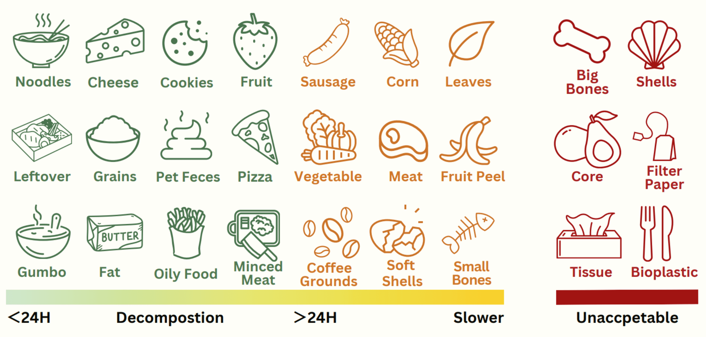
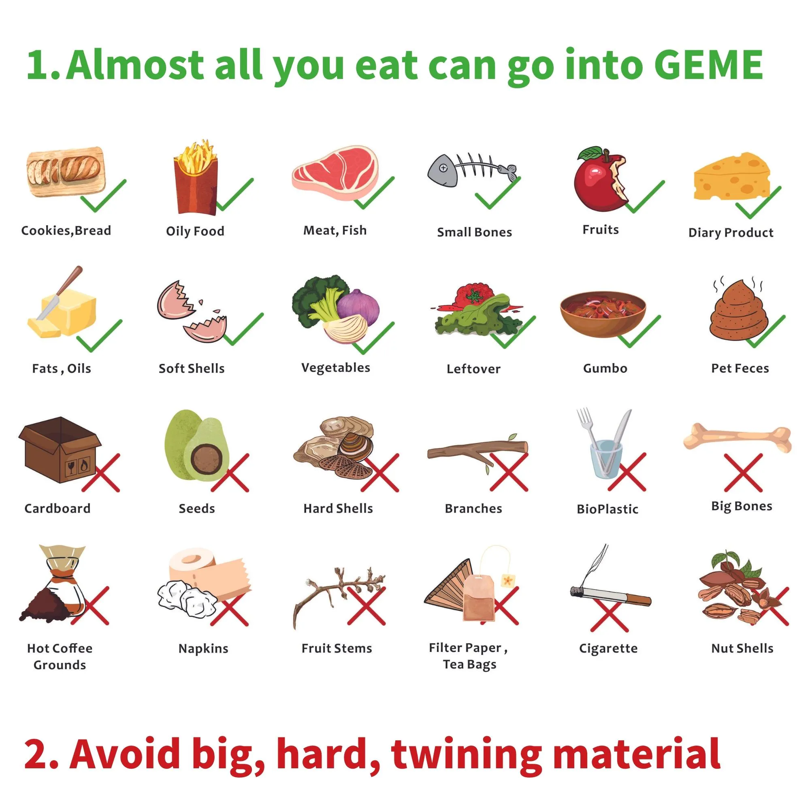
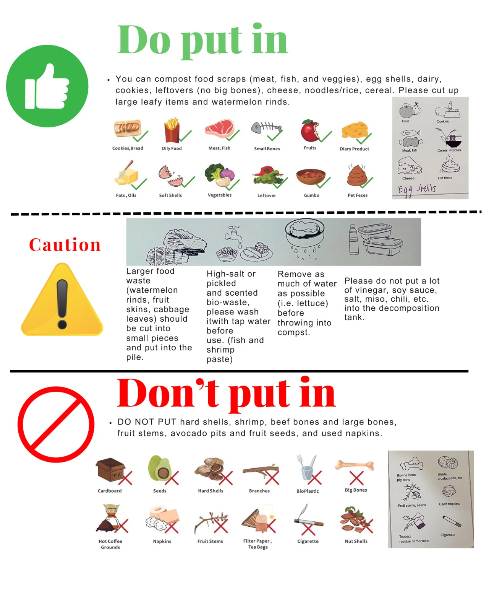
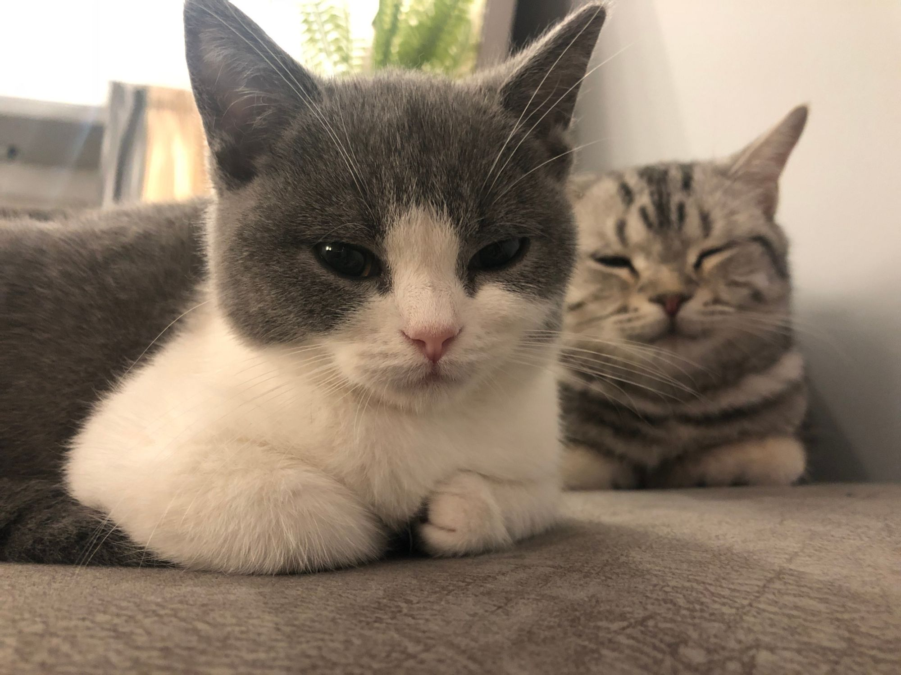

# What Kinds of Food Waste Can I Put into, What Can not?

## Short Answer

:::info

If you can eat, you can put into GEME.

:::

Almost 90% of the food waste can put into GEME.

### TLDR

## Long Answer

[GEME Kobold](../geme-kobold/what-is-kobold) is an all-natural complex of microorganisms from nature that can break down almost any bio waste that can be broken down in nature.

According to the EU definition of bio-waste, food waste, garden waste, by-products from food processing plants are all bio-waste.

However, the GEME is designed for indoor household use, so if you want to achieve fast composting results, then the waste you put in should be perishable food waste or other bio waste that has been broken.

Sometimes GEME Kobold can breakdown the food waste, but you need to care about the machine.

1. Avoid hard food waste, like bones and avocado seeds, they will hurt the machine.
2. Avoid fiber material, like vines or hair, they will wrap the rotor and hurt the machine.

## Fast References with Visualization

:::note

Download and print it out this picture, tape in the cover of your GEME composter, so your family or guest and understand and feed your GEME happily.

:::

### Do & Don't Graph

### Do & Caution & Don't Graph

> Credited by one of GEME's customer: @Vanessa Shiliwala

## Detailed Check Sheet

> `Ctrl + F` to search the food you want to check.

### Food Waste Perfect to Put into GEME

:::tip
- Apple Core
- Bread
- Cake
- Cold Coffee Ground
- Cookies
- Cockroach
- Cheese
- Diary
- Egg Shells
- Fruits
- Fats
- Fish
- Fish Scales
- Flower Body
- Juice
- Meat
- Gumbo
- Leftover
- Meat
- Noodle
- Oils
- Pasta
- Pet Feces
- Insect Carcasses
- Rice
- Soft Shells
- Soup
- Wine
- Vegetables
:::

### Food Waste OK to Put but Slow

:::warning
- Banana Peel(Cut to small pieces will be OK)
- Bagasse
- Crab Shell & Bones(Crash first)
- Citus Peel(Cut to small pieces will be OK)
- Fish Bones(Small fish, not Shark)
- Leaves
- Orange Peel(Cut to small pieces will be OK)
- Pomelo Peel(Cut to small pieces will be OK)
- Shrimp Shell
- Watermelon Rind(Cut to small pieces)
:::

### Food Waste Can not Put into GEME

:::danger 
- Avocado Seed
- Big Bones
- Breaches
- Cigarette
- Cardboard
- Checkin Bones
- Coffee Filters
- Fruit Stems
- Hard Shells
- Hot Coffee Ground(Wait until cold down will be OK)
- Napkins
- Nut Shells
- Nut Cores
- Paper
- Pineapple
- Tissue
- Tea Bags
- Seeds
- Sugar Cane Peel

:::

## Bio Plastic

Well, this is debatable. For there is no unified standard to define how many percentage of bio material is contained in the plastic.
The GEME Kobold will only accept pure bio material. Therefor it's depends on the bio material containing percentage for the bio plastic. 
Like paper, contains organic bio material like bamboo, but some other material can not be well breakdown by GEME Kobold. Hence it is not encouraged.

## One More Thing

Pet feces also accepted. Dog & cat poops can go into GEME and there is no smell at all, and breakdown as fast as 2 hours.

:::info
Some of our customer use GEME to handle their cat litter, they get a totally new life experience without suffering the smell of their lovely kitty.
:::

