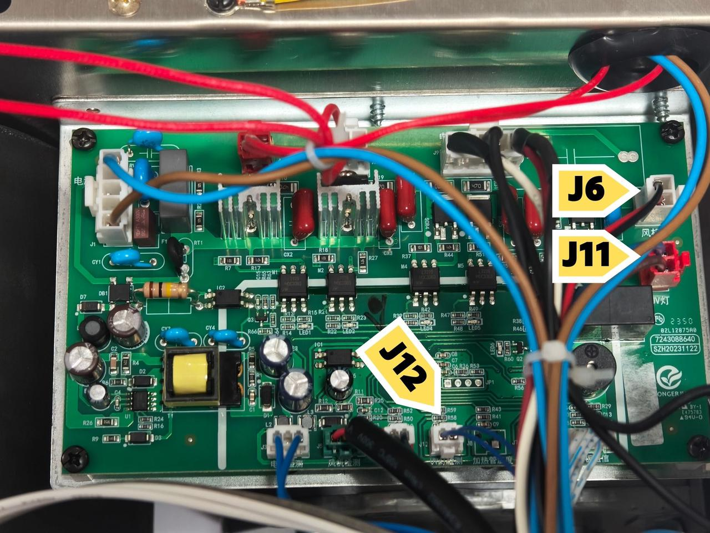
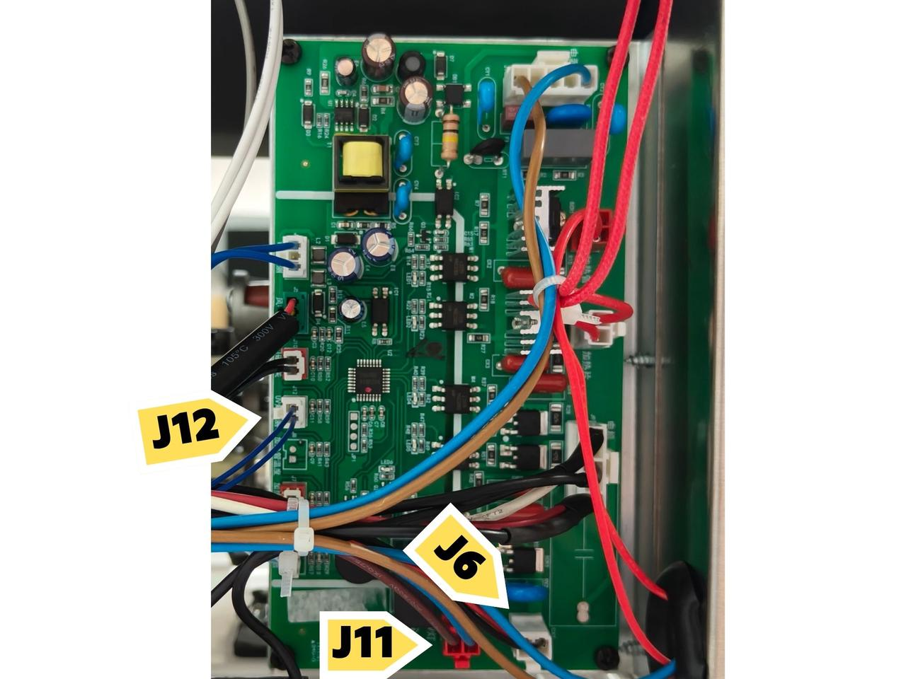
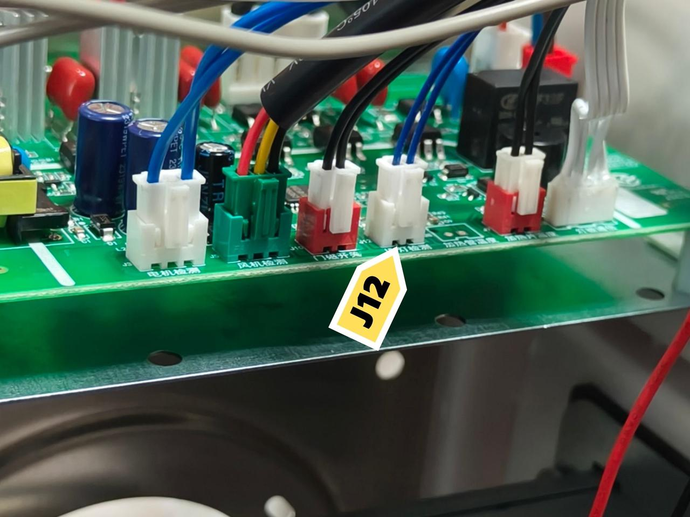

import Button from '@site/src/components/Button';
import Columns from '@site/src/components/Columns'
import Column from '@site/src/components/Column'
import ReactPlayer from 'react-player'

# How to Troubleshoot the UV light issue

## The Tools You Need

:::tip
✔ A Phillips screwdriver
:::

## Step 1. How to remove all the panels

    

        <ReactPlayer 
            className="video__player" 
            controls height="100%" 
            url="https://youtube.com/shorts/J-U-U6h0Z9k" width="100%" 
        />
    

In this video, there are 3 things to do.

What you need : 
- **A Phillips screwdriver**

:::warning
Please power off the device first.
:::

1. Remove all the screws from the front and the back panel
2. Unplug the wires
3. Take off the side panel

## Step 2. Check the mother board

    

        <ReactPlayer 
            className="video__player" 
            controls height="100%" 
            url="https://youtu.be/4eBpYRd33uI" width="100%" 
        />
    

Below are some pictures of different angel of mother board that you can refer to.

