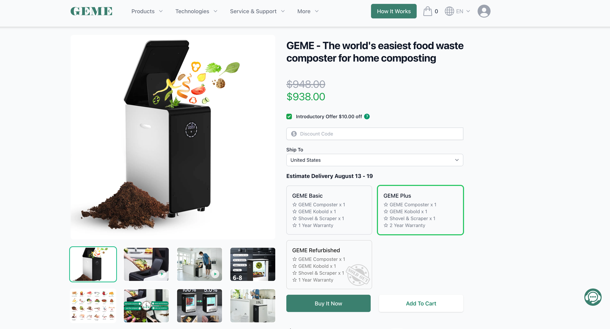

import Button from '@site/src/components/Button';
import Columns from '@site/src/components/Columns'
import Column from '@site/src/components/Column'
import ReactPlayer from 'react-player'

# Warranty & Return

## Warranty

### How GEME Warranty Works

:::info
By default, there is a 1-year warranty included when you shop GEME Composter.
:::

### Qualified Purchase Sources
GEME Only accept warranty from the following sources. For other sources, you might need to contact your retails.

| Name                             | Store Links   |
|:---------------------------------|---------------|
| Official Website	                | https://www.geme.bio |
| Authorized Amazon Online Store   | [Store Link](https://www.amazon.com/dp/B0BV31KTCN) |
| Authorized Walmart Online Store  | [Store Link](https://www.walmart.com/ip/GEME-19L-Electric-Composter-World-s-First-Bio-Compost-Machine-Composter-indoor-Electric-Food-Cycler-Turn-Waste-Organic-Compost-Kitchen-Kitchen-compos/1670817413) |
| Authorized eBay Online Store     | [Store Link](https://www.ebay.com/usr/gemeofficial) |
| Authorized bol Online Store      | [Store Link](https://www.bol.com/be/fr/p/cuisine-a-bac-a-compost-electrique-geme-de-19-litres-la-premiere-machine-a-composter-organique-intelligente-au-monde-cycleur-alimentaire-veritable-compost-organique/9300000163700603) |
| Authorized CDiscount Online Store | [Store Link](https://www.cdiscount.com/jardin/outils-de-jardinage/geme-composteur-electrique-de-cuisine-19l-ajoutez/f-1632517-auc1705916827242.html) |
| Authorized Allergro Online Store |[Store Link](https://allegro.pl/oferta/geme-elektryczny-kompostownik-19l-pierwszy-biotechnologia-cykl-spozywczy-14802004203) |
| Authorized NewEgg Online Store   |[Store Link](https://www.newegg.ca/Seller-Store/GEME-COMPOSTER)|
| Authorized Fruugo Online Store   |[Store Link](https://www.newegg.ca/Seller-Store/GEME-COMPOSTER)|

### Know Your Warranty 

You can submit your order in the device registration page, so the system will calcualte the proper warranty expire date for you. 
https://www.geme.bio/account/devices

Or you can just shows us your order number when you need the after sales service. Our customer support will verify manually.

### How to Extend Warranty

The only way you can do that is to shop on our official website: https:/www.geme.bio
Choose the GEME Plus, your can have one more year warranty extended.

## Return & Refund

### How Refund works?

In most of the case, we will require your product to return to our warehouse first, then the refund will be applied.
The refund amount will get back to your bank account in 3 to 8 business days. 

### How Return works?

#### Returns within 30 calendar days

Enjoy 30 days of happiness with GEME at home!

If you're not happy, return it within 30 days(since item delivered). We'll take care of the rest and cover the postage.

If you haven't used GEME-Kobold, get a full refund, no questions asked!

Used it? No problem! Return it, we still cover the shipping fee. Only a mere $70 will be deducted from the original payment for a thorough cleaning and replenish.

:::warning
For GEME Kobold, once it has been delivered, returns and refunds are not accepted.
:::

#### Returns within 45 calendar days

If you are not satisfied with your product for any other reason, you have up to 45 calendar days to request a return. An additional restocking fee of 50% of the product's selling price will be charged. The original delivery, shipping, and service charges will not be refunded.

#### After 45 calendar days

If the 45-day return window has passed and your product is still under warranty, please call us for warranty service or to arrange a repair. A fee may apply.

### References

More details please check our [return policy](https://www.geme.bio/return-policy).
